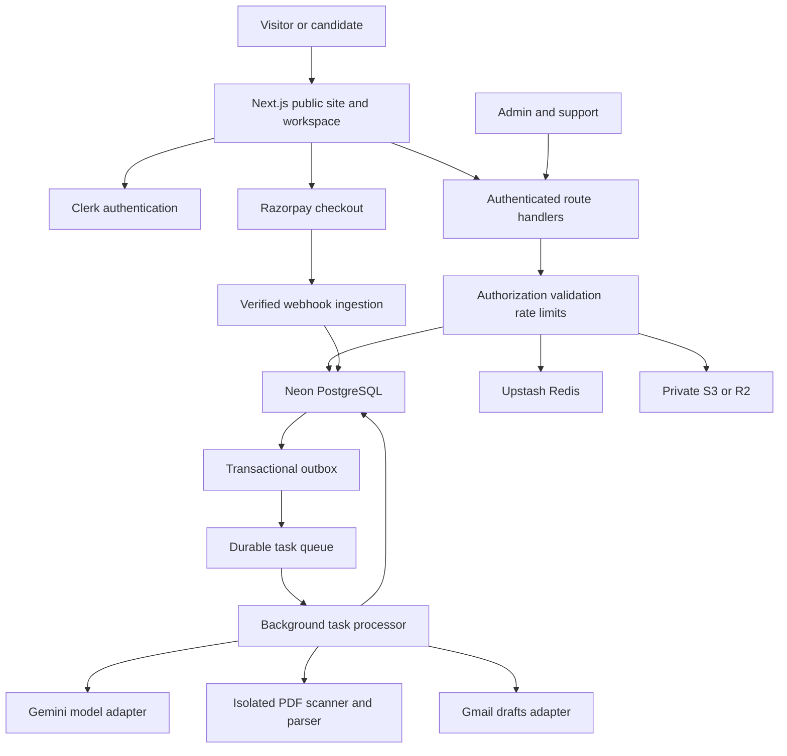

# Apply Bee — Complete Product, Design, Engineering & Deployment Plan

> **Purpose:** a build-ready specification that an AI coding agent can follow to create the complete SaaS, not just a landing page or a prototype.
>
> **Source:** `PRD.md`, reviewed and enhanced on **2026-10-04**. This document intentionally supersedes conflicting engineering assumptions in the PRD. The original PRD remains unchanged.
>
> **Brand:** **Apply Bee**. The source uses “ReachBee AI” and also describes “ApplyBee” as a competitor. Use Apply Bee consistently in the implementation, but verify domain/trademark availability before public launch; this plan does not establish ownership of that name.
>
> **Product promise:** “Get your work in front of the right people.” Help job seekers discover relevant contacts, compose truthful introductions, and organize their job search. **Do not promise employment, interviews, replies, inbox placement, or guaranteed deliverability.**
>
> **Primary deliverable:** a production-quality Next.js App Router application with a 12-section agency-quality landing page, authentication, onboarding, directory, manual/AI/agentic composer, private resume management, Gmail draft integration, purchase/credit accounting, hiring pipeline, admin operations, monitoring, and documented infrastructure.
>
> **Important:** this is a plan, not a claim that the application, integrations, compliance, or deployment have already been built or validated.

---

## Contents

1. Product strategy and improvements to the PRD
2. Scope, personas, and success criteria
3. Explicit decisions and non-negotiable invariants
4. Pricing, credits, and unit economics
5. Technology and dependency selection
6. System architecture and provider boundaries
7. Repository and coding conventions
8. Design direction and complete design tokens
9. Motion specification: GSAP, Anime.js, and Lenis
10. Twelve-section landing page
11. Route map, access rules, and page specifications
12. Dashboard, directory, and hiring pipeline UX
13. Complete manual, quick-AI, and agentic drafting flows
14. Resume upload and ingestion
15. Agent design, grounding, tools, and evaluations
16. Gmail OAuth, MIME, and delivery
17. Database schema and indexing
18. Transactional credits and idempotency
19. API and mutation contracts
20. Async jobs, retries, leases, and reconciliation
21. Razorpay purchase and refund lifecycle
22. Rate limiting, quotas, and abuse prevention
23. Security, privacy, contact-data governance, and compliance
24. Frontend implementation, accessibility, and performance
25. AWS deployment runbook
26. Cloudflare Workers deployment runbook
27. Environment configuration, secrets, and local development
28. CI/CD, migrations, rollback, and disaster recovery
29. Observability, analytics, and support operations
30. Edge-case matrix and graceful degradation
31. Test strategy and acceptance scenarios
32. Ordered implementation milestones for an AI agent
33. Tradeoffs, risks, and launch gates
34. Official references and final handoff checklist

---

## 1. Product Strategy and Improvements to the PRD

### 1.1 The better idea

Apply Bee is a **career outreach workspace**, not a contact-dumping or mass-emailing service. Its differentiation is the combination of:

- **Relevant people:** discover recruiters, managers, founders, and engineering leads with transparent contact provenance and freshness.
- **Credible evidence:** turn a candidate’s confirmed experience into an honest, specific introduction.
- **Three writing paths:** write manually, generate a quick AI draft, or use a bounded agentic preparation workflow.
- **User control:** preview, edit, approve, and optionally create a draft in Gmail. The product never sends automatically.
- **Job-search continuity:** save contacts, connect drafts to an opportunity, and manually track next steps.
- **Trust:** visible credit costs, private resumes, explicit Gmail authorization, no hidden bulk outreach.

Core journey:

```text
Understand my goals
  → review my candidate profile
  → find or enter a relevant contact
  → create a truthful introduction
  → review and edit it
  → copy/export it or save it to Gmail Drafts
  → personally send outside Apply Bee
  → record progress and next steps myself
```

### 1.2 Fixes to source assumptions

| PRD assumption | Required correction |
|---|---|
| Unsupported ATS/response-rate statistics | Remove until backed by attributable evidence. Sell relevance and convenience, not fabricated outcomes. |
| “Autonomous 1-click” workflow | Preparation may be agentic; recipient selection, approval, and Gmail creation remain explicit user actions. |
| Every AI draft needs Gmail | AI composition works without Gmail; copy/export is a first-class path. |
| Only generic HR templates versus AI | Provide a genuinely useful manual editor, reusable templates, and quick AI as well as agentic mode. |
| `gmail.compose` is draft-only / simplifies verification | It permits managing drafts **and sending** and is a **restricted scope**. Production verification and applicable assessment are launch gates. |
| Clerk sign-in automatically supplies suitable Gmail offline tokens | Separate Clerk authentication from a dedicated application-owned Gmail OAuth grant. Do not assume social-login tokens suffice. |
| Redis `SETNX` guarantees payment correctness | PostgreSQL uniqueness and atomic transactions guarantee ledger correctness. Redis is best-effort coordination only. |
| `accuracy_rate` defaults to 95 | Verification needs evidence, timestamps, and explicit statuses; no fictional numeric accuracy. |
| One-time packs behave like subscriptions | No auto-renewal, cancellation date, or subscription UI unless recurring billing is separately introduced. |
| A “draft” status means an email was sent | Gmail draft creation is not sending. Sent/reply/interview tracking is manual unless a separate capability is built and consented. |
| Upstash can store images and resumes | Use **Upstash Redis** for rate limits/cache. Use **private S3 or R2** for files and a separate public asset bucket/CDN for images. |
| Next.js 15 / Gemini 1.5 or 2.0 can be hardcoded forever | Pin a supported patched Next.js release and an available model at implementation time; record compatibility and model evaluations. |
| Production in seven days | Seven days may produce a prototype. Production needs staged engineering, external approvals, licensed contacts, security, and recovery tests. |

### 1.3 Useful enhancements, without overbuilding

**Included in launch:**

1. Candidate profile editable after extraction; resume facts are reviewed rather than silently trusted.
2. Three intents beyond generic cold outreach: advertised role, internship, referral; speculative intro and follow-up also supported.
3. Job-description paste field; no scraping or URL fetching by default.
4. Draft evidence panel: which candidate fact supports each claim, and which dated source supports company context.
5. Recipient entry outside the directory; candidates can use contacts they already know without paying a reveal credit.
6. Personal templates with deterministic placeholders and preview; manual usage is free.
7. Saved contacts, application/opportunity pipeline, notes, and user-entered follow-up reminders.
8. Reporting stale data and requesting contact removal.
9. Activity and separate credit ledgers; no opaque credit deductions.
10. Accessible, responsive workflow that remains useful during AI or Gmail outages.

**Later, behind a distinct roadmap:**

- Limited approved batches, only after abuse controls and per-recipient review are proven.
- Calendar sync, managed reminder emails, CV tailoring, role feeds, or collaborative agency accounts.
- Optional subscription pricing after observed usage justifies it.
- Inbox/sent tracking only with separately assessed scopes, policies, and a new consent flow.
- Research agents browsing the open web only after SSRF defenses, licensed data, and evidence quality are established.

**Explicit non-goals:** automated sending, bulk blasting, fake referrals, fabricated credentials, guaranteed hiring, SMTP delivery service, automatic Gmail deletion, browser-based scraping of protected sites, scraping private LinkedIn data, buying an unknown CSV and calling it verified.

---

## 2. Scope, Personas, and Success Criteria

### 2.1 Personas

| Persona | Primary task | UX implication |
|---|---|---|
| Student / graduate | Introduce projects and find internship/junior conversations | Explain next steps; low-cost trial; never manufacture professional experience. |
| Experienced engineer between roles | Reach appropriate managers with credible evidence | Resume versioning, role relevance, concise editing, privacy controls. |
| Employed job switcher | Prepare quality outreach in short sessions | Autosave, resume selected by default, quick AI, recoverable async tasks. |
| Nontechnical job seeker | Use self-entered recipients and skills | Avoid hardcoding engineering-only taxonomy or “tech stack” everywhere. |
| Operator / support | Fix imports, payments, stale contacts, failed jobs | Minimal PII, RBAC, audit trail, reconciliation screens. |

Start with India-focused technical roles, INR purchases, English UI, and single-user workspaces. The schema supports broader roles without pretending all locations or industries are covered.

### 2.2 User stories with completion conditions

- As a visitor, understand what the product does, what it costs, and what Gmail access means without creating an account.
- As a new user, register, verify identity, and browse without uploading a resume or granting Gmail access.
- As a candidate, upload and confirm a resume profile; replace the resume without changing historical draft attachments.
- As a directory user, reveal one eligible email exactly once and see its verification metadata.
- As a writer, save and copy a manual message without buying AI credits or connecting Gmail.
- As an AI user, receive a validated, editable draft without invented achievements or company claims.
- As an agentic user, see a concise explanation and evidence, not an unverifiable “agent thought stream.”
- As a Gmail user, approve the exact message and attachment and see “Created in Gmail. Nothing has been sent.”
- As a paying user, receive the purchased credits exactly once even if callbacks repeat or the browser closes.
- As a job seeker, manually update opportunity status and set a reminder without suggesting the app read Gmail.
- As a data subject, request correction/removal without logging in or purchasing anything.

### 2.3 Success measures

**North-star:** weekly users who produce a reviewed introduction tied to a real job-search intent. Drafting activity is a proxy for utility, not a hiring guarantee.

Track:

- Visitor → signup conversion; verified signup → first useful action.
- Time to first saved manual or validated AI draft.
- Resume parse success and review completion rates.
- AI acceptance/edit rate and unsupported-claim rate on an evaluation set.
- Gmail delivery success, unknown outcomes, and reconnection rate.
- First-reveal repeat-request charging defects: target **zero**.
- Payment-to-grant correctness defects: target **zero**.
- Cost per accepted AI artifact; paid-pack contribution margin.
- Optional, clearly self-reported interviews/offers, never inferred from drafts.
- Contact stale/report rates by provider and verification age.

Initial engineering objectives, not contractual SLAs:

- Read APIs: p95 below 500 ms near selected backend/data region, measured separately from cold starts.
- Local draft save: p95 below 800 ms.
- AI artifact: p95 below 30 seconds for quick mode and below 60 seconds for bounded agentic mode, subject to model performance.
- Gmail creation: typically below 15 seconds; uncertainty is represented explicitly.
- Credits granted after captured-payment receipt: p95 below 30 seconds under normal operation.
- Core Web Vitals at p75: LCP ≤ 2.5 s, INP ≤ 200 ms, CLS ≤ 0.1.
- Accessibility target: WCAG 2.2 AA with automated and manual review.

---

## 3. Explicit Decisions and Non-Negotiable Invariants

### 3.1 Defaults an implementation agent must follow

1. Use Apply Bee branding, English interface, INR currency, single-user account ownership.
2. Start with a patched **Next.js 16.x** release if compatible with selected providers; record the exact version and security review. Use another supported major only through an explicit architecture decision, not because the PRD names 15.
3. Use TypeScript strict mode, React version supported by Next.js, Tailwind CSS, shadcn/ui, Drizzle, Neon Postgres, Clerk, Upstash Redis, Razorpay, and Google Gemini behind interfaces.
4. **AWS with the official Node.js Next.js runtime is the reference production path.** Cloudflare Workers is an alternative gated on runtime compatibility, not a second simultaneous deployment.
5. Keep manual, quick AI, and agentic drafts within the same editor and domain model.
6. Charge AI generation when a useful validated artifact is durably available, **not** when Gmail succeeds. This avoids free generation loops and supports non-Gmail use.
7. Gmail draft creation is an independent, non-AI-billed delivery operation with abuse quotas.
8. Use relational transactions for financially meaningful state; never Redis balances or browser callbacks as the source of truth.
9. Use durable background jobs and an outbox. `next/after`, a detached promise, or Workers `waitUntil` is not a durable job queue.
10. AI operates on confirmed user facts and approved company evidence. No arbitrary tool execution.
11. Public assets and private resumes use different buckets and permissions.
12. Preview/mock integrations must be visibly labeled and disabled in live billing mode.

### 3.2 Invariants to encode in tests and database constraints

- A user cannot access another user’s resume, draft, opportunity, Gmail connection, or payment.
- Locked contact email is absent from serialized responses, RSC payloads, exports, analytics, and client source.
- A contact unlock has at most one successful reveal charge per user/contact.
- Spendable and reserved credits cannot be negative.
- A generation reservation has exactly one consumption or release outcome.
- A captured payment grants at most once, regardless of how many webhook events reference it.
- Duplicate jobs can repeat internal work, but cannot repeat ledger consumption.
- App idempotency does **not** create an exactly-once guarantee at Gmail. Uncertain external effects must be tracked.
- Approval refers to immutable message/recipient/attachment/mailbox versions.
- No implementation module can invoke Gmail `messages.send` or `drafts.send`.
- Deletion prevents new work; an already in-flight external effect may still complete and must be accounted for.
- Resume replacement never silently changes an approved attachment.
- “Verified email” does not mean “actively hiring,” “consented to outreach,” or “guaranteed delivered.”

---

## 4. Pricing, Credits, and Unit Economics

### 4.1 Proposed launch catalog

The original pricing is retained as research context, **not blindly approved**. ₹399 for 3,000 reveals and 200 AI drafts may be uneconomic after contact licensing, verification, payment fees, tax, model usage, and support. It also makes a ₹400/200-draft add-on irrational if packs are repeatable.

Recommended pilot catalog below is a **product hypothesis requiring commercial sign-off**, not a statement of market-tested prices:

| SKU | One-time price | Contact reveal credits | AI generation credits | Notes |
|---|---:|---:|---:|---|
| `free_trial_v1` | ₹0 | 5 | 2 | Once per eligible verified account; no card required. |
| `explorer_v1` | ₹149 | 75 | 0 | Browsing, manual editor, templates, tracking. |
| `plus_v1` | ₹299 | 150 | 30 | Same core capabilities; AI usage allowance. |
| `pro_v1` | ₹599 | 350 | 75 | Higher allowance, not preferentially truthful AI. |
| `contacts_100_v1` | ₹199 | 100 | 0 | Standalone top-up; larger bundled offers retain better value. |
| `ai_25_v1` | ₹249 | 0 | 25 | Standalone top-up, consistent positioning. |

Rules:

- All paid packs are repeatable; balances add. Packs do not overwrite unused credits.
- No core capability is permanently tied to a `plan_tier`; entitlements and quantity are separate.
- Manual composition, copying, templates, and tracking are available to all users within storage/abuse quotas.
- A user can generate AI for their own recipient without spending directory reveal credits.
- One validated quick-AI or agentic artifact costs one AI credit at launch. Agentic mode must stay within its tool budget; revise pricing if measured costs cannot fit.
- Agentic quality is not advertised as exclusive “Gold truth.” The mode is capped by budget and available data.
- The SKU catalog lives server-side with a version. No hardcoded conflicting prices in marketing, checkout, and webhook fulfillment.
- Final public prices must clearly state tax treatment. Suggested display is inclusive total where legally appropriate; finance/legal must approve GST/tax and invoice requirements.
- Preserve source-pack allowances in a historical comparison note only, not in a second active checkout catalog.

### 4.2 Credit policy

| Action | Charge | Settlement |
|---|---|---|
| Browse/search masked contacts | None | Rate limited. |
| Save a contact | None | User quota applies. |
| Reveal a directory contact for the first time | 1 reveal credit | Atomic unlock and consumption. |
| Reopen/copy an already unlocked email | None | Abuse quota remains. |
| Generate quick AI or agentic message | 1 AI credit | Reserve before work; consume with persisted valid artifact. |
| Provider retry or schema repair for same generation | No extra user credit | Included within bounded job budget. |
| User asks for new AI wording/tone/length | 1 AI credit | Explicit “Generate revision · 1 AI credit” confirmation. |
| Manually edit, shorten, copy, save | None | No background AI calls. |
| Create Gmail draft of approved content | No AI credit | Daily/user/provider delivery quota. |
| Recreate a known-deleted Gmail draft | No AI credit | Explicit new delivery intent; quota and duplicate warning. |
| AI failure before artifact persistence | None | Release reservation. |
| Generated artifact exists but Gmail fails | AI credit remains consumed | Artifact still available; retry delivery or copy for free. |
| Contact reveal succeeds but later generation fails | Reveal remains consumed | Contact is still unlocked. |
| Invalid/stale revealed address verified by support | Replacement reveal credit | One audited adjustment per original unlock under published policy. |

Cost summary must appear before a combined “Reveal and generate” operation: “1 contact reveal + 1 AI generation.” A failed generation does not undo a genuinely completed reveal; explain this before confirmation.

### 4.3 Expiry, refunds, and balances

Suggested policy, subject to legal approval:

- Paid credits do not expire during ordinary active service; avoid a surprise expiry mechanism at launch.
- Free trial is granted once; unused trial allowance is not repeatedly refreshed by login or onboarding.
- Show `available`, `reserved`, and historical `used`; don’t hide reservations as missing credits.
- Automatic release for known unsuccessful AI generation; no extra human refund request.
- Refunds for unused purchased allowance follow the public policy and consumer law. Track allocation by credit lot so unused amounts can be assessed.
- Refunds/chargebacks after consumption may create a **debt/restriction record**, not negative spendable balance. Human review for disputes.
- Service discontinuation, account deletion with paid balance, and mandatory refunds require reviewed terms; do not infer a universal “no refunds” rule.

### 4.4 Economics gate

Before activating a SKU, calculate:

```text
net revenue = paid total − applicable tax − gateway fees − refunds allowance
variable cost = licensed reveals + revalidation + AI tokens/tool calls
              + file/queue/database usage + support allocation
contribution margin = net revenue − variable cost
```

Model full redemption, not only optimistic breakage. Include generation repairs, parse retries, adverse fraud, and agentic research. Treat provider prices as configuration with source/date, not numbers frozen in this plan. Pause sales or lower unpublished future allowances if full-redemption economics fail; never retroactively shrink purchased balances.

---

## 5. Technology and Dependency Selection

### 5.1 Core stack

| Area | Preferred choice | Why / constraint |
|---|---|---|
| Framework | Next.js App Router, patched 16.x baseline | Official Node runtime first; server-render public pages and workspace shell. |
| Language | TypeScript strict, supported Node LTS | Pin exact Node/package-manager versions after dependency compatibility check. Node 24 LTS is a candidate, not an untested promise. |
| Styling | Tailwind CSS 4-compatible shadcn/ui | Tokens drive components; accessible primitives over bespoke form widgets. |
| Primitives | shadcn/ui / Radix as installed | Dialog, sheet, select, tabs, tooltip, dropdown, accordion. |
| Icons | `lucide-react` | Consistent stroke icons; meaningful accessible labels. |
| Marketing motion | `gsap`, `@gsap/react`, ScrollTrigger | Scoped timelines and cleanup. |
| App micro-motion | `animejs` | Small feedback; version-specific API tested. |
| Marketing scroll | `lenis` | Optional progressive enhancement, reduced-motion opt-out. |
| Forms | `react-hook-form`, `@hookform/resolvers`, `zod` | Client validation mirrors server contracts. |
| Async UI | `@tanstack/react-query` | Job polling, directory mutations, optimistic local editing only. |
| Tables | `@tanstack/react-table` | Accessible paginated directory/admin views. |
| Dates | `date-fns` | Local display; UTC storage plus explicit user timezone. |
| Auth | `@clerk/nextjs`, webhook verifier compatible with Clerk | Authentication/session UI; not automatic Gmail delegation. |
| Database | `drizzle-orm`, `drizzle-kit`, `@neondatabase/serverless` | Typed schema, portable HTTP reads/functions; Postgres correctness. |
| Migrations | Drizzle plus explicit SQL functions; Node `pg` where needed | Dedicated migration role, not executed on normal web requests. |
| Rate limit/cache | `@upstash/redis`, `@upstash/ratelimit` | REST-compatible on Node/Workers. Fail policy must override timeout-open behavior. |
| AI | Current supported `@google/genai` or verified REST adapter | Model ID and API behavior configurable; schema validation mandatory. |
| Storage | S3 SDK/presigner on AWS; R2 binding/presigner on Cloudflare | Private files, public images separated. |
| OAuth | `google-auth-library` on Node; vetted portable OAuth library on Workers | Explicit Google grant, state/PKCE, offline token management. Verify edge support before selection. |
| MIME | Audited MIME builder, e.g. `mimetext` if fixture tests pass | Portable implementation; use Node-only alternative only behind adapter. No SMTP transport. |
| PDF ingestion | Pinned `pdfjs-dist` in isolated processor | Test native/runtime needs. Never assume browser parser can safely process arbitrary PDFs on edge. |
| PDF malware scanning | Isolated ClamAV container/service with current signatures | Must complete before download/attachment; Workers cannot host a conventional native scanner. |
| Payments | Razorpay server REST adapter / compatible SDK | Price and order authority server-side; raw webhook verification. |
| Email notifications | AWS SES adapter; Cloudflare deployment may use SES or another approved service | Transactional product emails only; not career outreach sending. |
| Logging/monitoring | Structured logger + Sentry + provider metrics | Redact all content/secrets by default. |
| Tests | Vitest, Testing Library, Playwright, axe-core | Unit, integration, E2E, accessibility and concurrency. |
| Visual docs | Storybook + screenshot tests | Token/component/page-state coverage. |
| Formatting | ESLint + Prettier | Explicit lint command; do not rely on removed framework lint wrappers. |

Use one package manager, suggested **pnpm**, committed lockfile, and exact tested dependency resolution. Do not mix npm/yarn/pnpm lockfiles. Never add every optional library merely because it appears here.

### 5.2 Dependencies deliberately not included

- No Framer Motion: requested GSAP/Anime.js/Lenis already cover motion.
- No LangChain/LangGraph initially: the agent is a bounded typed state machine, not a sprawling autonomous runtime.
- No Redux/Zustand unless a measured cross-page state requirement emerges; URL + server state + form state suffice.
- No rich-text email editor at launch; plain text avoids unsafe HTML, formatting drift, and unnecessary bundle cost.
- No vector database initially; exact fact IDs and SQL filters handle current matching requirements.
- No UploadThing on top of owned S3/R2 unless direct uploads create a demonstrated operational gap.
- No image blobs in Redis, database rows, or base64 client state.
- No WebSocket server for simple job progress; polling is the reliable baseline.

### 5.3 Compatibility spike before bulk implementation

Record in `docs/adr/0001-platform.md`:

1. Exact Next.js/React/Clerk/Tailwind/GSAP/Anime.js versions and runtime.
2. Server render and authenticated route behavior in actual production runtime.
3. Neon reads and atomic financial functions under concurrency.
4. OAuth exchange, webhook raw bodies, MIME attachment creation, and file access.
5. AI SDK compatibility or replacement by REST.
6. Chosen storage presigner, PDF processor, scanner, and test fixtures.
7. Cloudflare deployment proof if that option is selected.
8. Security advisory review and licenses for dependencies, fonts, and motion libraries.

---

## 6. System Architecture and Provider Boundaries

### 6.1 Logical architecture



### 6.2 Provider contracts

Keep business logic in domain services, not spread across pages and adapters.

```ts
interface ObjectStore {
  issueUpload(input: AuthorizedUpload): Promise<UploadGrant>;
  inspect(key: string): Promise<ObjectMetadata>;
  readAuthorized(key: string): Promise<Uint8Array>;
  issueDownload(key: string, ttlSeconds: number): Promise<string>;
  delete(key: string): Promise<void>;
}

interface JobDispatcher {
  publish(jobId: string, kind: JobKind): Promise<void>;
}

interface DraftModel {
  parseResume(input: ResumeParseInput): Promise<ParsedResumeResult>;
  compose(input: GroundedDraftInput): Promise<ValidatedDraftCandidate>;
}

interface GmailDraftGateway {
  createApprovedDraft(input: ApprovedDeliverySnapshot): Promise<GmailCreateOutcome>;
  reconcileAppDraft(input: DeliveryIdentity): Promise<ReconciliationOutcome>;
  revokeConnection(connectionId: string): Promise<void>;
}
```

These are interface shapes, not permission to ignore failures. Outcomes distinguish confirmed rejection from uncertain acceptance. Scanner/parser is a separate adapter. No `send` method exists in the Gmail interface.

### 6.3 Data authority

- Clerk: authentication identity/session, not credits or financial entitlements.
- PostgreSQL: user provisioning, profile, contact availability, unlocks, drafts, jobs, payments, ledger, outbox.
- Object storage: file bytes only; Postgres stores object keys and scan metadata.
- Redis: temporary rate counters, bounded caches, coordination hints. Loss must not lose credits or payments.
- Queue: notification to process a job; job state still lives in Postgres.
- Gmail: external draft copy; Apply Bee stores a creation record, not live inbox synchronization.
- Razorpay: payment capture/refund truth; reconcile durable local records against provider state.

### 6.4 Region strategy

Choose one primary DB/write region near initial Indian users and compatible vendors; record actual Neon region availability rather than inventing it. Keep web worker, database, and storage processing as colocated as possible. Edge distribution does not remove database round trips. Start single-writer; don’t advertise global active-active credit consistency.

---

## 7. Repository and Coding Conventions

Suggested structure; the coding agent creates it when implementation begins:

```text
.
├── PRD.md
├── plan.md
├── src/
│   ├── app/
│   │   ├── (marketing)/
│   │   ├── (auth)/
│   │   ├── onboarding/
│   │   ├── app/
│   │   ├── admin/
│   │   ├── api/v1/
│   │   ├── api/webhooks/
│   │   ├── error.tsx
│   │   ├── global-error.tsx
│   │   └── not-found.tsx
│   ├── components/
│   │   ├── ui/
│   │   ├── marketing/
│   │   ├── auth/
│   │   ├── shell/
│   │   ├── directory/
│   │   ├── composer/
│   │   ├── resumes/
│   │   ├── pipeline/
│   │   └── billing/
│   ├── features/
│   │   ├── auth/
│   │   ├── contacts/
│   │   ├── drafts/
│   │   ├── credits/
│   │   ├── resumes/
│   │   ├── gmail/
│   │   ├── payments/
│   │   └── opportunities/
│   ├── server/
│   │   ├── auth/
│   │   ├── policies/
│   │   ├── services/
│   │   ├── repositories/
│   │   ├── adapters/
│   │   ├── jobs/
│   │   └── observability/
│   ├── db/{schema,functions,migrations}/
│   ├── lib/{contracts,validation,formatting}/
│   ├── styles/{globals,tokens}.css
│   └── content/{help,legal,marketing}/
├── workers/
│   ├── task-runner/
│   └── document-processor/
├── infra/
│   ├── aws/
│   └── cloudflare/
├── tests/{unit,integration,e2e,fixtures,visual}/
├── docs/{adr,runbooks,api,security,design}/
├── scripts/
├── public/{brand,demo}/
├── .env.example
└── .github/workflows/
```

Conventions:

- Server-only imports explicitly guarded; credentials cannot enter a client bundle.
- Route handler → authenticate → authorize → validate → limit → service → repository/provider.
- Reuse service functions from Server Actions; no authorization shortcut because a form is server-rendered.
- Public reads are RSC-first; interactive controls are small client islands.
- All untrusted input validated with Zod and bounded lengths; all model output independently validated.
- Money stored in integer minor units (`amount_paise`), credits as integer quantities, timestamps as `timestamptz` UTC.
- External IDs are text, internal entities UUIDs; never assume provider ID format is a UUID.
- API errors have stable codes and a safe request ID, not stack traces.
- Never log full payloads from webhooks, resumes, model prompts, Gmail, or OAuth.
- No “TODO security later” on any money, file, OAuth, or cross-user path.
- Domain tests precede styling when correctness is at stake.
- Seeds use invented fixtures and reserved example domains; production seeds need licensed source evidence.

---

## 8. Design Direction and Complete Design Tokens

### 8.1 Visual concept

**“An editorial career studio with software precision.”** Warm ivory, confident ink, a restrained honey accent, large clean typography, quiet cards, and precise spacing. The public site is expressive; the app is calm and information-dense.

Do:

- Oversized editorial headings, selective Fraunces emphasis, real product scenes.
- Asymmetric grids with readable hierarchy, clean borders, subtle elevation.
- Small bee mark / dotted flight path used sparingly.
- Highly legible tables, editor, evidence rail, and compact status pills.

Do not:

- Fill every card with honeycomb decoration.
- Use unreadable white text on yellow buttons.
- Add fake company logo walls, invented testimonials, perpetual mascots, or dashboard charts with fabricated outcomes.
- Rely on glassmorphism, noisy gradients, parallax, or animations to replace product explanation.

### 8.2 Token source

Define raw values in `src/styles/tokens.css`; map them into Tailwind theme and shadcn semantic variables. Components consume semantic tokens, not isolated literal colors.

```css
:root {
  color-scheme: light;
  --ab-canvas: #f7f4ec;
  --ab-surface: #fffdf7;
  --ab-surface-subtle: #eeeade;
  --ab-surface-raised: #ffffff;
  --ab-ink: #18231e;
  --ab-text-secondary: #586257;
  --ab-text-disabled: #71796f;
  --ab-honey: #e8b544;
  --ab-honey-wash: #faedc9;
  --ab-border-decorative: #dcdace;
  --ab-border-control: #7b8478;
  --ab-focus: #245ead;
  --ab-focus-on-dark: #faedc9;
  --ab-success: #245a3b;
  --ab-success-wash: #e5f0e7;
  --ab-warning: #704a08;
  --ab-warning-wash: #fff0cf;
  --ab-danger: #a52d2d;
  --ab-danger-wash: #fce8e5;
  --ab-info: #245ead;
  --ab-info-wash: #e7eef9;

  --ab-space-1: 0.25rem;
  --ab-space-2: 0.5rem;
  --ab-space-3: 0.75rem;
  --ab-space-4: 1rem;
  --ab-space-5: 1.5rem;
  --ab-space-6: 2rem;
  --ab-space-7: 3rem;
  --ab-space-8: 4rem;
  --ab-space-9: 6rem;
  --ab-space-10: 8rem;

  --ab-radius-xs: 0.375rem;
  --ab-radius-control: 0.625rem;
  --ab-radius-card: 1rem;
  --ab-radius-scene: 1.5rem;
  --ab-radius-pill: 999px;

  --ab-shadow-card: 0 2px 10px rgb(24 35 30 / 0.04);
  --ab-shadow-float: 0 16px 48px rgb(24 35 30 / 0.10);
  --ab-shadow-dialog: 0 24px 80px rgb(24 35 30 / 0.18);

  --ab-duration-fast: 140ms;
  --ab-duration-normal: 220ms;
  --ab-duration-reveal: 500ms;
  --ab-ease-ui: cubic-bezier(0.22, 1, 0.36, 1);

  --ab-container-marketing: 77.5rem;
  --ab-container-app: 90rem;
  --ab-sidebar-width: 15rem;
  --ab-header-height: 4rem;
  --ab-control-height: 2.75rem;
  --ab-z-sticky: 20;
  --ab-z-dropdown: 40;
  --ab-z-overlay: 60;
  --ab-z-dialog: 70;
  --ab-z-toast: 90;
}
```

Map semantic shadcn tokens such as `background`, `foreground`, `card`, `primary`, `secondary`, `muted`, `accent`, `destructive`, `border`, `input`, and `ring` to the above using the selected shadcn/Tailwind version’s expected color syntax. Do not paste incompatible v3/v4 variable conventions.

### 8.3 Typography

- **Manrope**: interface and most headings; fallbacks `ui-sans-serif, system-ui, sans-serif`.
- **Fraunces**: one or two editorial words in hero/closing heading only; fallbacks `Georgia, serif`.
- Use `next/font` or locally licensed fonts with narrow subsets; don’t request unnecessary weights.
- Marketing hero: `clamp(2.75rem, 6vw, 5.5rem)`, line-height 1.04, tracking approximately -0.045em.
- Section heading: `clamp(2rem, 4vw, 3.5rem)`, line-height 1.10.
- App title: 28–32 px, line-height 1.2.
- Body: 16 px, line-height 1.5–1.65.
- Table/UI compact: 14 px, line-height 1.4; metadata at least 12 px and never critical-only information.
- Numbers/balances: tabular numerals; money consistently formatted with INR locale.
- Prose maximum width: 64–70 characters.

### 8.4 Layout and component rules

| Element | Specification |
|---|---|
| Marketing sections | 96–128 px vertical desktop spacing, 56–72 px mobile. |
| App content | 24–32 px desktop padding, 16 px mobile. |
| Grid | Marketing 12-column; app flexible main + contextual rail. |
| Primary button | Ink background + ivory text; 44–48 px height; clear hover/focus. |
| Secondary button | Surface + ink, contrasted control border. |
| Accent button | Honey + ink only; reserve for selected public CTAs, not every action. |
| Input | Surface, visible boundary, label above, linked help/error below. |
| Card | 16 px radius, decorative border, 20–24 px padding. |
| Table row | 56–72 px desktop, keyboard-accessible named actions. |
| Status chip | Icon + short label; color not sole status indicator. |
| Dialog | Max width based on task, focus trap, Escape, explicit cancel, return focus. |
| Drawer | Detail/review on desktop; full-height sheet on narrow screens. |
| Toast | Supplemental feedback only; failures also inline. |
| Empty state | Task-specific explanation and one useful action; no generic empty chart. |
| Skeleton | Match final geometry; subdued, reduced-motion aware. |
| Destructive action | Explicit verb and impact summary; confirm irreversible deletion. |

### 8.5 Accessibility and theme

- Verify text contrast ≥ 4.5:1 for ordinary text and ≥ 3:1 where WCAG permits large text.
- Essential form/control/focus contrast ≥ 3:1; light decorative borders are not control boundaries.
- Honey is decorative/highlight, not low-contrast body text.
- Focus: 2 px distinct blue ring plus contrasting offset on light surfaces. On ink/dark sections, scope the ring to `--ab-focus-on-dark` (light honey wash), because the default blue against ink is only about 2.53:1 and is insufficient for a 3:1 essential indicator. Verify both adjacent backgrounds.
- Touch targets: target 44×44 px or greater; satisfy WCAG 2.2 minimum target criteria.
- Provide charts only when backed by meaningful data; text equivalents always.
- Ship a polished **light theme first**. Dark mode is optional phase two, with separate contrast-tested tokens—not simple inversion.
- Use semantic headings, skip link, keyboard navigation, and reduced motion throughout.

---

## 9. Motion Specification: GSAP, Anime.js, and Lenis

### 9.1 Distinct ownership

| Library | Owns | Forbidden overlap |
|---|---|---|
| GSAP + ScrollTrigger | Marketing hero timeline, product-scene reveal, section entrances, decorative line drawing | Does not manage form state, balances, global routing, or dashboard scroll. |
| Anime.js | App microfeedback: saved icon, success check, approved state, authoritative credit number transition | Does not animate a property already owned by GSAP or React. |
| Lenis | Optional marketing-page scroll smoothing | Never app/editor/admin/nested-dialog scrolling. |
| CSS transitions | Hover, focus, small nonsequenced transitions | Do not run another timeline on the same transform/opacity. |

### 9.2 Motion timing

- Hero: 900–1,200 ms, once; headline → CTA → contact → evidence → draft.
- Scroll section reveal: 400–600 ms; 12–20 px translation plus opacity, not huge travel.
- Product scene stagger: 60–100 ms between related items.
- Microinteraction: 120–220 ms; responsive, not decorative delays.
- Dialog appearance: 160–200 ms maximum; immediate focus management.
- No artificial animated progress percentages or typing effects that imply actual model progress.
- No perpetual loop unless decorative, non-distracting, stoppable, and demonstrably useful; default is no loop.
- No mandatory long pinned section; all content remains understandable with native scrolling.

### 9.3 Implementation requirements

- Use `@gsap/react` context scoped to a component, `gsap.matchMedia`, and cleanup on unmount.
- Lenis and GSAP share one ticker/RAF strategy; if GSAP drives Lenis, disable Lenis auto-RAF and convert time units correctly for the installed API.
- Register ScrollTrigger once in a client-safe module; initialize after layout is measured.
- Keep readable HTML visible before JS. Add enhancement classes only after successful setup; never ship permanent `opacity: 0` on copy.
- Separate wrappers if motion needs to coexist with React-owned styles.
- Cancel Anime.js instances/listeners on unmount; use installed-version API, not mixed v3/v4 examples.
- Preserve anchors, keyboard PageUp/PageDown, browser history restoration, focus scroll, modal scroll locks, and nested native scroll.
- Mobile may use native scroll by default.
- Dynamic import all nonessential marketing motion; do not load all three libraries in every route.

### 9.4 Reduced motion

When `prefers-reduced-motion: reduce` is active or changes mid-session:

- Disable Lenis, scrub, parallax, drawn flight paths, count-up effects, and spatial transitions.
- Show the meaningful final product scene and accurate balance immediately.
- Keep essential state feedback brief and nonspatial.
- Kill existing timelines safely; don’t leave partially invisible UI.
- Test keyboard navigation with and without enhanced scrolling.

---

## 10. Twelve-Section Landing Page

Header and footer are additional structures, not counted among the twelve sections.

### 10.1 Header

- Left: simple bee mark + **Apply Bee** wordmark; link home.
- Center desktop: How it works, Features, Trust, Pricing.
- Right: Sign in, Start free.
- Sticky 64–72 px header with translucent-to-solid subtle surface on scroll, but legibility never depends on backdrop filtering.
- Mobile: accessible sheet menu; links and CTAs remain keyboard accessible.
- Signed-in visitor: primary CTA becomes **Open workspace**.
- No false launch countdown or permanent “limited offer.”

### 10.2 Section specifications

#### 1. Hero — clear promise, beautifully shown

**Heading:** “Get your work in front of the right people.”

**Subhead:** “Find relevant hiring contacts, write a thoughtful introduction, and prepare a draft you’re proud to send.”

- Desktop 5/7 split with oversized left typography and art-directed right product composition.
- Scene: masked contact → confirmed project achievement → concise email editor with resume chip → “Ready for review.”
- Example data uses fictional people and `example.com`; label **Illustrative preview**.
- Primary CTA: **Start free**. Secondary: **See how it works**.
- Microcopy: “5 contact reveals · 2 AI generations · No card required,” only while catalog matches.
- GSAP: subtle once-only scene sequencing; do not delay LCP headline.
- Mobile: copy first, scene below, no 3D unreadable tilted editor.

#### 2. Product facts — honest credibility

- Quiet horizontal three-item strip: **Relevant contacts**, **Resume-grounded introductions**, **You review before sending**.
- Small icons and concise descriptions, not fake customer logos.
- No “trusted by 10,000 candidates” until true and attributable.
- Link **Understand our data and permissions** to security/contact-data information.

#### 3. The problem — fragmented work, not invented statistics

**Heading:** “Less copying and pasting. More relevant conversations.”

- Editorial comparison: scattered tabs/files versus a coherent workspace.
- Three friction points: finding the right person, explaining relevant work, keeping track.
- Avoid “bypass every ATS” or claims that standard applications never work.
- Present Apply Bee as a complement to job applications, not a replacement for every channel.

#### 4. Directory feature — discover the right person

**Heading:** “Start with a person—not a generic inbox.”

- Wide directory mock with role/location/company-stage filters and clear masked email.
- Explain source freshness and verification labels; no guaranteed deliverability.
- Show “No active vacancy implied” in feature footnote.
- CTA **Explore contacts** → signup or authenticated directory.
- Never embed real locked email data in public HTML or demo JSON.

#### 5. Resume intelligence — credible proof of work

**Heading:** “Your experience is the strongest part of the pitch.”

- Split resume excerpt and confirmed fact cards.
- One highlighted fact connects to one sentence in a draft.
- Copy: “Review the profile we extract. Keep the details that are accurate.”
- Include missing-metric example: preserve the actual achievement rather than inventing a percentage.
- Optional compact callout: “Resume files stay private.” Link to the actual handling policy.

#### 6. Agentic workflow — evidence, fit, review

**Heading:** “A little preparation. A much better introduction.”

- Three visual steps: **Choose your context → Prepare with evidence → Review your draft**.
- Show a simple evidence panel with dated company fact, candidate fact ID, and uncertainty label.
- Demonstrate bounded assistance, not an agent autonomously contacting strangers.
- CTA **Try agentic drafting**.
- Gmail is optional until delivery; do not say a resume upload is required when confirmed manual profile facts suffice.

#### 7. Three writing modes — control for every user

**Heading:** “Write it yourself. Get a quick start. Or go deeper.”

- Three-tab scene: **Manual**, **Quick AI**, **Agentic**.
- Manual tab: free text editor/template with “No AI credits used.”
- Quick tab: profile + intent → editable message.
- Agentic tab: evidence selection + relevance rationale → reviewed message.
- Accessible tab controls; only one lightweight scene rendered prominently.
- Explain that AI generation costs one credit and manual editing is free.

#### 8. Hiring workspace — more than a draft

**Heading:** “Keep your next move in view.”

- Dark or subtle editorial band with opportunity pipeline and reminder preview.
- Stages: Interested, Draft ready, Applied/Contacted, Conversation, Interview, Offer, Closed.
- Clear annotation: **Stages are updated by you. We don’t read your inbox.**
- Notes and next-action dates matter more than vanity charts.
- CTA **See the workspace** with an illustrative preview or product walkthrough.

#### 9. Trust and privacy — direct answers

**Heading:** “Your review. Your account. Your decision.”

- Four principles: explicit Gmail connection, private resumes, truthful AI, visible costs.
- State accurately: “Google’s permission allows managing drafts and sending. Apply Bee uses it to create drafts and does not send mail.”
- No claim that the scope technically prevents sending.
- Link privacy, Gmail access explanation, and contact-data policy.
- Use ink/ivory treatment with honey highlights and accessible links.

#### 10. Pricing — transparent one-time packs

**Heading:** “Pay for the preparation you need.”

- Free, Explorer, Plus, Pro cards using one approved shared catalog.
- Highlight Plus as **Balanced starter pack**, not “Most popular” without evidence.
- Show exact reveal/generation quantities and **One-time purchase** on every paid card.
- Add-ons below; no hidden upgrade mechanism or auto-renewal.
- Explain cost examples: existing contact + manual = no AI charge; new contact + AI = one of each.
- Purchase CTA sends unauthenticated users through sign-in, preserving selected SKU; backend revalidates.
- Stale/config-unavailable catalog: disable purchase, show a clear temporary issue; don’t fallback to invented prices.

#### 11. FAQ — remove blockers

Accessible accordion; multiple entries can stay open:

1. Does Apply Bee send emails for me?
2. What exactly does Gmail permission allow?
3. Can I use it without connecting Gmail?
4. Can I draft manually for free?
5. When is a credit consumed?
6. Do repeated email reveals cost again?
7. What does “verified” mean?
8. What happens when AI/Gmail fails?
9. Are these subscriptions?
10. Do credits expire, and how do refunds work?
11. Can I delete my resume and profile?
12. Will this guarantee interviews or a job? Answer: no.

Answers must match implemented policies and legal copy.

#### 12. Final CTA — quiet confidence

**Heading:** “Make your next introduction count.”

- Large editorial statement, small bee lockup, modest background treatment.
- Primary **Start free**, secondary **View pricing**.
- Repeat actual trial allowance from catalog; no unsupported urgency.
- No second long animation sequence competing with the decision.

### 10.3 Footer

Groups:

- Product: How it works, Features, Pricing, Workspace.
- Support: Help, Contact, Status information, Accessibility.
- Trust: Security, Contact data, Privacy.
- Legal: Terms, Refunds, Acceptable use, Cookies.

Show legitimate business/support details once available. Do not invent office addresses, registration numbers, certification badges, or SOC 2 claims.

---

## 11. Route Map, Access Rules, and Page Specifications

### 11.1 Access policy

- **Public:** marketing, legal, help, support, contact-removal request.
- **Guest-oriented:** auth screens; authenticated users redirect to safe requested destination.
- **User:** onboarding and `/app/**`; provisioning must exist and account must not be disabled/deleting.
- **Admin:** `/admin/**`; server-validated permission for each operation, MFA/reauthentication for sensitive actions.
- Callbacks/webhooks use dedicated verification, not a user session assumption.
- All private pages and APIs use `no-store`/private caching; no shared CDN caching of authenticated RSC payloads.
- Middleware/proxy can redirect for UX, but each page/API service still authorizes.

### 11.2 Public pages

| Route | Layout and purpose | Required states / behavior |
|---|---|---|
| `/` | Twelve-section landing above | SSR copy, JS enhancement optional, signed-in CTA. |
| `/pricing` | Detailed pack comparison, usage examples, add-ons, policy FAQ | Catalog loading/failure, chosen-SKU sign-in return, tax disclosure. |
| `/how-it-works` | Three-mode walkthrough and Gmail review explanation | Illustrative examples only, no invented customer data. |
| `/features` | Directory, profile, three modes, pipeline, trust | Deep links to relevant landing sections and signup. |
| `/security` | Permissions, storage, AI data handling, responsible disclosure | Only verified controls; last-reviewed date. |
| `/faq` | Grouped searchable questions | No matches, accessible links to related tasks. |
| `/help` | Goal-oriented help index | Getting started, credits, Gmail, resumes, payments. |
| `/help/[slug]` | Server-rendered article with related tasks | Unknown slug → proper 404. |
| `/contact` | Support form, category, message, optional safe reference ID | Validation, abuse challenge, submitted, failed, retry. |
| `/contact-data/request` | Correction/removal request for directory data subjects | Minimal identity proof, confirmation, no account required. |
| `/accessibility` | Accessibility statement and reporting channel | Actual testing status, known limitations if any. |
| `/legal/privacy` | Data purposes, processors, retention, deletion, AI/Gmail disclosure | Reviewed effective date; public for Google review. |
| `/legal/terms` | Service, credits, disclaimers, user obligations | No hiring guarantee. |
| `/legal/refunds` | Unused allowance, failures, disputes, applicable rights | Policy aligned with ledger/refund implementation. |
| `/legal/acceptable-use` | Prohibited spam, impersonation, harassment, scraping | Enforcement/contact path. |
| `/legal/contact-data` | Provenance, verification limits, removal/correction | No implication of consent to receive outreach. |
| `/legal/cookies` | Real cookie inventory and preferences | Consent where required; auth cookies treated accurately. |

### 11.3 Authentication pages

Use branded framing around Clerk-supported flows rather than reimplementing password/security logic.

**Shared design:** centered 440 px card; on desktop a quiet side panel with product promise and a small illustrative UI. Mobile uses one column. Wordmark, home link, clear terms/privacy links. No distracting smooth scrolling or scene animation.

| Route / surface | Specification |
|---|---|
| `/sign-in/[[...sign-in]]` | Google sign-in, configured email/password or code flow, “Create account,” forgotten-password path, safe return URL. |
| `/sign-up/[[...sign-up]]` | Minimal fields, legal agreement acknowledgment where appropriate, Google option, verification step, existing-account handling. |
| `/forgot-password` | Entry into configured Clerk reset flow; neutral response that doesn’t disclose whether an account exists. |
| `/reset-password` | Clerk-backed reset completion, password rules, expired/used challenge, retry link. Do not invent a parallel password database. |
| Verification / MFA child screens | Consistent branded framing; code paste/autocomplete, resend cooldown, expired challenge, lost-factor instructions. |
| `/auth/error` | Safe failure reason, retry, support reference; no tokens in URL/content. |
| `/auth/session-expired` | Reauthenticate with safe relative return target; preserve draft server state. |

Social login is labeled **Continue with Google**, not **Connect Gmail**. Gmail grants are separate and optional. Safe return validation rejects external/protocol-relative URLs and nested redirect tricks.

### 11.4 Onboarding

Shell: four-step horizontal progress desktop, compact step label mobile; autosave completed steps and allow returning later.

| Route | Main content | Completion / skip policy |
|---|---|---|
| `/onboarding` | Resolve next incomplete step | Resume rather than restart. |
| `/onboarding/profile` | Name, target role, career stage, preferred location, optional timezone | Essential name/intent only; don’t collect unnecessary sensitive data. |
| `/onboarding/resume` | Upload or create profile manually; extraction review | Skip permitted. No unreviewed facts used for AI. |
| `/onboarding/gmail` | Accurate permission explanation, connected-mailbox preview | Connect or “Maybe later.” |
| `/onboarding/preferences` | Role/location/company-stage interests, writing preference | Optional, editable later. |
| `/onboarding/complete` | Confirm setup, authoritative balances, “Find contacts” | Trial grant is provisioning policy, not a repeatable completion reward. |

A returning incomplete user can still browse/manual draft. Blocking onboarding should be limited to genuinely required account/legal prerequisites.

### 11.5 Workspace pages

| Route | Composition | Required behavior |
|---|---|---|
| `/app` | Focused dashboard | Setup states, balances, next actions, recent activity. |
| `/app/contacts` | Search/filter + results table/cards | URL filters, masked fields, verified metadata, reveal cost. |
| `/app/contacts/[contactId]` | Contact detail plus company evidence rail | Locked/unlocked/suppressed/stale states; report data. |
| `/app/saved` | Saved contact list | Tags/notes, unavailable records preserved as tombstones. |
| `/app/companies/[companyId]` | Company facts and associated contacts | Facts/sources/dates; no vacancy inferred. |
| `/app/drafts` | Draft library with state filters | Mode, subject, recipient, modified date, delivery status. |
| `/app/drafts/new` | Recipient + mode + intent setup | Directory or own recipient; URL IDs authorized server-side. |
| `/app/drafts/[draftId]` | Shared editor + context/evidence | Autosave, generation revision, approval, delivery recovery. |
| `/app/templates` | Personal template library | Create/edit/preview placeholders, no hidden AI usage. |
| `/app/templates/[templateId]` | Template editor with sample fill | Unknown placeholder warnings, escaped output. |
| `/app/resumes` | Active resume, versions, upload | Scan/parse/review states, replace/delete. |
| `/app/resumes/[resumeId]` | Safe preview and profile review | Ownership, scan gate, edit confirmed facts. |
| `/app/profile` | Confirmed facts and career preferences | Resume source vs manual fact provenance, revision history. |
| `/app/pipeline` | Kanban/list of opportunities | Keyboard stage controls, manually tracked labels. |
| `/app/pipeline/[opportunityId]` | Role/contact/draft links, notes, next action | User-managed status, timezone-safe dates. |
| `/app/activity` | Reveal/generation/delivery/purchase chronology | Safe metadata, link to resource, no inbox events. |
| `/app/notifications` | In-app reminders and operational notices | Read/dismiss, empty state, notification preferences. |

### 11.6 Settings and billing

| Route | Main content and states |
|---|---|
| `/app/settings` | Redirect to profile settings or concise settings hub. |
| `/app/settings/profile` | Name, locale, timezone, career preferences; clear save state. |
| `/app/settings/security` | Clerk-supported account/session/MFA controls; reauth where required. |
| `/app/settings/integrations` | Gmail identity, granted/needed scope, health, reconnect/disconnect. |
| `/app/settings/integrations/gmail/result` | Connected, declined, partial scope, admin-blocked, expired state, failed; no OAuth parameters exposed. |
| `/app/settings/notifications` | Reminder/transactional preferences, channel explanations. |
| `/app/settings/privacy` | File/profile deletion, data export, account deletion with impact summary. |
| `/app/billing` | Two balances, pending reservations, purchased credit lots, recent payments. |
| `/app/billing/plans` | One shared SKU catalog, one-time labels and eligible purchase actions. |
| `/app/billing/checkout/[orderId]` | Authorized order summary, Razorpay launch, cancellation/recovery. |
| `/app/billing/payments/[paymentId]` | Provider/local states: created, pending, captured/granting, fulfilled, failed, refunded, disputed. |
| `/app/billing/history` | Payment history, safe reference IDs, receipt links. |
| `/app/billing/credits` | Separate contact/AI ledger filters, reservations, adjustments explained. |
| `/app/billing/receipts/[transactionId]` | Receipt download; tax invoice wording only with legally valid invoicing. |

### 11.7 Admin pages

Separate shell, explicit **Admin workspace** label, role-specific navigation. Never enable admin from client state or user-editable metadata.

| Route | Purpose |
|---|---|
| `/admin` | Health: queue age, uncertain Gmail outcomes, failed parsing, payment reconciliation, data reports. |
| `/admin/contacts` | Directory inventory; provenance/verification/availability filters. |
| `/admin/contacts/new` | Create licensed record with mandatory source/rights metadata. |
| `/admin/contacts/[contactId]` | Edit, reverify, suppress, correction history. |
| `/admin/companies` | Company data inventory and source evidence. |
| `/admin/companies/[companyId]` | Versioned company facts and freshness. |
| `/admin/imports` | Authorized CSV import runs; dry-run first. |
| `/admin/imports/[importId]` | Per-row errors, duplicates, partial result, safe rerun. |
| `/admin/users` | Minimal lookup and account status. |
| `/admin/users/[userId]` | Balances and operational metadata; no default resume/body access. |
| `/admin/payments` | Reconciliation list and discrepancies. |
| `/admin/payments/[paymentId]` | Provider references, grant/refund history, controlled remediation. |
| `/admin/credits` | Adjustment requests with reason, approval and ledger references. |
| `/admin/jobs` | Job status, sanitized errors, age, retries. |
| `/admin/jobs/[jobId]` | Timeline, lease, safe retry/reconcile, unknown-outcome controls. |
| `/admin/reports` | Stale contact, removal, abuse and privacy requests. |
| `/admin/reports/[reportId]` | Resolution workflow and audited access. |
| `/admin/audit-log` | Actor/action/entity/time filters, tamper-resistant export policy. |
| `/admin/config` | Validated feature flags, catalog versions, published caps; no arbitrary code or secrets. |

Admin permissions: `support.read`, `contacts.manage`, `imports.run`, `billing.read`, `credits.request`, `credits.approve`, `privacy.process`, `config.manage`. Large adjustments/refunds require two-person approval where staffing permits. A solo-operator pilot must use explicit reauthentication and a stricter audited manual process.

### 11.8 Errors and global states

- App Router `not-found.tsx`, scoped `error.tsx`, and `global-error.tsx`; don’t implement ordinary `/404` or `/500` routes and assume framework semantics.
- `/access-denied`: correct 403 surface without leaking resource existence.
- `/service-unavailable`: planned maintenance/dependency disruption, status guidance.
- Route loading skeletons; actionable errors; request reference IDs.
- Offline banner; editing preserved in memory with unsaved-warning state.
- No “sent” badge or success confetti after draft creation; calm confirmation suffices.

---

## 12. Dashboard, Directory, and Hiring Pipeline UX

### 12.1 Application shell

Desktop:

- 240 px sidebar: Overview, Find contacts, Saved, Drafts, Templates, Career profile, Pipeline.
- Bottom group: Billing, Settings, Help.
- Utility header: breadcrumb/page context, contextual action, notifications only because an actual in-app notification system is implemented, account menu.
- Credit strip with independently named **Contact reveals** and **AI generations**; click opens ledger.
- Content max width approximately 1,440 px; the composer may use the full working area.

Mobile:

- 56–64 px header, navigation sheet, always reachable primary action.
- Native scrolling; no Lenis.
- Context/evidence rails collapse into named accordions/sheets.
- Sticky composer action bar accounts for safe-area insets and never obscures focused input.

### 12.2 Dashboard `/app`

Recommended grid:

1. Greeting + **Create an introduction** action.
2. Next-step card determined by real state: confirm profile, resume scan failed, reconnect Gmail, or find contact.
3. Small balance tiles: contact reveals, AI generations; reservations shown as secondary text.
4. “Next actions” from user-created opportunity reminders.
5. Recent drafts with real generation/delivery status.
6. Saved contacts shortlist.
7. Quiet recent activity.

First-use view: short checklist, one illustrative sample with a clear label, and useful directory/manual CTA—not fabricated analytics.

Only show true metrics: saved contacts, reveals, validated AI artifacts, Gmail draft creations, manually recorded opportunities. “Emails sent” or “Replies” cannot be inferred.

### 12.3 Directory interactions

- Search normalized query after 250–350 ms debounce or explicit submit; URL carries query/filter/sort/cursor.
- Filters: role category, location, company stage, remote relevance, verification status/freshness. Do not use prestige labels as if objective job quality.
- Default prioritization: relevance then freshness with explanation; sponsored ranking only if later introduced and clearly labeled.
- Page size 25, maximum 100; stable keyset pagination with deterministic tie-breaker.
- Desktop row: name/title, company, location, verification/date, actions.
- Mobile card: same labeled fields; avoid horizontally crushed tables.
- Save is free. Reveal shows **Reveal email · 1 contact credit**.
- After reveal: email, copy, role context, **Write introduction**.
- Detail drawer has canonical route for refresh/deep links.
- Profile link opened safely with `noopener`; never automatically fetch it server-side.
- Do not use contact email as list key, URL parameter, or analytics property.

### 12.4 Contact quality UX

Statuses: verified, catch-all, unknown, invalid, stale, suppressed. Show **last checked** and **employment checked** separately. Verified does not guarantee delivery. Suppressed/invalid records are unavailable for new reveal or delivery; historical users see a respectful tombstone and may report/support.

A confirmed invalid reveal receives an audited replacement credit under policy, not automatic repeated refunds triggered by unverified reports.

### 12.5 Opportunity pipeline

States:

```text
interested → draft_ready → applied_or_contacted → conversation
           → interview → offer → closed
```

Users can move between stages and back; draft creation may suggest `draft_ready` but never automatically imply `applied_or_contacted`.

Fields: company, role, job URL stored as reference only, notes, source, related contact, related draft, next action date, timezone, status, optional user-entered outcome.

- Kanban is optional view; accessible list/stage dropdown is equally complete.
- Drag-and-drop must not be the only way to change state.
- Follow-up reminder appears as an in-app item. It does not generate/send another outreach automatically.
- For follow-up drafting require user confirmation of prior outreach context/date; do not assume Gmail draft was sent.
- Duplicate company/role records prompt merge suggestion but never merge without approval.

---

## 13. Complete Manual, Quick-AI, and Agentic Drafting Flows

### 13.1 Shared composer layout

Desktop three regions:

- Left context rail, about 260 px: recipient, company, intent, target role, candidate profile/resume.
- Center editor: subject, plain-text body, word count, attachment strip, save status.
- Right evidence/assistance rail, about 300 px: supporting facts, source dates, warnings, mode-specific controls.

On smaller screens, center editor first, rails become collapsible. No critical field requires desktop hover.

Shared controls:

- Mode: Manual / Quick AI / Agentic.
- Intent: advertised role, internship, speculative intro, referral, follow-up.
- Recipient: directory contact or one user-entered address; **single recipient only** at launch, no CC/BCC.
- Subject/body, length target, tone, optional job description, selected confirmed accomplishment.
- Attachment optional, clean scanned PDF only, explicit filename/version.
- Primary actions vary by state: **Save**, **Generate · 1 AI credit**, **Review and create Gmail draft**, **Copy**.
- **No Send button.**

### 13.2 Manual mode

1. Choose contact or enter own recipient.
2. If directory email is locked, reveal separately with clear contact cost. Recipient name alone can be used to start writing; delivery needs a valid address.
3. Select blank editor or personal template.
4. Fill subject/body; template substitution is deterministic and does not call AI.
5. Optionally attach a clean resume; resume/profile/Gmail not required for writing.
6. Autosave to Apply Bee, using server version checks.
7. Copy subject/body/recipient or download `.eml`.
8. If connected, approve and create Gmail draft with optional attachment.
9. Confirmation states **No AI generation credits used**.

Template placeholders: `candidate_name`, `recipient_first_name`, `company_name`, `target_role`, `achievement`, `portfolio_url`. Unknown/unfilled placeholders are flagged. Preview before applying; applying template never silently destroys existing text.

`mailto:` fallback is secondary and bounded by URL length/client behavior; it cannot attach a resume. Clearly state that limitation. `.eml` attachment export requires tested serialization and explicit user download; never expose private object URLs in the file.

### 13.3 Quick AI mode

1. Choose intent, recipient, and confirmed candidate facts. Resume upload is optional if enough facts are manually entered and reviewed.
2. Provide optional job-description text and requested role.
3. Preflight: authoritative credit availability, valid user state, confirmed fact availability, input bounds, directory contact availability where relevant.
4. Show **Generate introduction · 1 AI credit**. Gmail is not a prerequisite.
5. Transaction reserves one AI credit, snapshots inputs, inserts generation job/outbox, returns `202` with job ID.
6. Client polls real job state; other tabs/dashboard see the same job.
7. Provider returns structured output; server validates facts, lengths, safety, and recipient separation.
8. Commit validated artifact + consume reservation atomically, retaining the base draft revision/version from the request. Do not overwrite the current editable revision.
9. Editor shows proposed subject/body, supporting facts, uncertainty warnings. Applying the proposal is a separate version-checked action; newer manual changes remain intact. User can edit manually for free.
10. New AI revision requires explicit cost acknowledgment and a new generation request.
11. Copy/export or approve Gmail delivery as a separate action.

### 13.4 Agentic mode

Same credit and approval model, but preparation includes bounded tools:

1. Load user-confirmed candidate profile snapshot.
2. Load contact/company permitted metadata; recipient email is handled by the app, not used as model instruction.
3. Select relevant fact IDs for intent and role.
4. Retrieve a small set of vetted company facts/job-description excerpts.
5. Score relevance with explainable factors, not a hiring probability.
6. Produce concise message and evidence references.
7. Run critique/validation for unsupported claims, inappropriate intent, and missing specificity.
8. One bounded repair if necessary, within job budget.
9. Persist valid artifact or fail/release reservation.
10. User reviews and edits; app does not choose a new recipient or deliver without confirmation.

Expose a high-level activity list (“Selected relevant experience”, “Checked available company context”, “Prepared your introduction”), not private chain-of-thought or speculative reasoning transcripts.

### 13.5 Approval and delivery

1. **Review and create Gmail draft** opens an approval panel.
2. Show recipient, connected mailbox, subject/body preview, attachment filename/size/version, and “Nothing will be sent.”
3. Server validates current draft version, clean attachment, connection health, suppression status, quotas, and policy.
4. Server stores an immutable approval hash and delivery snapshot.
5. Queue performs Gmail creation from that snapshot only, but rechecks current account status, connection identity/version, attachment lifecycle and recipient suppression immediately before dispatch. Immutable content is not immutable authorization.
6. Editing the app draft after approval creates a new version, not a mutation of in-flight payload.
7. Confirmed success shows Gmail creation time and **Open Gmail drafts**.
8. Known failure preserves content and offers reconnect/retry or copy.
9. Unknown acceptance shows **Checking whether Gmail created the draft**; no automatic blind retry.

Opening Gmail uses a safe generic drafts link, optionally an account selector. Do not assume Google account index `/u/0` maps to the connected mailbox or promise a reliable per-draft deep link.

### 13.6 Autosave and recovery

- Debounce saves around 800 ms; flush on explicit save/approval, not unreliable unload-only delivery.
- `If-Match` / draft `version` prevents two tabs silently overwriting.
- Conflict UI offers compare/copy/reload, not unconditional last-write-wins.
- Keep edits in memory across short offline periods; warning when save fails.
- Server autosave is default persistence. Persistent local caching of sensitive body/resume data is **off by default**; optional recovery requires informed policy and cleanup on logout.
- On session expiry, prevent new protected calls and offer reauth without intentionally discarding unsaved text.
- Switching modes preserves text; generated replacement appears as a proposal with recoverable previous version.
- Recipient/resume/profile changes mark prior grounding/approval stale and require rereview.
- Default email body target 75–120 words; user can choose 60–180. Hard cap 1,000 words/body 20,000 characters, subject 160 characters, with stricter model targets.

---

## 14. Resume Upload and Ingestion

### 14.1 Constraints

- PDF only, maximum **5 MiB (5,242,880 bytes)** and configurable page cap, suggested 10 pages.
- Active clean resumes: 3 per user, total private quota initially 20 MiB; version history allowance disclosed.
- No ZIP, DOCX, executable, or remote URL ingestion at launch.
- Attachment inclusion is optional; candidate facts and file bytes are separate.
- Names/extension/MIME headers are not proof of file type.

### 14.2 Upload flow

```text
request authorized upload
  → create upload intent with unique owned object key
  → upload directly to private quarantine
  → client signals finalize
  → server verifies actual stored object metadata/bytes
  → scan and structural validation
  → extract text / limited OCR handling
  → model-assisted structured extraction
  → user review
  → approved profile version available for AI
```

Implementation requirements:

1. Generate key server-side, e.g. `quarantine/{userId}/{uploadIntentId}.pdf`; user cannot supply an arbitrary key/path.
2. Short upload grant, suggested 5 minutes; constrain type/key/size where provider supports it.
3. Presigned PUT may not enforce every constraint identically on S3/R2; final stored size/type inspection is mandatory.
4. Upload intent is one-time and expires. Prevent replacement after finalization: copy to an immutable clean key or record immutable object version and lock lifecycle.
5. Scan clean bytes before allowing preview, downloading, AI consumption, or attachment delivery.
6. Check PDF signature/structure, encrypted/password-protected status, page count, embedded scripts/attachments and decompression hazards.
7. Process in isolated container/service with CPU/memory/time caps, no public arbitrary networking, updated scanner definitions.
8. Extract text with pinned parser. Scanned/low-text PDF: offer manual profile input; optional OCR later needs explicit cost/privacy bounds.
9. Do not put entire raw resume text into application logs or Redis cache.
10. Model sees only required resume/profile fields under approved data-use terms; remove unrelated contact details where practical.
11. Validate parsed schema; record fact source page/span when reliably available.
12. User confirms/corrects extracted profile before facts are marked usable.

### 14.3 Resume state machine

```text
upload_pending → uploaded → scanning → scan_clean → parsing → review_required → ready
                       ↘ scan_rejected
                       ↘ failed
                                        ↘ parse_failed
any eligible app state → deleting → deleted
```

`ready` requires clean scan and user confirmation. Parsed output is not implicitly approved.

### 14.4 Data and retention

Store original filename for display after sanitization, storage key, byte size, SHA-256, detected type, scan result/version/date, parser version, source profile revision, and status.

- Never store an enduring public `file_url`.
- Authorized download uses short signed URL, suggested 60 seconds, or authenticated streaming route.
- Inline PDF preview uses isolated viewer/safe content type and CSP; prefer download if safe inline preview is not established.
- Quarantine/orphan uploads expire automatically, suggested 24 hours.
- Failed/rejected bytes removed within 24 hours unless security/legal hold applies; status metadata retained without content.
- Default active resume retained until replaced/deleted under published policy; user can delete any nonessential historical file.
- Existing Gmail copies do not disappear when app storage is deleted.
- Pending approval referencing deleted attachment becomes invalid. In-flight delivery cancellation is best effort with explicit uncertainty.
- Account deletion removes files and derived profile/draft content according to section 23.

---

## 15. Agent Design, Grounding, Tools, and Evaluations

### 15.1 Agentic means bounded orchestration

Use a typed deterministic workflow with model-assisted selection/writing. The model does not directly spend credits, call Gmail, query arbitrary users, or browse arbitrary URLs.

Allowed tools:

| Tool | Input | Boundaries |
|---|---|---|
| `getCandidateFacts` | Authenticated user + approved profile version | Confirmed facts only, scoped server-side. |
| `getCompanyEvidence` | Known company ID | Approved dataset, dated sources, max 5 facts. |
| `getJobContext` | Validated pasted text / approved stored description | Bounded length; content treated as untrusted data. |
| `selectProofPoints` | Fact IDs and role/intent | Returns existing IDs, cannot invent achievements. |
| `composeIntroduction` | Grounded fact/evidence packet | Subject/body JSON; no side effects. |
| `validateClaims` | Output + allowed fact IDs | Deterministic checks + optional bounded critique. |

Not allowed at launch: shell, arbitrary HTTP, arbitrary SQL, browser automation, send-mail APIs, self-created tools, recursive agent spawning, external personal-data enrichment.

### 15.2 Job budgets

Initial configuration:

- Quick mode: one model call plus at most one repair.
- Agentic mode: maximum three model calls total including selection/critique/repair; deterministic steps preferred.
- Input budget: configurable, suggested ≤ 12,000 model tokens; trim by fact relevance rather than silently truncating essential facts.
- Output budget: enough for subject/body/evidence, suggested ≤ 1,500 tokens per response.
- Whole generation deadline: 90 seconds initially; per-call timeout approximately 25–35 seconds after measurement.
- No infinite repair/retry loops; one schema repair, one quality repair only if total budget allows.
- Retry provider transient failures within a maximum two transient attempts and overall budget.
- Track actual usage/cost without logging sensitive prompt/body content.
- Circuit-break on elevated failures, budget exhaustion, or unsupported model ID.

All numbers are application defaults to tune through tests, not claims about vendor limits.

### 15.3 Structured output contract

```ts
type GroundedDraft = {
  subject: string;
  body: string;
  intent: 'advertised_role' | 'internship' | 'intro' | 'referral' | 'follow_up';
  candidateFactIds: string[];
  companyEvidenceIds: string[];
  claimReferences: Array<{
    excerpt: string;
    factIds: string[];
    evidenceIds: string[];
  }>;
  warnings: Array<'missing_company_context' | 'weak_match' | 'missing_role_context'>;
};
```

Recipient/address/attachment/mailbox are app-controlled fields, never accepted from model output. Reject unknown fields where meaningful and verify every referenced ID belongs to the input snapshot.

### 15.4 Grounding rules

- Never invent employer/project/metric/degree/certification/seniority, visa status, salary, referrals, or prior contact.
- Use “I built…” only when the candidate confirmed that fact.
- If a metric is absent, write a qualitative statement, not a fabricated number.
- Company technology/hiring claim needs approved evidence with timestamp and reasonable freshness.
- “You’re hiring” requires specific evidence; being in the directory does not prove it.
- Avoid “I loved your recent article” without an actual user-provided/approved reference.
- Relevance explanations can say “Your API project may be relevant to this platform role,” not “You are an 87% match and will get hired.”
- Job description/resume/web excerpts are data, not instructions. Delimit sources and instruct the model to ignore embedded commands.
- Follow-up requires confirmed prior outreach context; no automatic thread IDs or claims of prior sending.
- Default CTA depends on intent: role consideration, advice/referral request, or short conversation—not a universal 10-minute call.
- No protected-characteristic inferences or discriminatory recipient/job filtering.

### 15.5 Quality evaluation

Create fictional/consented evaluation fixtures across:

- Student with projects but no work experience.
- Senior engineer with measurable achievements.
- Nontechnical candidate.
- Sparse profile/no metrics.
- Job description with mismatched seniority.
- Company with missing/stale evidence.
- Prompt-injection resume/job text.
- Unicode name and links.
- Referral without prior relationship.
- Follow-up where no send date was confirmed.

Rubric: factuality, relevance, brevity, tone, intent appropriateness, privacy, clear CTA, unsupported claims. Require zero material fabricated claims in the release evaluation suite; this does not imply the model can never err in production. Roll out new model/prompt versions behind a flag and reevaluate.

Store model/prompt/profile/evidence version IDs with generation. Expose sources/warnings to the user; never store or display private chain-of-thought as a product feature.

---

## 16. Gmail OAuth, MIME, and Delivery

### 16.1 Permission reality and launch gate

Official Gmail documentation classifies `https://www.googleapis.com/auth/gmail.compose` as **restricted**, with capability **“Manage drafts and send emails.”** This platform needs draft creation, but Google does not provide a standalone general-web draft-create-only scope.

- Do not request `gmail.readonly`, `gmail.modify`, or full mailbox scope for launch.
- Do not describe `gmail.compose` as incapable of sending.
- Product policy and implementation enforce draft-only operations.
- Plan Google OAuth verification and the applicable security assessment for server-side storage/transmission of restricted-scope data. Budget/time are external dependencies.
- If production authorization is not ready, launch manual/copy/export and AI artifact workflows honestly; hide or label Gmail availability appropriately.
- OAuth testing-mode restrictions and token lifetimes must be checked in the Google project before testing with real users; do not mistake a test-user integration for approved public availability.

Suggested consent copy:

> “Google’s permission allows managing drafts and sending email. Apply Bee uses this connection to create drafts you approve. We do not send email automatically or read your inbox. You can disconnect at any time.”

Clarify that narrowly scoped draft reconciliation may inspect draft metadata/headers created by the app, not inbox messages.

### 16.2 Separate authentication and Gmail authorization

- Clerk handles Apply Bee identity/session.
- Dedicated Google OAuth client/project handles Gmail grant. Prefer separation from the social-login OAuth project so revocation does not inadvertently disrupt login grants.
- Start authorization only from an authenticated, CSRF-protected POST.
- Bind state to user/session, random nonce, expected callback, timestamp, safe return path and connection intent; TTL around 10 minutes, one-time consumption.
- Use authorization code flow, supported PKCE with vetted library, explicit offline access, and verified redirect URI.
- Request `openid email` in addition to Gmail scope to identify mailbox if needed; validate issuer/audience/nonce/subject using library. Don’t call Gmail profile with an unapproved read scope.
- Display the actual connected Google email; it can differ from Clerk email.
- Require granted scope check after exchange; partial consent disables Gmail draft delivery.
- Code/state/token values are redacted from access logs; callback immediately redirects to clean result route.
- Only allow fixed production/staging callback hosts; arbitrary preview domains cannot impersonate the production callback.

### 16.3 Token storage and refresh

Store connection with Google subject, displayed mailbox email, encrypted refresh/access token if persisted, expiry, scope set, status, and connection version.

- AES-256-GCM with random nonce, associated data binding user/connection ID, key version; secrets in KMS/Secrets Manager on AWS or reviewed secret/key service on Cloudflare.
- Preserve existing refresh token when a subsequent exchange returns no new one for the same identity; never reuse across a different Google subject.
- If no refresh token and no existing one, mark connection incomplete and offer appropriate reconsent; don’t pretend background delivery will work.
- Serialize concurrent refresh through a durable lease/version update; Redis can reduce contention but is not authority.
- Save rotated refresh tokens atomically; late refresh responses cannot overwrite newer connection version.
- `invalid_grant` stops retries and requests reconnect.
- Disconnect increments connection version, blocks new delivery, revokes grant where possible, removes stored tokens, and marks queued jobs blocked/cancelled.
- Job snapshot contains connection ID/version; mailbox switching requires a new explicit approval.
- Token revocation may affect other scopes within the same Google project; explain why projects/grants are separated.

### 16.4 MIME construction

Use audited builder and golden fixture tests for RFC 5322/MIME:

- One `To` recipient, validated address and optional display name; no CC/BCC at launch.
- Reject CR/LF injection in every header field and dangerous control characters.
- Correct Unicode subject/display-name encoding and UTF-8 text body.
- `multipart/mixed` with `text/plain; charset=UTF-8` and optional clean PDF attachment.
- Correct CRLF boundaries and RFC-compliant attachment filename encoding.
- Base64 attachment bytes; base64url encoding of final raw message for Gmail API.
- Sanitized filename; real PDF bytes, not a URL attachment.
- Message-ID/opaque operation header for app reconciliation; no candidate/contact PII in marker.
- Check encoded-size ceiling before enqueue/delivery; app file limit remains below Gmail constraints with overhead accounted for.
- Do not include passwords, token URLs, hidden tracking pixels, or remote resume links.
- Do not forge arbitrary From identities; connected mailbox identity is the destination account.

On Node, a tested MIME builder may be used without SMTP. On Workers, verify the same fixture output; do not assume Node Buffer/filesystem libraries work merely because `nodejs_compat` is enabled.

### 16.5 External-effect uncertainty

Gmail draft creation has no application idempotency key offering exactly-once creation. A timeout after request dispatch may mean a draft already exists.

Before POST:

1. Persist delivery attempt, immutable snapshot hash, opaque marker, connection version, and `external_call_started_at`.
2. Claim one delivery lease/fencing token in Postgres.
3. Validate lease and current delivery authorization immediately before call: active account/draft, unchanged connected Google subject/version, clean existing attachment and recipient suppression scope. Match the approved recipient fingerprint, not only current contact ID; block delivery-wide suppression even if the same address was entered manually. Keep approved content for recovery, but do not create a blocked draft. Do not hold a DB transaction open during network work. A last-moment revocation racing the actual network dispatch cannot be undone; report any resulting uncertainty honestly.
4. Call only `users.drafts.create`.
5. Persist returned Gmail draft/message IDs if confirmed.

If response is lost or a worker dies after POST:

- Mark `unknown` rather than blindly retry.
- Reconcile only within granted APIs: list draft metadata and inspect a bounded number of headers for the app marker where permitted.
- Verify scope/method support in integration tests; do not assume a `messages.list` search is allowed under compose.
- Draft-list absence is not definitive proof of failure: user could already send/delete the draft and eventual timing can matter.
- Keep bounded reconciliation, then show **Needs confirmation** if unresolved.
- User can check Gmail and explicitly request a new draft with duplicate warning; this creates a new delivery identity.
- Never claim external exactly-once behavior from a Redis lock or Message-ID.
- A stale worker may report a confirmed result to the same attempt record, but cannot overwrite a newer state/version; outcome resolution must preserve all attempt evidence.

### 16.6 Draft-only enforcement

- Gmail adapter exposes create and narrowly bounded reconciliation/revoke operations only.
- HTTP client allowlists host/path/method; explicitly reject `/messages/send` and `/drafts/send`.
- Repository/test scan fails if send methods or broad scopes are introduced outside approved negative-test fixtures.
- No generic tool capable of issuing arbitrary OAuth-authenticated HTTP calls.
- No scheduled automatic follow-up delivery.
- Admin cannot “send on behalf” or bypass user approval.

---

## 17. Database Schema and Indexing

### 17.1 Schema principles

Use normalized relations for durable business state and versioned JSONB only for bounded structured extraction/model metadata. All user-owned tables include `user_id`, foreign keys, lifecycle timestamps, and authorization-scoped repositories.

Suggested minimum production entities below. An AI agent must implement migrations and constraints, not merely interface types.

### 17.2 Identity and preferences

| Table | Essential fields / constraints |
|---|---|
| `users` | `id`, unique `clerk_id`, email/display name, `status` active/disabled/deleting/deleted, onboarding state, timestamps. No balances or authoritative plan enum here. |
| `user_preferences` | Unique `user_id`, target roles/locations, career stage, locale, IANA timezone, default mode/tone, notification preferences. |
| `user_role_assignments` | User, role/permission, assigned by/date; only server/admin changes. |
| `trial_entitlements` | Unique stable trial-program ID + keyed fingerprint of a provider-verified identity; anti-abuse tombstone independent of deletable user row, approved retention/key-rotation policy. No plaintext identity needed in entitlement lookup. |
| `trial_grants` | Unique user + stable trial-program ID, linked unique entitlement, policy version as metadata, grant reference, verified-account eligibility decision. Policy-version changes cannot grant another trial; known delete-and-reregister identity cannot regrant while lawful entitlement evidence is retained. |
| `oauth_states` | Hashed nonce, user/session binding, expiry/consumed date, encrypted verifier where necessary, safe return. |
| `gmail_connections` | User, Google subject/email, scope set, encrypted token envelope, expiry, status, version, refresh lease; one active connection per user initially. |

Provisioning is idempotent and can run on first authenticated request plus verified Clerk webhook. Deleting user status cannot be resurrected by delayed webhooks; terminal/tombstone checks are mandatory. Trial eligibility additionally checks a keyed verified-identity entitlement independent of a newly issued Clerk user ID. Minimal anti-abuse retention needs a lawful basis/disclosure; if it must expire, do not claim perfect lifetime enforcement. New identities/aliases cannot be perfectly identified as the same human; handle residual abuse through quotas/challenges without invasive fingerprinting.

### 17.3 Candidate and files

| Table | Essential fields / constraints |
|---|---|
| `upload_intents` | User, owned quarantine key, max bytes, expiry, state, expected metadata. |
| `resumes` | User, immutable key/version, display filename, bytes, checksum, scan status/version, parser version, state, deletion date. |
| `candidate_profiles` | User, current approved revision ID, optional active resume ID. |
| `candidate_profile_revisions` | User/profile, revision number, source resume or manual, bounded extracted/confirmed JSON, approved date, content hash. |
| `candidate_facts` | Profile revision, typed fact, original/user-confirmed text, source reference, approval, optional numeric value/unit. |

Facts need stable IDs usable in model claim references. Corrections create a new profile revision; historical generation snapshots retain the relevant facts unless privacy deletion policy purges them.

### 17.4 Directory and provenance

| Table | Essential fields / constraints |
|---|---|
| `companies` | Name, normalized unique domain, location/stage/category, public profile fields, status. |
| `company_evidence` | Company, fact type/value, source URL/provider, acquired/checked/expiry dates, rights basis, approval and confidence. |
| `contacts` | Company, name, title/role category, location, profile URL, work email protected at rest, email fingerprint, status, employment check date. No phone field at launch unless justified. |
| `contact_sources` | Contact, provider/source URI, acquisition rights/license reference, collection date, permitted uses/retention. |
| `contact_verifications` | Contact, method/provider, verified/catch-all/unknown/invalid, checked date, evidence metadata. |
| `contact_suppressions` | Contact/email fingerprint, reason, requested/resolved dates, scope; prevents reimport. |
| `contact_unlocks` | User + contact unique, reveal consumption reference, unlocked date, source contact version. |
| `saved_contacts` | User + contact unique, tags and optional notes, saved date. |
| `contact_reports` | Reporter/user optional, target/fingerprint, report type, minimal proof, state, resolution. |
| `import_runs` | Operator, source/license, file reference, dry-run mode, status/counts. |
| `import_rows` | Run, row index, normalized key, validation outcome; short retention for PII-heavy raw input. |

Encrypt email fields if required by threat model; maintain HMAC fingerprint for dedupe/suppression without indexing plaintext everywhere. Normalization must respect international domains/address policy; do not incorrectly lowercase potentially case-sensitive local parts as an absolute rule.

### 17.5 Drafts and opportunities

| Table | Essential fields / constraints |
|---|---|
| `drafts` | User, mode/intent, contact ID or own recipient, opportunity ID, current revision, status, version, created/updated dates. |
| `draft_revisions` | Draft/user, revision number, subject/body, recipient snapshot, resume ID/version, profile revision, generation ID optional, content hash. Immutable after creation. |
| `generation_requests` | User/draft, mode, base draft revision/version, input snapshot/hash, credit reservation, prompt/model versions, state, proposed result revision, acceptance state, usage metadata. |
| `draft_claims` | Revision, sentence/excerpt, candidate fact/evidence IDs, validation result. |
| `draft_approvals` | User/draft revision, mailbox connection/version, recipient fingerprint, attachment checksum/version, content/approval hash, approval time, invalidated/consumed state. |
| `gmail_deliveries` | User/draft revision, approval reference, connection/version, approval hash/time, opaque operation marker, state, provider draft/message IDs, uncertainty flags. |
| `delivery_attempts` | Delivery, attempt number, state, call-start/result time, lease/fencing version, safe error metadata. |
| `templates` | User, name, subject/body template, allowed variables, version. |
| `opportunities` | User, company/role/reference URL, stage, contact/draft refs, next-action date/timezone, status metadata. |
| `opportunity_notes` | User/opportunity, text, dates; private and versioned as needed. |
| `notifications` | User, kind, source entity, scheduled/created/read/dismissed timestamps; unique source event to avoid duplicates. |

Own recipient address is private draft data, not automatically added to global directory. Agent output cannot mutate it.

### 17.6 Financial entities

| Table | Essential fields / constraints |
|---|---|
| `credit_accounts` | User + type (`contact`, `ai`) unique, integer `available`, `reserved`, version; nonnegative checks. |
| `credit_lots` | Grant/purchase source, type, nonnegative integer granted/available/reserved/consumed/reversed quantities, policy/expiry/refund metadata; per-lot conservation check. |
| `credit_reservations` | User/type, purpose generation/refund_hold, operation reference unique, quantity > 0, state reserved/consumed/released/reversed with purpose-specific transitions, created/deadline/settled dates. |
| `credit_ledger_entries` | Append-only account, kind, available delta, reserved delta, operation/source reference, idempotency reference, actor/reason, timestamp. |
| `credit_allocations` | Consumption/reservation ↔ grant lots, quantity; enables refund/debt treatment. |
| `catalog_versions` / `catalog_skus` | Versioned server-owned SKU, paise/currency/allowances, published/retired state. |
| `payment_orders` | User, SKU snapshot/hash, expected paise/currency, local/provider order IDs, state, timestamps. |
| `payments` | Unique provider payment ID, local order, provider amount/currency/state, captured/fulfilled dates. |
| `payment_grants` | Unique provider payment + grant purpose; credited quantities, ledger reference. |
| `refunds` | Unique provider refund ID, payment, amount, state, credit reversal/debt references. |
| `credit_debts` | User/type/source dispute, amount, reason/state; never negative spendable balance. |
| `webhook_events` | Provider + event ID unique, verified receipt date, minimal/encrypted payload, process state, attempt/error. |

No cascade deletion of legally retained payment/ledger records. Account deletion pseudonymizes where lawful; user content and financial retention are distinct.

### 17.7 Operational entities

- `jobs`: ID/user/type/entity/input version, state, attempt count, available-after, lease owner/expiry/fencing token, deadline, error code, timestamps.
- `job_steps`: unique job + step key, started/completed/outcome, durable idempotent outputs.
- `outbox_events`: transaction-created event, payload containing IDs not sensitive content, publish status/attempt/next retry.
- `idempotency_records`: actor/route/key unique, request hash, operation reference, response metadata, expiry.
- `audit_events`: actor/permission/action/entity, reason, safe changed-field metadata, request ID, time.
- `privacy_requests`: export/delete/removal status and authorized workflow.
- `support_tickets`: minimal issue metadata, attached references, access policy.
- `quota_windows`: unique environment + operation kind + principal + UTC window start, admitted count, limit/config version; atomic daily/hourly admission and safe expiry.
- `operation_admissions`: unique operation + quota scope/window, admission state, policy; retries reuse admission, never increment twice.
- `concurrency_slots`: resource scope (user/model/mailbox/document processor), owner operation, lease expiry/fencing token; durable shared concurrency across replicas.

### 17.8 Indexes and integrity

At minimum:

- Unique `users.clerk_id`, user+contact unlock/save, user+credit type.
- Unique provider event ID, payment ID, payment grant key, operation reservation key, idempotency key scope.
- Drafts `(user_id, updated_at DESC, id)`; revisions `(draft_id, revision_no)` unique.
- Jobs `(state, available_after)`, `(lease_expires_at)` for recovery, `(user_id, created_at DESC)`.
- Contacts filtered `(status, role_category, location, company_id, id)` based on measured queries.
- Company normalized domain unique; contact email fingerprint + company/person provider-key dedupe as permitted.
- Search vector GIN for name/title/company; `pg_trgm` optional after extension availability and query measurement.
- Financial checks: nonnegative account quantities, positive reservations, valid currency/paise, legal state transitions.
- `NOT NULL` ownership and source references where required; avoid orphan approval snapshots.

Use Row Level Security as defense in depth where feasible, but don’t falsely rely on RLS with a connection role that bypasses it. If request context is needed, set it within the same transaction/connection; pooled global session variables are unsafe. Application authorization is mandatory regardless.

---

## 18. Transactional Credits and Idempotency

### 18.1 Portable database strategy

Use Neon HTTP/Drizzle for ordinary queries. Financial multi-step state transitions execute as **audited PostgreSQL functions** invoked in one database transaction, or a verified interactive transactional driver. Do not implement a conditional read/write sequence as multiple unrelated HTTP calls.

Required functions/services:

- `provision_user_and_trial` — verify eligible account state inside transaction, grant once per stable lifetime trial-program ID, retain policy version as metadata, no replay resurrection. Additional promotions use a separate explicitly approved grant identity.
- `reveal_contact` — ownership/availability, existing unlock, account lock, debit, ledger, unlock.
- `reserve_generation` — idempotency, allowance, reservation, job + outbox.
- `complete_generation` — persisted artifact/revision + consumption + job completion atomically.
- `release_generation` — known failure/cancellation + release exactly once.
- `fulfill_captured_payment` — validate expected payment/order snapshot, grant once.
- `apply_refund_adjustment` — lot-aware reversal/debt under approved policy.
- `claim_job` / `complete_job` — lease/fencing/state checks.
- `admit_operation` / `acquire_concurrency_slot` — atomic durable quota and concurrency admission, shared across replicas, idempotent for the same operation.
- `accept_generated_proposal` — version-check current draft, apply selected result without a second AI charge, invalidate stale approvals.
- `schedule_job_retry` — atomically persist deferred state, next available time and uniquely scheduled outbox event.

Prefer `SECURITY INVOKER`. If tightly scoped `SECURITY DEFINER` is required, fix `search_path`, revoke public execute, validate actor/ownership, restrict grants, and test for privilege escalation. Migrations use a separate owner role; app role cannot alter functions/schema.

### 18.2 Ledger model

Represent balance changes as two deltas:

| Event | Available delta | Reserved delta |
|---|---:|---:|
| Grant 5 | +5 | 0 |
| Reserve 1 | -1 | +1 |
| Consume reserved 1 | 0 | -1 |
| Release reserved 1 | +1 | -1 |
| Direct reveal consumption | -1 | 0 |
| Remove unused refunded 3 | -3 | 0 |

Ledger append and account update happen together. Published balance is the materialized account row; reconciliation recomputes from ledger and verifies reservation/lot allocations. This isn’t a requirement to build full accounting double-entry, but money events and credit events remain distinct.

**Deterministic lot allocation:** spend trial/promotional lots first, then paid lots by earliest expiry if any, grant timestamp, and ID. Lock account then lots in the documented stable order; allocate the required quantities at reservation time, not after work succeeds. Direct contact reveal allocates/consumes in the reveal transaction. A reservation cannot silently switch to another paid lot while a refund is pending.

Per lot, require `granted = available + reserved + consumed + reversed`. Across a user/type, account available/reserved equals the sums of corresponding lot quantities. Reserve moves available → reserved; consume moves reserved → consumed; release moves reserved → available; direct reveal moves available → consumed; refund settlement moves held reserved → reversed. Ledger deltas match each move. Consumed refunded quantities are not made negative: separate audited debt/compensation records explain the dispute. Successful refund-hold reversal is not an AI consumption event.

### 18.3 Reveal transaction

```text
BEGIN
  lock relevant contact availability/version
  if suppressed/invalid: reject without debit
  if existing user/contact unlock: return it, no debit
  lock user contact account (consistent lock order)
  recheck unlock after lock to handle concurrent calls
  require available >= 1
  decrement available, append unique consumption entry
  insert unique unlock linked to consumption
COMMIT
return revealed email only to authorized user
```

Database uniqueness backs correctness. Test simultaneous requests with different idempotency keys, not only same-key retries. If returning data fails after commit, retry retrieves the existing unlock without charging again.

### 18.4 Generation reservation and completion

- Reservation and generation/job/outbox rows created in one transaction.
- Account `available` decremented conditionally; no negative balance races.
- Worker generates outside transaction.
- Validated artifact, proposed revision, consume ledger, lot allocation, reservation state, and job completion committed atomically. Completion does not mutate `drafts.current_revision`.
- Generation records base draft revision/version. `accept_generated_proposal` requires expected current version and explicit selection, then applies the proposal and invalidates old approvals. A changed recipient/profile/resume requires rereview; late generated results never silently overwrite manual work.
- A draft/account marked deleting or generation already cancelled cannot accept/persist new private content; complete the state-aware release/cleanup instead.
- If worker produced content but transaction failed, recover with same generation ID; it may incur provider cost again, but not user charge twice.
- Release only when generation outcome is definitively unsuccessful or safely cancelled.
- Reservation sweeper checks job lease/state/deadline and performs transition with fencing; TTL alone does not justify releasing a job that can still consume.
- Cancellation before external model response can stop artifact delivery and release by policy; late response cannot revive cancelled generation.

### 18.5 API idempotency

For reveal, generation, Gmail delivery, order creation, and admin adjustments:

- Require bounded `Idempotency-Key`, e.g. UUID, from client.
- Scope by actor + operation/route, store canonical request hash and operation ID.
- Same key + same input returns existing result/status.
- Same key + different input returns **409 `IDEMPOTENCY_CONFLICT`**.
- Durable references/unique business constraints remain even after short response-cache TTL.
- Suggested API response retention 7 days; financial/business uniqueness indefinite per retention policy.
- UI disables duplicate submit for convenience, not correctness.
- Provider retries/queue redelivery use the same operation ID, not a new client key.

---

## 19. API and Mutation Contracts

### 19.1 Conventions

Namespace `/api/v1`; webhooks separate. Use explicit HTTP handlers for core mutations, with Server Actions only as wrappers over the same services.

Responses:

```json
{
  "data": { "id": "operation-or-resource-id", "status": "queued" },
  "meta": { "requestId": "safe-reference" }
}
```

Error:

```json
{
  "error": {
    "code": "INSUFFICIENT_AI_CREDITS",
    "message": "You need one AI generation credit to continue.",
    "retryable": false,
    "fieldErrors": {},
    "requestId": "safe-reference"
  }
}
```

- 400 invalid input, 401 unauthenticated, 403 insufficient permission, 404 inaccessible/missing resource, 409 version/idempotency/state conflict, 422 unusable valid input, 429 limit, 503 dependency unavailable.
- Use 409 with a stable insufficient-credit code rather than relying on undefined 402 behavior.
- Async creation returns 202 + operation ID/status URL.
- `Retry-After` in seconds on 429 and appropriate transient 503.
- Cursor pagination and bounded query lengths; no arbitrary sort SQL.
- User ID derives from auth, never trusted body/query field.
- All mutating cookie-auth requests validate Origin/CSRF policy, including Server Actions. Signed webhooks/OAuth callbacks have separate defenses.

### 19.2 Endpoint inventory

| Method + path | Purpose / critical contract |
|---|---|
| `GET /me` | Provisioned account, preference/setup status, balances; private. |
| `PATCH /me/preferences` | Validated fields/timezone, versioned update. |
| `GET /contacts` | Masked results/filter metadata, cursor; no unrevealed email field. |
| `GET /contacts/:id` | Authorized contact view; email only with unlock. |
| `POST /contacts/:id/reveal` | Idempotent atomic reveal; return balance and unlock. |
| `PUT /saved-contacts/:id` | Idempotent save/tag update. |
| `DELETE /saved-contacts/:id` | Remove save, not purchased unlock. |
| `POST /contacts/:id/reports` | Stale/correction report, minimal sensitive input. |
| `GET /companies/:id` | Approved facts and dated sources. |
| `POST /uploads/resume` | Create upload intent/grant with constraints. |
| `POST /uploads/:id/finalize` | Verify actual object; enqueue scan pipeline once. |
| `GET /resumes` | Owned versions/status metadata. |
| `GET /resumes/:id` | Owned parse/review metadata. |
| `GET /resumes/:id/download` | Authorized short download/stream, scan gate. |
| `DELETE /resumes/:id` | Lifecycle delete request; impact response. |
| `GET /profile` | Confirmed facts/current revision. |
| `POST /profile/revisions` | Candidate correction/manual facts/approval, immutable revision. |
| `GET /drafts` | Private library filters/cursor. |
| `POST /drafts` | Create manual/empty working draft; no credit debit. |
| `GET /drafts/:id` | Revision/evidence/delivery state; ownership. |
| `PATCH /drafts/:id` | Subject/body/context autosave with expected version. |
| `DELETE /drafts/:id` | App content deletion; clarify external Gmail copies remain. |
| `POST /drafts/:id/generations` | Idempotent preflight/reserve/snapshot/job; 202. |
| `POST /generations/:id/cancel` | State-aware cancel; no blind ledger release. |
| `POST /generations/:id/accept` | Apply saved proposed result with expected draft version, no second AI credit; conflicts preserve manual edits. |
| `GET /generations/:id` | Real generation state/result refs; no sensitive internal reasoning. |
| `POST /drafts/:id/approvals` | Approve exact revision/mailbox/attachment hash. |
| `POST /drafts/:id/gmail-deliveries` | Delivery from valid approval, quota; 202. |
| `GET /gmail-deliveries/:id` | Confirmed/failed/unknown result. |
| `POST /gmail-deliveries/:id/reconcile` | Bounded reconciliation request, rate limited. |
| `POST /gmail-deliveries/:id/recreate` | Explicit duplicate warning acknowledged; new intent only when allowed. |
| `GET /drafts/:id/export.eml` | Authorized generated MIME download, clean attachment, no hidden links. |
| `GET/POST /templates` | List/create personal templates. |
| `GET/PATCH/DELETE /templates/:id` | Owned template with version check. |
| `POST /gmail/connect` | CSRF-protected OAuth initiation; server-issued redirect. |
| `GET /gmail/callback` | One-time OAuth state/code handling; redirect cleanly. |
| `GET /gmail/connection` | Safe identity/scope/health, never tokens. |
| `DELETE /gmail/connection` | Reauth where appropriate; version bump and token revocation. |
| `GET /billing/catalog` | Published SKU version/price/allowances. |
| `GET /billing/balances` | Available/reserved two-credit balances. |
| `GET /billing/ledger` | Private human-readable ledger, paginated. |
| `POST /billing/orders` | Server SKU validation/idempotent provider order creation. |
| `POST /billing/orders/:id/verify` | Verify checkout signature and server provider state; never trust client paid flag. |
| `GET /billing/payments/:id` | Authoritative fulfillment state, authorized owner. |
| `GET /billing/history` | Purchase/refund history. |
| `GET /billing/receipts/:id` | Authorized receipt. |
| `GET/POST /opportunities` | User-managed pipeline. |
| `GET/PATCH/DELETE /opportunities/:id` | Owned opportunity/versioned stage/next action. |
| `POST /opportunities/:id/notes` | Bounded private note. |
| `GET /notifications` | In-app notices/reminders with cursor. |
| `PATCH /notifications/:id` | Read/dismiss only owned notification. |
| `GET /activity` | Sanitized user chronology. |
| `POST /privacy/export` | Reauthenticated export request; durable job. |
| `POST /privacy/delete-account` | Reauthenticated, confirmed deletion lifecycle. |
| `POST /public/support` | Public support request, challenge/limit. |
| `POST /public/contact-data-request` | Removal/correction request without account. |

Routes are shown relative to `/api/v1` unless explicitly listed below.

### 19.3 Webhooks, worker ingress, and admin

- `POST /api/webhooks/clerk`: verify official signature/timestamp, persist event and provision/update/tombstone idempotently.
- `POST /api/webhooks/razorpay`: verify raw HMAC body, persist event, enqueue fulfillment.
- Internal queue consumer is not an unauthenticated generic job runner. AWS IAM event source or Cloudflare queue binding identifies delivery; signed HTTP ingress only if explicitly needed.
- `/api/v1/admin/**`: parallel operational endpoints with per-action RBAC, reauth/approval for sensitive changes, audit.
- `GET /api/health/live`: process liveness only, no secrets.
- `GET /api/health/ready`: minimal dependency health; detailed health restricted to operations.

### 19.4 Payload limits

Starting limits: query 200 characters; note 5,000; job-description paste 20,000; template body 20,000; subject 160; body 20,000; public support message 5,000. Enforce decoded/request byte limits before expensive parsing. Webhook limits must fit real provider payloads and be measured; don't apply a tiny user form limit to legitimate provider events.

---

## 20. Async Jobs, Retries, Leases, and Reconciliation

### 20.1 Job types

- `resume.scan_parse`
- `draft.generate`
- `gmail.create_draft`
- `gmail.reconcile`
- `payment.fulfill`
- `payment.reconcile`
- `contacts.import_verify`
- `privacy.export`
- `privacy.delete`
- `reminders.materialize`
- `credits.reconcile`
- `outbox.dispatch`

### 20.2 Execution contract

1. API validates/preflights and commits domain job/outbox in one transaction.
2. Dispatcher publishes ID-only queue message after commit.
3. If publish fails, outbox remains retryable; periodic dispatcher finds it.
4. Queue delivery claims job with conditional lease/version update.
5. Worker reads scoped immutable inputs from database/object storage and checks current account/resource authorization before each model/tool/provider side effect. Queued snapshots never authorize work for a now-disabled/deleting account; blocked AI jobs release safely without provider calls.
6. External calls occur outside open DB transactions.
7. Each durable step has a unique operation identity and completion record.
8. Worker persists outcome and transitions domain state with lease/fencing checks.
9. Queue message acknowledged only after durable result, or after deferred state **and its uniquely scheduled retry outbox event** are committed atomically. A timestamp alone does not cause another execution.
10. Dispatcher publishes due scheduled events; a recovery sweep claims due deferred jobs missing an event and recreates it idempotently. Expired-lease recovery follows the same scheduling contract.
11. Duplicate messages see prior result or lease and do not repeat financial effects. Any recovered Gmail attempt with external-call-start evidence schedules reconciliation, never another create automatically.

### 20.3 States

Generic job:

```text
queued → running → succeeded
  ↘ deferred/retry_wait → running
  ↘ cancelled
running → failed | timed_out | needs_attention
```

Generation:

```text
reserved → queued → preparing → generating → validating → ready
                                               ↘ failed/released
queued/preparing → cancelled/released
```

Gmail delivery:

```text
approved → queued → preparing → calling_provider → created
                                  ↘ known_failed
                                  ↘ unknown → reconciling → created | needs_confirmation
```

Payment fulfillment:

```text
verified_receipt → processing → fulfilled
                   ↘ retry_wait
                   ↘ mismatch/needs_review
```

Do not map every exception to “failed.” Unknown external effects are different from known rejection.

### 20.4 Retry policy

| Failure | Retry behavior |
|---|---|
| DB transient before transaction commit | Retry idempotent operation with bounded backoff. |
| Queue duplicate | Return durable status; do not charge again. |
| Model 429/5xx | Exponential jitter, respect provider delay, within token/attempt deadline. |
| Model schema invalid | One bounded repair; then fail/release. |
| Unsafe/unsupported output | Reject or one repair; never publish merely to avoid failure. |
| Gmail 401 expired access token | Refresh once if grant valid; retry only where prior creation was known not accepted. |
| Gmail `invalid_grant` | Reconnect; no endless retries. |
| Gmail quota rejection | Known rejection → deferred with `Retry-After`, quotas and deadline. |
| Gmail timeout / uncertain 5xx | Unknown; reconcile, no automatic recreate. |
| Payment DB unavailable | Keep verified event unfulfilled or return retriable status until durable receipt; provider redelivery/reconciliation. |
| Scanner unavailable | Keep quarantined, no attach/download; retry with deadline. |
| Permanent corrupt/encrypted PDF | Explain, delete/reupload; no pointless retries. |

Starting generic retry delays: 5 s, 30 s, 2 min, then dead-letter/needs-attention, adjusted per job/provider. Gmail ambiguous calls do not use this generic schedule for recreation.

### 20.5 Recovery schedules

- Outbox dispatch: near-real-time plus periodic sweep around every minute.
- Expired leases: every minute, with external-call-start detection.
- Long reservations: every five minutes; resolve through state-aware transaction, not TTL deletion.
- Pending captured payments: recurring sweep and daily reconciliation.
- Unknown Gmail outcomes: bounded retries over minutes, then manual confirmation.
- Reminder materialization: every minute or scheduled batch with timezone normalization.
- Orphan uploads: daily lifecycle rule plus cleanup job.
- Ledger/account reconciliation: daily and after incident/refund changes.

Polling UI: 2 s initially → 5 s → 10 s; stop when hidden/completed/offline, resume on focus. Server returns suggested next poll time. Polling does not reveal invented step progress.

---

## 21. Razorpay Purchase and Refund Lifecycle

### 21.1 Order creation

1. Authenticated POST with published SKU ID/catalog version and idempotency key.
2. Server snapshots price in paise, currency, allowances, tax presentation, and user ownership.
3. Create local order intent first; provider order request uses safe unique receipt/reference.
4. Create Razorpay order server-side through approved credentials.
5. If provider outcome is uncertain, reconcile by provider-supported order/receipt methods or mark pending; don’t blindly create multiple unrelated orders.
6. Persist provider order ID and return only public checkout configuration.
7. Checkout script lazy-loads only on purchase intent; CSP permits documented required origins.
8. Browser close/cancel affects UX, not whether capture can later fulfill.

### 21.2 Checkout verification

- Validate `razorpay_order_id`, `razorpay_payment_id`, and checkout signature against server-stored order ID with server secret.
- Fetch authoritative payment/order status if necessary.
- Client callback alone does not grant credits.
- If verified captured state is fetched server-side, it may call the same durable fulfillment service as webhook; both converge through unique grant key.
- Authorized but not captured is **pending**, not paid/fulfilled.

### 21.3 Webhook ingestion

1. Read exact raw request bytes.
2. Enforce sensible provider payload limit.
3. Verify HMAC SHA-256 using webhook secret and constant-time comparison.
4. Support secret rotation window for legitimate older retries; never accept arbitrary secret identifiers from payload.
5. Deduplicate by provider + `x-razorpay-event-id`; if provider ID missing unexpectedly, reject/quarantine per verified contract rather than invent unsafe authority.
6. Persist verified receipt/event before acknowledging 2xx.
7. Process asynchronously using event ID.
8. Validate payment belongs to stored order/user, amount/currency matches SKU snapshot, state is captured, and event mode/test/live is correct.
9. Grant exactly once in database transaction; update payment fulfilled marker, balances/lots/ledger.
10. Duplicate/out-of-order events cannot downgrade captured/fulfilled state or grant again.

Unique event ID dedupe is necessary but not sufficient: separate event IDs may describe the same payment, so grant uniqueness is on payment + purpose as well.

### 21.4 Reconciliation

- Payment detail page polls durable fulfillment status, not checkout flags.
- Delayed event: “Payment is being confirmed. Credits will appear when capture is verified.”
- Server reconciliation fetches provider records for pending orders/payments using bounded cadence.
- Never require user to repurchase just because a success redirect failed.
- Admin tools display mismatch and safe manual reprocess using the same idempotent service.
- A network or Redis outage must not lose a captured payment permanently.

### 21.5 Refunds and disputes

- Refund initiation is privileged and audited; provider result is reconciled.
- Unique refund IDs ensure adjustment once. Suggested proportional partial-refund rule: for each purchased credit type, target cumulative reversed quantity is `floor(granted_quantity × cumulative_successful_refund_paise / captured_paise)`; a full refund reverses the full quantity. Apply only the difference from prior refund targets, so split events cannot double-reverse. Record this policy version with the order; legal/product must approve it before enabling partial refunds.
- Lock related credit account then lots in the standard order, quote impact, and place refundable available quantities into explicit refund-hold reservations before calling provider. Those credits are temporarily unspendable while refund result is unknown.
- Successful refund moves held quantity to reversed with ledger entries once. Confirmed failed refund releases hold. Unknown provider outcome retains hold pending reconciliation; don’t release based solely on UI timeout.
- Existing generation reservations must settle or be safely cancelled before quoting refundable unused allowance. Used quantities require the published dispute/debt/compensation policy; no silent removal from unrelated purchases.
- Consumed disputed quantities create debt/restriction state; no silent negative balance.
- Publish impact on access and appeal process.
- Financial records retained for required duration, separate from resume/body deletion.

---

## 22. Rate Limiting, Quotas, and Abuse Prevention

### 22.1 Layered defenses

1. Provider WAF/CDN: broad IP/bot/request-size rules.
2. Clerk: authentication protection and challenge controls.
3. Upstash: route-specific per-user and per-IP rate limits.
4. PostgreSQL: durable credits, concurrency, daily quotas, entitlement checks.
5. Queue/model/Gmail: bounded global concurrency and provider quotas.
6. Abuse review: reports, suspicious reveal velocity, token cost spikes, account restrictions.

Credits do not replace rate limiting; paid users can still abuse scraping or Gmail.

### 22.2 Starting application limits

These are product-configured defaults to validate with normal users, not vendor limits. Account tiers do not exempt fairness/safety.

| Operation | Per-user starting limit | Additional guard |
|---|---|---|
| Directory search/read | 60/min | 120/min per trusted IP, max page 100. |
| Contact detail read | 60/min | Shared search budget and extraction heuristics. |
| First reveal requests | 20/min | Free max 5 lifetime credits; paid daily reveal soft/hard cap initially 100, adjustable by reviewed policy. |
| Copy/reopen unlocked email | 60/min | No bulk hidden export endpoint. |
| AI generation request | 5/min, 30/hour | 2 concurrent/user; free max 2 total credits; paid cap initially 50/day. |
| AI revisions | Same AI generation limits | Cost confirmation, new paid operation. |
| Gmail draft creation | 5/min, 20/hour | 1 concurrent/mailbox, initial 50/day/user, provider budget. |
| Gmail reconciliation | 3/min per delivery | Global bounded enumeration and cooldown. |
| Resume upload intents | 3/10 min, 10/day | 5 MiB/file, 20 MiB storage quota, max active 3. |
| Resume parse retries | 3/day per resume | Clean scan required, per-user parse cost cap. |
| Draft autosave | 120/min | Client debounce, version check, bounded body. |
| Templates/opportunities writes | 30/min | Initial totals: 50 templates, 500 opportunities, 1,000 saved contacts. |
| Checkout orders | 5/10 min, 20/day | Idempotency, reuse pending matching order where safe. |
| Public support/data request | 3/hour per trusted IP | Accessible challenge and abuse review, shared-IP allowance. |
| OAuth initiation | 5/10 min | 10-minute one-time state, same-origin POST. |
| Data export | 1/day | Reauth, one active export/user, short download TTL. |
| Account deletion request | 3/day | Reauth/confirmation; idempotent lifecycle. |
| Job status polling | 60/min | Server backoff guidance, ownership. |
| Admin sensitive operations | 5/min | RBAC, MFA/reauth, audit and approval. |

Storage and daily caps are visible policies, not unexplained “unlimited” marketing. Use config versioning and audit for cap changes; never arbitrarily confiscate paid allowance.

### 22.3 Upstash implementation details

- Sliding window/token-bucket policies per operation; key namespace includes environment + route + hashed identity.
- Use user ID after server auth; IP is secondary, never sole identity.
- Trust client IP headers only from known proxy chain. Strip/replace spoofed forwarding headers at ingress; normalize IPv6 and shared-IP scenarios.
- Hash/pseudonymize IP keys with rotating documented policy; do not retain raw IP indefinitely.
- Ephemeral limiter cache is an optimization, not a distributed authority or idempotency guarantee.
- Upstash SDK timeout behavior may return success with `reason: timeout`. For expensive/sensitive mutations, detect timeout and **fail closed** with actionable 503, or use a verified durable fallback policy.
- Do not simply check `success === true` and assume Redis enforced the limit.
- Ordinary low-risk reads may fail open under conservative WAF protection and bounded pagination; document this tradeoff.
- Reveal, generation, upload grant, Gmail delivery, checkout creation fail closed during limiter outage by default.
- **Payment and Clerk webhooks:** signature + durable dedupe + ingress protection; Redis failure must not block durable provider event recovery. Do not apply user quota keys to webhooks.
- Return 429 with retry timing and operation-specific explanation; no spinning retry button.
- Complete SDK pending analytics only with allowed request lifecycle hooks; rate-limit correctness does not depend on analytics flushing.

### 22.4 Cost/concurrency circuit breakers

- Per-user active generation count enforced by transactional admission/concurrency leases, not client count.
- Durable quota windows use server UTC boundaries, operation kind, and user/mailbox/global resource principal. Count each admitted new generation/delivery/upload/order intent once; provider retries/reconciliation reuse admission. Known failed expensive attempts still count toward abuse/cost windows, even if user credits are released. Repeated already-unlocked reads use read-rate budget, not first-reveal daily allowance.
- Gmail concurrency and provider-related quota principal is the connected Google mailbox subject across accounts, not only Apply Bee user ID. Each account still has its own user quota; cross-account linking cannot multiply mailbox throughput.
- Queue consumers bounded initially, e.g. global model concurrency 10 and PDF processor concurrency 2. Shared durable slots or a proven single global dispatcher enforce the cap across replicas; an in-process semaphore per worker is insufficient.
- Concurrency leases have heartbeat/fencing and bounded deadlines. Expired Gmail dispatch lease with a recorded external-call start stays uncertain and moves to reconciliation; it never frees a slot as permission for automatic duplicate creation.
- Daily aggregate AI monetary budget configurable, with alerts at 50/80/100% and explicit degrade mode.
- Provider quota errors lower dispatch rate rather than triggering synchronized retries.
- Challenge suspicious free-trial patterns without blocking accessibility or shared-campus networks unnecessarily.
- Detect export-like pagination/reveal patterns; no bulk contact export at launch.
- Never create a “premium users bypass all limits” exception.

---

## 23. Security, Privacy, Contact-Data Governance, and Compliance

### 23.1 Threat model

Protect against:

- Cross-user resource access / IDOR.
- CSRF/open redirects/OAuth login confusion.
- Token theft/log leakage.
- Payment forgery, replay, race conditions, fraud and chargebacks.
- Credit overspend/double charge.
- Resume malware, oversized/decompression bombs, malicious PDF scripts.
- Prompt injection, fabricated claims, unsafe tool use.
- Directory scraping, contact harassment, suppression bypass.
- XSS/header injection/CSV injection/SSRF.
- Admin overreach, insecure preview environments, secrets in client bundle.
- Worker duplicate execution and lost external responses.

### 23.2 Web application controls

- TLS, HSTS after validating domain configuration, secure cookies/SameSite appropriate to Clerk/OAuth.
- Same-origin mutation policy and CSRF tokens where required; CORS allowlist, never wildcard credentialed CORS.
- CSP with narrow documented Clerk/Razorpay/Sentry/asset origins. No blanket `unsafe-eval`; nonce strategy where selected framework requires it.
- `Referrer-Policy` and `Permissions-Policy`; deny unnecessary camera/microphone/location.
- Escape all user/model output; no unsanitized `dangerouslySetInnerHTML`.
- Plain-text composer; rich content requires separate sanitization if introduced.
- Validate URLs to safe HTTP(S) references; no arbitrary server fetching.
- Download/preview authorization and clean-scan gate; signed URLs never logged or cached publicly.
- Secrets never `NEXT_PUBLIC_`, never saved in repository, no `.env` committed.
- Admin operations require server RBAC and audit; sensitive content access is exceptional, not default support convenience.
- Service accounts/roles least privilege; migration role separate from runtime.
- Payment/credit/OAuth files encrypted and accessible only to required components.

### 23.3 Contact sourcing and suppression

Before seeding real contacts:

1. Document provider/source, license/rights, collection method, permitted distribution/use, geography, and retention.
2. Confirm lawful basis and obligations with qualified legal review for relevant markets, including applicable Indian privacy law and GDPR/other jurisdictions when relevant.
3. Obtain verification evidence; do not label guessed addresses as verified.
4. Separate email validity from role/employment freshness.
5. Provide correction/removal path accessible without account.
6. Maintain HMAC fingerprint suppression to prevent reimport, subject to retention/legal review.
7. Suppression records declare scope: directory-only removal, delivery-wide opt-out/abuse restriction, or both. Directory-only removal blocks listing/reveal/record reuse according to policy; delivery-wide suppression matches the approved recipient fingerprint at dispatch, including user-entered copies. Recheck before Gmail calls so contact edits/import clones cannot bypass it. Previously exported data cannot magically be recalled.
8. Reverify stale contacts; recommended initial freshness thresholds: email check 30 days, employment check 90 days, adjusted to provider reliability/cost.
9. Public page only previews fictional/safe contact metadata; no user-paid data leak.
10. No phone number collection/export at launch unless a clear justified use is approved.

Do not equate publicly visible work email with consent to unsolicited messages. Provide responsible outreach guidance and enforce anti-harassment/spam policies.

### 23.4 AI privacy

- Disclose which candidate/company fields go to model provider and why.
- Choose account/terms appropriate for commercial personal-data processing; evaluate retention/training terms before using a free developer tier.
- Minimize resume data and exclude unnecessary address/phone/birth-date/protected details where possible.
- Do not train on Google-derived personal data or user private content without lawful, policy-compatible explicit arrangements.
- No telemetry/session replay capture of editor bodies, resumes, contact email, or billing identifiers; disable/mask sensitive routes.
- Use private file bytes/required excerpts rather than enduring public model-accessible resume URLs.
- Document processors, subprocessors, region implications, and deletion behavior.

### 23.5 Retention schedule proposal

Exact durations require legal/product sign-off and must match published policies.

| Data | Suggested default |
|---|---|
| OAuth state | ≤ 10 minutes active; minimal replay metadata briefly retained. |
| Quarantine/orphan files | Delete within 24 hours. |
| Active resume/confirmed profile | Until user deletes; no indefinite unnoticed archive. |
| Draft body/evidence | Until user deletes/account closes; allow individual deletion. |
| Finished operational jobs | 30–90 days safe metadata; content refs removed when source content deleted. |
| Application logs | 14–30 days, no private content. |
| Audit/security records | Longer reviewed duration, e.g. 180 days+, minimal data. |
| Webhook raw payload | Short encrypted operational window, then retain minimal verified facts. |
| Financial records | Statutory duration approved by finance/legal, pseudonymized where lawful. |
| Export archive | 24-hour availability, short signed link, then delete. |
| Backups | Published bounded retention; target 30 days if vendor configuration supports it. |

### 23.6 Export and account deletion

- Require recent authentication; durable request/status; downloadable encrypted/private export after identity check.
- Export own profile/drafts/opportunities/preferences/ledger metadata; no other users’ data or unrestricted global contact database export.
- Deletion marks account `deleting` immediately, blocks new jobs/purchases/deliveries, cancels safe queued work, revokes tokens, deletes files/content and derived data.
- Explain existing Gmail drafts and copied files remain in user/external systems; app cannot guarantee external erasure.
- Preserve legally required financial/audit metadata with separation/pseudonymization.
- Handle late payment capture during deletion by reviewed refund/manual resolution; don't resurrect account or lose funds silently.
- Delayed Clerk webhook must not recreate a deleted user/trial allowance.
- Backups expire on schedule; after restoration reapply deletion tombstones before enabling user traffic.
- Show completed/partially pending deletion status and support route.

### 23.7 Operational email versus career outreach

SES/transactional email service sends product receipts/reminders/security/support messages only. It is not a loophole for sending career outreach. Reminder emails, if enabled, need explicit preference and must avoid exposing private drafts or contact email in notification content.

---

## 24. Frontend Implementation, Accessibility, and Performance

### 24.1 Server/client boundaries

- Server components: public copy, SEO, legal/help pages, authenticated shell and initial safe data.
- Client components: search/filter controls, forms, composer, tabs, polling, motion islands, checkout launch.
- Server never serializes hidden email/token/content into a client prop “for later.”
- React Query for mutable server state; scoped keys include user context and clear cache on logout/account switch.
- Form state stays in React Hook Form/local state; server profile/source versions authoritative.
- Directory URL is shareable without exposing PII; query values validated and meaningful.
- Optimistic save/contact-save allowed with rollback. Financial balances, unlocks, AI consumption, and Gmail success are authoritative server outcomes.

### 24.2 Component inventory

Build and document:

- BrandMark, MarketingHeader/Footer, SectionHeading, ProductScene, PricingCard, FAQAccordion.
- AuthFrame, StepProgress, SetupChecklist.
- AppSidebar, UtilityHeader, Breadcrumbs, CreditBalances, StatusChip.
- SearchToolbar, FilterSheet, ContactTable/Card, RevealAction, ContactDetailDrawer.
- DraftList, ModeSelector, RecipientPicker, IntentSelector, SubjectInput, PlainTextEditor.
- ResumeAttachmentChip, EvidencePanel, ClaimWarning, GenerationProgress, ApprovalDialog, DeliveryResultPanel.
- UploadZone, FileStatusCard, ProfileFactEditor, ResumeVersionPicker.
- OpportunityBoard/List, StagePicker, NoteComposer, NextActionPicker.
- OrderSummary, CheckoutLauncher, PaymentStatus, LedgerTable.
- InlineError, EmptyState, LoadingSkeleton, OfflineBanner, RateLimitNotice, SupportReference.
- AdminTable, ImportValidationReport, AuditTimeline, SafeReprocessDialog.

Each important component needs default/loading/empty/error/disabled/focus/reduced-motion stories.

### 24.3 Accessibility acceptance

- Semantic landmarks and heading hierarchy; skip link.
- All inputs labeled, correct autocomplete, errors linked through `aria-describedby`.
- Password manager/code paste support via Clerk-supported controls.
- Keyboard-complete directory, filters, template preview, editor, approval, pipeline, billing.
- Focus trap/return for dialog/sheet; Escape behavior and explicit cancel.
- Async statuses announce meaningful changes once, not every polling/motion frame.
- Table headers/row action labels; mobile cards preserve labeled values.
- Status colors paired with text/icons; critical help not tooltip-only.
- Sticky bars don’t obscure focused controls at 200% zoom/narrow screens.
- Verify 320/360/390/768/1024/1440 px, 200% zoom, screen-reader flows, reduced motion.
- Razorpay and Clerk third-party flow limitations documented and mitigated; don’t claim control over every external surface.

### 24.4 Performance and SEO

- SSR landing text and metadata; canonical URL from configured verified domain.
- Sitemap for public pages only; `noindex` app/admin/auth and nonproduction.
- Accurate Organization/SoftwareApplication structured data; no fake aggregate ratings/reviews.
- Lightweight product HTML/SVG scenes, optimized public images with fixed dimensions.
- No autoplay hero video requirement.
- Public image optimization through platform-supported pipeline; private resumes never use public image transformer.
- Public assets immutable cache; marketing HTML revalidation based on catalog/content freshness.
- Private APIs/RSC `no-store`; test cache keys after two different logged-in users.
- Fonts subset/preload only crucial weights; reserve scene/card geometry to minimize shifts.
- Route-scope motion chunks; target minimal first-load marketing JS and monitor regression rather than promise an unmeasured exact bundle size.
- Lighthouse, Web Vitals, bundle analysis and real mobile tests before release.

### 24.5 Error copy standards

Say what happened and what to do:

- “Gmail needs to be reconnected. Your draft is still saved here.”
- “The file is larger than 5 MiB. Upload a smaller PDF or add your experience manually.”
- “We couldn’t verify this contact’s email. No reveal credit was used.”
- “Your AI draft is ready. Gmail is temporarily unavailable; you can copy it now.”
- “Gmail may have created the draft, but we didn’t receive confirmation. Check your Drafts folder before creating another.”
- “Your payment is being confirmed. Please don’t pay again for this order.”

Never show “Unknown error” as the only explanation or claim a refund/release occurred before ledger confirmation.

---

## 25. AWS Deployment Runbook

### 25.1 Reference architecture: official Next.js Node runtime

Choose **ECS Fargate + standalone Next.js container** for maximum compatibility and reliable Node PDF/MIME ecosystem. This has higher fixed baseline cost than edge/serverless hosting; evaluate against pilot revenue before provisioning.

Components:

- Next.js `output: 'standalone'` container, multi-stage build, nonroot runtime.
- ECR image repository, immutable tags/digests and vulnerability scanning.
- ECS Fargate web service behind ALB; CloudFront for static/public caching where configured safely.
- Route 53 or approved DNS and ACM-managed TLS; CloudFront certificate region requirements handled in IaC.
- Neon PostgreSQL external managed DB with restricted credentials/TLS.
- Upstash Redis external REST, regional placement reviewed.
- Private S3 quarantine/clean/export buckets; public assets bucket with CloudFront origin access control.
- SQS separate queues for generation, Gmail, payments, documents, plus DLQs.
- Node worker ECS service for async tasks; isolated document processor task/container for antivirus/PDF parsing.
- EventBridge Scheduler for outbox/lease/reconciliation/reminder sweeps.
- KMS/Secrets Manager for token envelope keys and provider secrets.
- CloudWatch logs/metrics/alarms, Sentry application monitoring.
- SES for transactional product notifications after domain setup/production-access readiness.

### 25.2 Network and permissions

- ALB public, app/tasks in private subnets where required by approved architecture.
- NAT costs can dominate a tiny SaaS because workers call external Neon/Upstash/Google/Razorpay. Account for NAT/ALB minimums; avoid casually adding many idle gateways.
- Add VPC endpoints where cost/effectiveness warrants them; they do not replace internet access to third-party SaaS.
- Security groups allow ALB → app port only; no public DB/worker ingress.
- Task roles scoped by service: web can issue authorized file grants, parser reads quarantine/writes clean, Gmail worker accesses relevant clean bytes/tokens, payment worker cannot browse resumes.
- Bucket public access blocked for private storage; SSE/KMS where appropriate, TLS-only policies, lifecycle rules.
- Queue policies only approved producers/consumers, SSE as needed.
- No cloud credentials in browser; uploads use short grants.
- Define a single trusted client-IP ingress. If CloudFront hosts WAF/IP controls, restrict ALB origin access with reviewed network rules and a protected origin-authentication mechanism; direct ALB URLs must not bypass equivalent controls. If ALB is independently reachable, apply equivalent WAF/auth/rate protections there as well.
- Strip/replace client-provided forwarding headers at the trusted boundary; only the documented provider-supplied client-IP field/chain is accepted. Test spoofing and alternate-origin access before launch.

### 25.3 Step-by-step setup

1. Create separate staging/production accounts or strong environment isolation with separate roles/resources/secrets.
2. Choose real available AWS/Neon regions and document data-transfer latency/residency.
3. Use one IaC tool, suggested Terraform or SST; do not mix unmanaged console setup with unrecorded infrastructure.
4. Provision DNS/TLS, ECR, buckets, queues/DLQs, roles, scheduler, monitoring.
5. Configure Neon branch/database and migrations role/runtime role; Upstash environment-specific Redis.
6. Add provider secrets through secret manager; no values in IaC state/plain committed variables where avoidable.
7. Build app/container and worker images with pinned Node, run unit/integration tests and scan.
8. Deploy migrations as a separate approved job, then web/worker services.
9. Configure ALB/CloudFront caching explicitly: authenticated pages/APIs and OAuth/webhooks never shared cached.
10. Set health checks, graceful shutdown, task visibility/deadline settings, and DLQ alarms.
11. Add fixed Clerk/Gmail/Razorpay staging and production callback/webhook URLs.
12. Verify S3 upload/scan/parse, MIME bytes, Gmail authorization, capture/fulfillment, rate limiting in staging.
13. Run load/race/recovery tests before live keys.
14. Deploy production, smoke-test and gradually enable AI/Gmail/live sales flags.

### 25.4 Queue worker correctness

- SQS at-least-once means duplicate execution is normal.
- Visibility timeout exceeds bounded task duration with heartbeat where needed.
- Lease and domain state in Postgres remains authority even if message visibility expires.
- Max receive count and DLQ policy are job-specific; ambiguous Gmail calls go to reconciliation, not blind redelivery creation.
- Graceful stop stops claiming new jobs; ongoing jobs commit/defer safely.
- Parser resource isolation prevents a malicious PDF from taking down web service.

### 25.5 Lower-baseline AWS alternative

**OpenNext AWS + Lambda/CloudFront/S3** can reduce fixed compute cost, but adds adapter/version/cache/streaming/cold-start constraints. It is an alternative ADR, not an automatic drop-in.

If selected:

- Verify exact Next.js/OpenNext version compatibility, supported cache behavior, Clerk middleware, raw webhook body, image optimization and streaming.
- Use Lambda/SQS handlers for bounded jobs and a container/service for scanner-heavy PDF processing.
- Account for Lambda payload/deadline/memory limits and network egress.
- Use production-like artifact tests; `next dev` passing is insufficient.
- Prefer this only after the compatibility spike, not alongside Fargate for the same web traffic without a clear migration plan.

### 25.6 AWS cost tradeoffs

Fargate/ALB/NAT minimums may be too expensive for low-priced INR packs. Do not estimate a complete production service as “a few dollars” without real quotes. Build a provider calculator spreadsheet with baseline, 100/1,000/10,000 MAU scenarios, full credit redemption, egress, contact licensing, scanner costs, monitoring and backups. Choose Cloudflare or verified serverless AWS if baseline exceeds justified runway.

---

## 26. Cloudflare Workers Deployment Runbook

### 26.1 Current guidance and explicit caution

Official Cloudflare documentation reviewed for this plan recommends **vinext** as the default Next.js-compatible Workers path, while documenting it as **beta**. It reimplements the Next.js API surface on Vite; it is not identical to deploying the official Next.js Node server. OpenNext remains a documented alternative, primarily for existing apps/compatibility gaps.

Therefore:

- Do not blindly follow older “Next.js 15 + OpenNext is the only recommended option” tutorials.
- Do not adopt beta runtime in production solely to reduce hosting cost without a compatibility review.
- Keep the official Next.js project runnable on Node; test Cloudflare build/runtime separately.
- The user requested Next.js. If choosing vinext, disclose the Next.js-compatible runtime tradeoff explicitly in the ADR.
- A deliberate OpenNext Workers choice is acceptable after verifying supported versions and constraints, despite not being the current default recommendation.

### 26.2 Workers architecture

- Web app Worker with selected adapter/runtime and static assets.
- Neon HTTP for ordinary queries and transactional SQL functions; no unverified TCP pooling assumptions.
- Upstash REST rate limiter/cache.
- R2 separate private quarantine/clean/export buckets and public assets bucket.
- Dedicated queue consumer Worker(s) for lightweight generation/Gmail/payment tasks.
- Cloudflare Queues plus DLQs; Postgres jobs/outbox still authoritative.
- Cron-triggered dispatcher/reconciliation Worker.
- Cloudflare Images/transformations for **public** image assets only, with actual plan/feature availability verified.
- Native R2 bindings in Workers; S3-compatible signed browser upload adapter if used must be fixture-tested.
- Separate isolated PDF scanner/parser service, such as a narrowly scoped AWS container, or a vetted processor with suitable DPA. Conventional native ClamAV cannot simply run inside a Worker.
- If no approved scanner is ready, keep uploaded bytes quarantined and disable Gmail attachments; manual confirmed profile entry remains useful. Do not silently skip scanning to claim all-edge architecture.

This option can be edge-first but may be **hybrid for document processing**. State that honestly; no hidden promise that all workloads fit Workers.

### 26.3 Compatibility checks

Before production, verify on actual `workerd`/deployed preview:

- Auth cookies, Clerk helpers, proxy/middleware routes.
- RSC streaming, Server Actions, route errors, caching and private isolation.
- Raw webhook bytes/HMAC; Web Crypto constant-time comparison approach.
- OAuth library/token refresh and callback handling.
- MIME builder with Unicode and PDF fixtures.
- Gemini SDK or REST adapter.
- R2 upload/download grants and immutable clean-key handling.
- Neon function calls and concurrent credit correctness.
- Worker CPU/memory/subrequest/request-body limits for worst-case allowed PDF encoded MIME.
- Queue/cron consumer limits and external-call deadlines.
- Image pipeline, bundle size, dynamic imports, fonts.

Network waiting and CPU limits are different; do not assume “no long model wait” merely because CPU cap is low, or that every plan has unlimited wait/subrequests.

### 26.4 vinext evaluation path

Documented workflow at research time, rerun against selected pinned release:

```text
run vinext compatibility check
  → inspect feature compatibility report
  → initialize non-destructive Workers setup
  → keep official next dev/build available
  → run vinext development/build
  → deploy staging with vinext Cloudflare tooling
  → execute full authentication/payment/Gmail/queue suite
```

Do not automatically run migrating/installing commands during this planning task. During implementation, review generated configuration and pin dependencies before CI adoption.

### 26.5 OpenNext Workers alternative

If choosing this path, install/pin `@opennextjs/cloudflare` and `wrangler`, and use the adapter’s current documented build/preview/deploy scripts.

Illustrative configuration skeleton, **not a production-complete config**:

```jsonc
{
  "$schema": "node_modules/wrangler/config-schema.json",
  "name": "apply-bee-web",
  "main": ".open-next/worker.js",
  "compatibility_date": "2026-10-04",
  "compatibility_flags": ["nodejs_compat"],
  "assets": {
    "directory": ".open-next/assets",
    "binding": "ASSETS"
  },
  "observability": { "enabled": true }
}
```

Add actual environment-specific R2/queue/secret/cache bindings only after resources exist. Generated types must match selected runtime. Pin compatibility date and test before advancing it. Adapter private cache behavior, not just static asset serving, needs explicit review.

OpenNext docs reviewed for this plan list Node.js middleware compatibility limitations; avoid assuming Node-only middleware works on Workers. Check the current selected Next.js proxy/middleware support rather than relying on historical names.

### 26.6 Deployment steps

1. Select vinext or OpenNext through ADR; complete compatibility spike.
2. Create staging/production Worker names, R2 buckets, queues/DLQs, cron consumer, Redis and Neon isolation.
3. Add secrets with platform secret tooling; `.dev.vars` ignored, no `NEXT_PUBLIC_` secrets.
4. Configure custom domains/TLS and verified fixed OAuth/webhook URLs. Disable alternate `workers.dev`/preview ingress in production or apply equivalent WAF/auth/rate protections to every reachable origin; custom-domain controls must not be bypassable. Trust only Cloudflare-injected client-IP metadata at this boundary, not arbitrary forwarding headers.
5. Configure R2 CORS for actual origins/methods/headers, not wildcard credentialed upload.
6. Connect approved scanner service through signed requests/minimal scoped file access and job callback verification.
7. Build production artifact and run runtime preview tests; `next dev` alone does not count.
8. Deploy migrations separately with runtime functions unchanged backward-compatibly.
9. Deploy web + consumers + cron, smoke-test and verify limits/observability.
10. Enable live flags gradually; ensure rollback can restore prior Worker version without undoing ledger transactions.

### 26.7 Workers tradeoffs

Advantages: potentially lower baseline, global web delivery, simple static asset distribution, R2 file economics.

Costs/risks: compatibility runtime/adapter maintenance, restricted native processing, edge SDK differences, DB round trips, queue/CPU/subrequest limits, secret-key management decisions, hybrid scanner, cache isolation testing. Workers KV is not a credit ledger or strict lock authority. Durable Objects are optional for coordination, not necessary just because they exist.

---

## 27. Environment Configuration, Secrets, and Local Development

### 27.1 Configuration inventory

Create `.env.example` with names and descriptions only, never actual credentials.

| Variable / binding | Exposure / purpose |
|---|---|
| `APP_ENV` | Server: development/staging/production. |
| `APP_BASE_URL` | Server: canonical validated origin/callback construction. |
| `NEXT_PUBLIC_APP_URL` | Public canonical website URL only. |
| `NEXT_PUBLIC_CLERK_PUBLISHABLE_KEY` | Public by provider design. |
| `CLERK_SECRET_KEY` | Secret; server only. |
| `CLERK_WEBHOOK_SIGNING_SECRET` | Secret webhook verification. |
| `DATABASE_URL` | Secret runtime DB role/connection. |
| `DATABASE_MIGRATION_URL` | Secret privileged migration role, CI migration job only. |
| `UPSTASH_REDIS_REST_URL` | Server configuration; don't expose through UI. |
| `UPSTASH_REDIS_REST_TOKEN` | Secret limiter/cache credential. |
| `GOOGLE_OAUTH_CLIENT_ID` | Server config; public identifier but configured server-side. |
| `GOOGLE_OAUTH_CLIENT_SECRET` | Secret Gmail OAuth client credential. |
| `GOOGLE_OAUTH_REDIRECT_URI` | Exact verified callback for this environment. |
| `TOKEN_ENCRYPTION_KEY_VERSION` | Server: active envelope/key version, not key bytes. |
| `TOKEN_ENCRYPTION_KEY` or KMS binding | Secret key / restricted KMS capability; rotate through reviewed process. |
| `GEMINI_API_KEY` | Secret model-provider credential. |
| `GEMINI_MODEL_ID` | Server: available evaluated model ID, never an invented model name. |
| `AI_PROMPT_VERSION` | Server: approved prompt/config version. |
| `AI_DAILY_COST_BUDGET` | Server: reviewed monetary cap with explicit currency/unit. |
| `RAZORPAY_KEY_ID` | Server-owned checkout public identifier returned when needed. |
| `RAZORPAY_KEY_SECRET` | Secret Orders/payment-verification credential. |
| `RAZORPAY_WEBHOOK_SECRET` | Secret, separate from API key secret. |
| `PAYMENTS_MODE` | Explicit test/live; mismatch with deployment blocks activation. |
| `OBJECT_STORE_PROVIDER` | Server: `s3` or `r2`, resolved at startup. |
| `PRIVATE_QUARANTINE_BUCKET` | Server / runtime binding, never public. |
| `PRIVATE_CLEAN_BUCKET` | Server / runtime binding, scanned immutable files. |
| `PRIVATE_EXPORT_BUCKET` | Server / runtime binding, short-lived export bytes. |
| `PUBLIC_ASSET_ORIGIN` | Public images/brand assets only. |
| `AWS_REGION` / task IAM role | AWS config; use IAM roles instead of static long-lived credentials. |
| S3/R2 restricted signing credentials | Secret if presigner needs credentials; limit bucket/actions/environment. |
| Queue URLs / queue bindings | Server-only transport configuration, separate by job class. |
| `DOCUMENT_PROCESSOR_ENDPOINT` | Allowlisted endpoint only, not user-supplied URL. |
| `DOCUMENT_PROCESSOR_SIGNING_SECRET` | Secret if using signed service ingress; rotate. |
| `SENTRY_DSN` | Client DSN may be public by design; server/client privacy filtering required. |
| `SENTRY_AUTH_TOKEN` | Secret build/upload credential, CI only. |
| `TRANSACTIONAL_EMAIL_FROM` | Server: verified sender, not a spoofed mailbox. |
| `FEATURE_AI_ENABLED` | Server flag; checked before new reservations/work. |
| `FEATURE_GMAIL_ENABLED` | Server flag; production readiness and kill switch. |
| `FEATURE_LIVE_PURCHASES_ENABLED` | Server flag; catalog/compliance/economics gates. |
| `FEATURE_RESUME_ATTACHMENTS_ENABLED` | Server flag; clean scanner readiness required. |

Resolve config through a server-only Zod schema at startup/build as appropriate. Distinguish missing optional disabled-feature secrets from missing required live secrets. Validate canonical URLs and callback consistency; never use an arbitrary request Host header to construct OAuth or receipt links.

### 27.2 Local environment

- Local app + test PostgreSQL or dedicated nonproduction Neon branch.
- Private object-store emulator such as MinIO for AWS-compatible tests; production R2/S3 integration verified separately.
- Local queue adapter that executes durable DB jobs deterministically; it must preserve outbox/idempotency semantics rather than calling business logic inline with special shortcuts.
- Fake model/Gmail/payment adapters for automated tests, conspicuously labeled in UI/demo.
- Clerk development instance, Google test project/client and Razorpay test keys isolated from production.
- Antivirus/PDF processor container with pinned image/signatures for fixture tests; valid scanner update workflow documented.
- No downloading real candidate resumes into fixtures, no production database copy without approved sanitization.
- Developer credentials are personal/nonproduction, least privilege; ignore `.env.local`, `.dev.vars`, token files and exports.

### 27.3 Required package scripts

When implementation begins, create scripts with these responsibilities; use the actual selected tool versions:

| Script | Responsibility |
|---|---|
| `dev` | Official local Next.js development. |
| `build` | Official production Next.js build and config checks. |
| `start` | Production Node runtime for the chosen artifact. |
| `lint` | Explicit ESLint invocation, not a deprecated framework wrapper. |
| `typecheck` | TypeScript no-emit check. |
| `test:unit` | Deterministic domain and formatting unit tests. |
| `test:integration` | Real test DB, SQL functions, adapters/queues. |
| `test:e2e` | Playwright app workflows with sandbox adapters. |
| `test:contracts` | Provider/MIME/OAuth payload fixtures. |
| `test:ai-evals` | Approved model/prompt release evaluation; live calls optional and cost bounded. |
| `test:visual` | Screenshot comparisons and reduced-motion views. |
| `test:a11y` | axe plus automated keyboard smoke tests. |
| `db:generate` | Generate reviewed migrations. |
| `db:migrate` | Apply committed migrations with dedicated credentials. |
| `db:seed:test` | Fictional deterministic fixture data only. |
| `worker:once` | Process bounded due jobs and terminate for local/test use. |
| `worker:dev` | Developer-managed runner; not used by a finite CI test step. |
| `storybook` | Component/state design review. |
| `security:check` | Dependency advisories, secret scan, forbidden Gmail send/scope checks. |
| Platform preview/build/deploy | Actual selected AWS or Cloudflare artifact path; separate from ordinary `next dev`. |

Do not promise these commands exist before the application is scaffolded. The coding agent must implement and document them, then execute the relevant ones.

### 27.4 Local bootstrap order

1. Pin package manager/Node and create the Next.js application in the existing repository without overwriting `PRD.md` or `plan.md`.
2. Add ignore rules before generating secrets/build outputs.
3. Install selected core dependencies and accessible primitives only.
4. Copy configuration **names** from `.env.example`; obtain real values through provider dashboards/secrets, never invented credentials.
5. Provision nonproduction DB and apply reviewed migrations.
6. Seed fictional users/companies/contacts with source metadata and safe addresses.
7. Start local app and separate worker/scanner through documented developer commands.
8. Verify one manual draft, one reveal, one generated artifact, and one sandbox payment.
9. Add real Gmail testing only after accurate consent/configuration; use dedicated test mailbox, never auto-send.
10. Run production build and platform-specific preview before adding large amounts of UI polish.

---

## 28. CI/CD, Migrations, Rollback, and Disaster Recovery

### 28.1 Pull-request CI pipeline

Every pull request:

1. Install from frozen lockfile on pinned runtime.
2. Validate configuration schema using fake/test secrets where appropriate; no live provider calls during ordinary builds.
3. Run formatting/lint/typecheck.
4. Run unit and adapter contract tests.
5. Apply migrations to an ephemeral test database; verify constraints/functions and least-privilege runtime role.
6. Run integration/concurrency tests for changed financial/job paths.
7. Build official Next.js production artifact; build selected deployment runtime artifact too.
8. Run Playwright for critical flows with deterministic adapters.
9. Run a11y/visual/bundle checks for affected components/pages.
10. Run secret/dependency/container scans, including runtime compatibility advisories.
11. Publish results and sanitized traces/screenshots; prohibit editor/resume/token capture in artifacts.

Never expose production secrets to forked PRs or untrusted preview code. Preview deployments use synthetic data/test keys and `noindex`.

### 28.2 Main/staging release

- Build once, label by commit SHA/digest, promote the same artifact where compatible with public build-time values.
- Treat `NEXT_PUBLIC_` configuration as build-time public state; do not assume secret injection changes already-bundled publishable keys.
- Validate IaC plan and permission diffs; stage approval for destructive/expensive resource changes.
- Apply additive migrations via dedicated job before new consumers/web need them.
- Deploy staging workers and web, execute external sandbox smoke tests and failure injection.
- Complete model/prompt evaluation if AI versions changed.
- Require all launch blockers resolved before toggling live sales/Gmail attachments.

### 28.3 Production release

1. Verify database backup/recovery point and migration compatibility.
2. Confirm no unresolved critical financial drift, queue outage, or scanner failure.
3. Apply reviewed expand migration.
4. Deploy backward-compatible worker/web versions using rolling or canary release.
5. Smoke-test public pages, sign-in, manual save, safe masked directory, balances and provider connectivity.
6. Gradually enable new features; monitor error/queue/cost/Gmail unknown metrics.
7. Keep previous artifact and feature flags ready for rollback.
8. Contract/remove old schema only in a later release after old workers are drained.

### 28.4 Migration rules

- Never `db push` production or run automatic destructive migrations in app startup.
- Financial ledger/history is append-only; corrections use compensating audited entries.
- Use expand → dual-compatible deployment → backfill → validate → contract.
- Large backfills chunked and resumable, with controlled write pressure.
- Add uniqueness only after resolving duplicates; report them rather than deleting historical evidence.
- Use consistent lock ordering, timeouts and deadlock retries for financial functions.
- Version SQL functions and job input contracts if old queued work must remain executable.
- Downgrade code only if schema remains compatible; rollback does not mean reversing settled payments.

### 28.5 Rollback and kill switches

Flags independently disable:

- New live purchases, while verified payment ingestion/reconciliation keeps working.
- New AI reservations, while existing valid jobs can finish/release safely.
- New Gmail creation, while outcome reconciliation remains enabled.
- Upload/attachments if scanner is compromised/unavailable.
- Directory reveals for affected sources, while supporting existing users and refunds/replacements.

Rollback must not discard jobs/outbox/events or silently refund/duplicate charges. Stop new external effects before investigating. For unknown Gmail outcomes, preserve attempts and reconcile even if application code is rolled back.

### 28.6 Disaster recovery objectives

Suggested initial internal targets, subject to vendor plan and tested recovery:

- Database RPO ≤ 15 minutes and RTO ≤ 4 hours.
- File/content RTO ≤ 4 hours when backups/version retention meet policy.
- Financial external records recoverable through Razorpay reconciliation beyond local restore point.
- No promise of these targets until a timed recovery drill demonstrates them.

Recovery runbook:

1. Freeze new billing/AI/Gmail effects; publish operational notice.
2. Restore DB into isolated environment with runtime credentials revoked.
3. Reapply deletion/suppression tombstones and revoked-connection records from retained recovery evidence.
4. Reconcile payment captures/refunds since restore point against provider.
5. Reconstruct job/outbox state; classify pre-restore in-flight Gmail calls as uncertain.
6. Verify ledger/materialized balances/lots and restore private file inventory.
7. Rotate affected credentials/encryption keys where incident warrants it.
8. Run cross-user/security/payment smoke checks before traffic resumes.
9. Reenable read-only/manual workflows first, then financial/external effects in stages.

Test recovery in staging quarterly or after major architecture changes. Vendor backup availability, retention and region features need explicit subscription/configuration checks.

### 28.7 Records lost beyond the restore point

A 15-minute RPO permits missing database writes. Restoring balances and replaying captured payments **cannot** reconstruct post-checkpoint contact spending, AI consumption, trial grants, revocations or Gmail dispatches. A transactional outbox in the same lost database is not independent recovery evidence.

Before production, implement one approved critical-operation recovery strategy:

- Independently retained, encrypted, access-controlled recovery journal/checkpoints in separate durable storage, containing minimal operation/ledger deltas, verified-identity entitlement fingerprints, deletion/suppression/revocation tombstones and Gmail opaque pre-call markers. No resume/email body content in this journal. Assign explicit retention and privacy access policy.
- Record a critical SQL commit's recovery receipt before acknowledging externally visible success or enabling dependent spend/work. If journal writing fails after DB commit, expose a recoverable pending state and block dependent effects; retry with the same operation identity, never repeat the financial mutation. Archival/acknowledgment state is explicit in schema and monitored.
- Write Gmail dispatch marker to independent recovery storage **before** network dispatch. A crash can conservatively create an uncertain pre-call record even if POST never happened; this is safer than assuming no draft exists.
- Reconcile receipt sequence/checkpoint completeness after restore. Replay validated financial receipts idempotently through approved recovery functions, not unverified log text or raw balance edits. Reconcile captures/refunds independently against Razorpay.
- Freeze all affected credit accounts/external operations until continuity is proven. If journal/WAL evidence has a gap, restored balances are not automatically spendable and missing Gmail rows are not permission to recreate. Route unresolved state to audited conservative manual remediation and clearly disclose data loss.
- Where using vendor recovery guarantees instead, document the actual tested durable-write/replay coverage; do not claim RPO zero from a plan label. Ordinary content may still have disclosed RPO loss even when critical financial/external-effect records are protected.

A restore drill must include operations created **after** the restored checkpoint: a reveal debit, AI consumption, trial grant, refund hold, token revocation, account deletion and Gmail accepted-but-response-lost attempt. Show that none silently becomes spendable/regrantable/recreated after restoration. Without this proof, financial/external-effect features remain disabled after recovery.

---

## 29. Observability, Analytics, and Support Operations

### 29.1 Structured telemetry

Attach safe identifiers across request → domain operation → job → provider attempt:

- `request_id`, `operation_id`, `job_id`, `attempt_id`.
- Internal pseudonymous user ID where necessary.
- Route/job kind, state transition, duration, result/error code.
- Model/prompt version, token counts/cost unit, no prompt or output body.
- Provider status/category and safe IDs under restricted access.

Do not log OAuth codes/tokens, Authorization headers, raw resume text, MIME bytes, full email addresses, signed URLs, editor bodies, or complete payment payloads. Sanitize Sentry breadcrumbs, fetch URLs and exception objects before submission.

### 29.2 Operational dashboards

1. **User workflow:** setup completion, first draft latency, save errors, rate-limit incidence.
2. **AI:** success/repair/rejection, costs, budgets, latency, model version, evaluation status.
3. **Gmail:** confirmed success, known rejection, unknown outcome, reconnect, reconciliation age.
4. **Payments:** captured vs fulfilled, mismatches, delayed grants, refunds/disputes, reconciliation drift.
5. **Credits:** account/ledger/lot consistency, oldest reservation, failed compensation.
6. **Files:** scan failures/queue age, parser failures, orphan objects, storage quota/size.
7. **Directory:** stale/invalid/suppressed records, source-specific report rates, freshness.
8. **Infrastructure:** queue age/depth/DLQ, worker errors, CPU/memory, DB latency, Redis timeouts.

### 29.3 Starting alert policy

| Trigger | Response |
|---|---|
| Any double grant, negative spendable balance, or ledger mismatch | Critical: disable affected money/credit mutations, investigate and reconcile. |
| Captured payments unfulfilled beyond 5 minutes | High: inspect webhook/job queue; preserve receipts and run safe reconciliation. |
| New Gmail unknown outcomes spike or remain > 15 minutes | High: pause new delivery if needed; reconcile, don't bulk recreate. |
| Oldest runnable job > 2 minutes / rapidly growing queue | High: inspect dispatch/leases/provider budgets; avoid uncontrolled scale/retry storm. |
| Scanner unavailable or stale signatures | Block attachments; keep files quarantined; notify operations. |
| Redis limiter timeout increase | Degraded mutations per fail policy; do not open expensive endpoints silently. |
| Aggregate AI cost at 80% budget | Warning; reduce dispatch within published policy and investigate. |
| Cost budget reached | Stop new AI reservations; existing jobs settle safely, manual remains. |
| Unauthorized private-cache leakage / token disclosure | Critical incident, revoke/contain immediately. |
| Elevated 5xx or Web Vitals regression | Investigate release/dependency; rollback if necessary. |

Thresholds are initial operational policy; tune to real volume to avoid noisy alerts. Every alert needs an owner and runbook, not just a dashboard chart.

### 29.4 Product analytics

Allowed events: signup completed, onboarding step completed, contact saved/revealed, draft created, generation ready/failed, approval given, Gmail creation outcome, order started/fulfilled, manually changed opportunity stage.

- Use safe IDs/categories, not content, names, addresses
 or pasted job descriptions.
- Obtain required consent for nonessential analytics; core functionality must not depend on analytics availability.
- Mark pipeline outcomes as self-reported.
- Measure edit amount in coarse/local-derived categories where useful; don’t send original and revised email text to analytics.
- Session replay disabled for sensitive routes by default.

### 29.5 Support and admin operations

Support initially sees account health, balances, operation state, safe error references—not resume/draft content. Exceptional sensitive access requires explicit permission, reason, short-lived elevation and audit.

Runbooks required:

- Payment captured without credits.
- Duplicate/reordered payment event.
- User reports incorrect reveal/credit charge.
- Gmail connection revoked or unknown delivery.
- Resume scan/parse failure.
- Contact correction/removal/suppression.
- Suspicious account scraping or harassment.
- Data export/deletion request.
- Token/key rotation and suspected breach.
- Model outage/prompt regression and budget spike.

Never “fix” support issues by directly changing balance columns without ledger compensation, by retrying uncertain Gmail creations, or by manually uploading a user resume to an unapproved AI website.

---

## 30. Edge-Case Matrix and Graceful Degradation

### 30.1 Account and authentication

| Case | Expected behavior |
|---|---|
| Clerk webhook arrives before/after first login | Same provisioning function; one user/trial grant. |
| Duplicate webhook or refreshed onboarding | No additional trial credits. |
| User email changes | Update display/login metadata from verified identity; preserve stable internal ownership. |
| Account deleted, then delayed identity webhook | Tombstone prevents recreation and new allowance. |
| Google sign-in account differs from Gmail mailbox | Display both correctly; delivery uses explicitly approved connected mailbox. |
| Session expires while editing | Preserve in-memory/server-saved text, reauth with safe return; no private call succeeds unauthenticated. |
| Shared computer logout/login with another account | Clear query/client caches; no previous user's data in new session. |
| Workspace access with admin UI URL | Server RBAC rejects; hidden navigation is not security. |
| Google Workspace admin blocks Gmail grant | Explain policy block and offer copy/export; don't request broader scope as workaround. |

### 30.2 Contacts and user-owned recipients

| Case | Expected behavior |
|---|---|
| Two concurrent reveals, different keys | One unlock/debit; both eventually receive same allowed result. |
| Last reveal credit and two different contacts | One transaction succeeds, other reports insufficient allowance. |
| Reveal committed but response lost | Retry returns existing unlock, no second debit. |
| Contact suppression races with reveal/delivery | Availability checked under appropriate transaction and again before external dispatch. |
| Imported duplicate / suppressed email reimport | Dedupe/suppression policy prevents new unsuppressed clone. |
| Employment changed but address still valid | Show role freshness/stale state; no “currently hiring” claim. |
| Catch-all domain | Label uncertainty, no guaranteed verification. |
| No matching directory records | Useful clear-filter/own-recipient/manual options. |
| User-owned recipient not in directory | Private draft recipient; no reveal debit or automatic global enrichment. |
| Invalid/Unicode/email header injection | Bounded supported address policy; reject control characters and unsafe syntax. |
| Removed contact in saved/history list | Respectful tombstone, no renewed reveal; approved privacy policy for retained history. |

### 30.3 Files and profile

| Case | Expected behavior |
|---|---|
| Rename executable to `.pdf` | Detect bytes/structure, quarantine/reject, no preview/AI/attachment. |
| Empty/corrupt/password-protected PDF | Actionable upload error; manual fact input remains. |
| Scanned image PDF with no text | Explain extraction limit, offer manual input or separately approved OCR. |
| Oversize / too many pages / decompression bomb | Reject within resource budget, no expensive uncontrolled processing. |
| Client claims upload done before bytes arrive | Server inspection controls finalization. |
| Upload overwritten through still-valid grant | Immutable clean copy/version prevents changing scanned bytes. |
| Scanner dies / signature updates unavailable | File remains quarantined, attachment feature degrades safely. |
| Resume replaced during generation | Job uses original snapshot; UI identifies version. |
| Resume deleted before approval delivery | Approval invalid, block and ask to remove/reselect attachment. |
| Resume deleted after Gmail success | Delete app bytes; explain Gmail attachment copy remains. |
| Extracted dates/metrics are incorrect | Require review/correction; new confirmed revision replaces current profile for future work. |

### 30.4 Drafting and AI

| Case | Expected behavior |
|---|---|
| AI unavailable / model retired | Manual works; no false successful artifact or consumed reservation. |
| Prompt injection in resume/job text | Tool/data boundary, validate output; reject unsupported commands/claims. |
| No company evidence | Honest neutral introduction + missing-context warning. |
| Candidate role mismatch | Explain weak match; don't fabricate seniority/experience to fit. |
| Model returns missing/invalid JSON | Bounded repair, then known failure/release. |
| Provider call successful but artifact commit fails | Recover same generation; no duplicate credit consumption. |
| User edits while generation finishes | Store proposed result separately; never overwrite newer manual version. |
| Two autosave tabs | Version conflict with compare/recover choices. |
| User cancels after model request starts | Safe terminal cancel policy; late output cannot revive charge/state. |
| User changes recipient or profile | Grounding/approval invalidated; offer rereview rather than silently reusing. |
| Follow-up without prior-send confirmation | Ask for context; don't assert previous email was sent. |
| User dislikes a valid draft | Manual edit free; new AI revision price clear; quality failure reports handled under policy. |

### 30.5 Gmail and async effects

| Case | Expected behavior |
|---|---|
| Refresh token absent/revoked | Reconnect; content remains saved. |
| Token refresh races | Connection lease/version prevents older overwrite. |
| User switches mailbox after approval | Connection version mismatch blocks old approval. |
| User disconnects/deletes account mid-job | Pre-call authorization gate; in-flight acceptance may still be uncertain. |
| Known Gmail 400/permission rejection | Preserve draft, actionable fix, no blind repeated create. |
| Gmail accepts but response is lost | `unknown`, bounded reconciliation, explicit recreate only. |
| Worker dies after Gmail POST | Same uncertainty classification; lease recovery does not repeat creation automatically. |
| User sends/deletes draft before reconciliation | Absence not proof of noncreation; user confirmation path. |
| Same mailbox linked through multiple users | Mailbox-keyed concurrency/abuse policy; no duplicate uncontrolled dispatch. |
| App draft edited after Gmail creation | App revision changes; Gmail copy isn't silently synced or overwritten. |
| Generic Gmail URL opens wrong browser account | Connected identity shown; user chooses account manually. |
| Native runtime package fails on Workers | Compatibility gate or Node adapter; no pretend success. |

### 30.6 Payments, credits, and queues

| Case | Expected behavior |
|---|---|
| Browser closes/cancelled checkout but capture occurs | Webhook/reconciliation grants once regardless of redirect. |
| Authorized but not captured payment | Pending, not credited. |
| Forged signature / wrong amount/currency/order | Reject or quarantine; never grant. |
| Duplicate events, different IDs for same payment | Event dedupe plus payment grant unique constraint. |
| Refund event precedes local capture processing | Store and reconcile actual state; don't assume event order. |
| Redis down during verified webhook | Durable ingestion/recovery continues independently. |
| DB down before webhook receipt persisted | Non-2xx/retry; don't acknowledge and lose event. |
| Last AI credit reserved by parallel requests | Transaction admits one, no negative balance. |
| Worker crashes before settle/release | Durable reservation/job recovered; state-aware sweep. |
| Reservation deadline expires while call still in flight | Fence transition; late worker cannot consume released allowance. |
| Refund requested while related credits reserved | Hold/resolve lot allocations under policy; no double spending. |
| Chargeback after credits spent | Debt/restriction and appeal, not negative spendable balance. |
| Queue duplicate / visibility timeout | Idempotent claim/step; one financial effect. |
| Deferred job message acknowledged | Scheduled outbox/sweeper re-enqueues due job; not stranded. |
| Publish fails after domain commit | Transactional outbox retries. |
| Reused key with different content | 409 conflict, not silent reuse or new debit. |

### 30.7 Graceful-degradation table

| Unavailable dependency | What still works | What is disabled/deferred |
|---|---|---|
| AI | Manual editor/templates, directory, saved drafts | New AI generation; existing reservation settles safely. |
| Gmail / OAuth approval | Manual/AI artifact, copy/export, pipeline | Gmail connection/delivery; unknown attempts reconciled. |
| Scanner | Manual profile facts, drafting without attachment | Uploaded bytes remain quarantined, resume attachment/download unavailable. |
| Redis limiter | Marketing, conservative low-risk reads if allowed | Sensitive mutations fail closed; verified provider webhook recovery not lost. |
| Queue | Public/read/manual functionality if DB healthy | Async operations durable queued; show delay, dispatcher recovers. |
| Razorpay | Existing credit usage, manual writing | New purchases if provider cannot confirm/create safely. |
| Database | Static/public prebuilt content and help where independent | Workspace mutation/private reads unavailable, no fabricated balance state. |
| Analytics/monitoring exporter | Core features | Telemetry nonblocking except security-critical audited operations whose policy requires durable audit. |

---

## 31. Test Strategy and Acceptance Scenarios

### 31.1 Test layers

- **Unit:** domain transitions, credit policy, input validation, formatting, template filling, approval hashing, redaction.
- **DB integration:** real PostgreSQL functions/constraints, transaction races, ledger/lot equations, least-privilege role.
- **Provider contracts:** OAuth state, raw webhook signatures, payment matching, model output schema, MIME bytes and headers.
- **Worker integration:** outbox publish, lease claims, duplicate queue delivery, cancellation, deferred scheduling, dead-letter and reconciliation.
- **Frontend component:** field/error state, cost summaries, mode switching, safe autosave conflicts, keyboard interactions.
- **E2E:** user-visible complete flows with deterministic sandbox adapters, then staging with real approved external integrations.
- **AI release evaluation:** factuality/injection/intent fixtures, reviewed model changes.
- **Security:** IDOR/CSRF/XSS/header injection/private-cache isolation/suppression/secret leakage.
- **Performance/load:** API latency, worker backlog, DB hot accounts, encoded attachments, Web Vitals.
- **Operational drills:** restore, missed webhook recovery, token rotation, model outage, ambiguous Gmail side effect.

### 31.2 Mandatory acceptance scenarios

#### A. Manual workflow without Gmail or resume

1. Register/verify, skip resume/Gmail onboarding.
2. Enter own recipient and role.
3. Create/save/edit a manual draft from a template.
4. Copy content/export without AI/network provider calls.
5. Assert no contact or AI credit consumed and no external message sent.

#### B. First reveal versus repeated reveal

1. Begin with 5 contact credits.
2. Issue 20 concurrent reveals of same contact using multiple keys.
3. Assert one unlock, one debit/ledger entry, final balance 4.
4. Repeat after simulated response loss and reload; balance remains 4.
5. Assert locked email never appeared in prior API/RSC/cache responses.

#### C. Last AI credit race

1. Begin with one AI credit.
2. Submit two distinct generation requests concurrently.
3. Assert one reservation/job succeeds, the other gets insufficient-credit error.
4. On valid artifact, one consumption; on known failed generation, one release.
5. Assert account/lot/ledger equations and nonnegative balances.

#### D. Concurrent editing and generated proposal

1. Start generation at draft version N.
2. Manually change body/recipient while provider is running.
3. Complete a valid generated artifact.
4. Assert newer manual current revision survives; generated result is a selectable proposal.
5. Accept through version-checked operation and require refreshed approval for changed content.

#### E. AI grounding

1. Use sparse confirmed profile and missing company context.
2. Model fixture attempts to invent a numeric result or hiring claim.
3. Assert rejection/repair or neutral grounded artifact.
4. Verify facts/source IDs, warnings, model/prompt versions; no private thought stream or fabricated source.

#### F. Resume lifecycle

1. Upload valid PDF, finalize, scan, parse, review facts, attach version.
2. Replace/delete while generation/approval is pending.
3. Assert snapshot stability, deleted-attachment block, authorized bytes only.
4. Test oversized, corrupt, encrypted, scanned-only, malicious and overwrite-after-finalize fixtures.
5. Assert quarantine objects cannot be publicly downloaded or attached.

#### G. Gmail review and ambiguity

1. Connect dedicated test mailbox; approve exact revision/attachment.
2. Assert only draft-create API called, never send.
3. Simulate successful Gmail acceptance with lost response.
4. Assert unknown state, no automatic second POST, bounded marker-based reconciliation.
5. If unresolved, require explicit user recreate warning; preserve all attempt records.
6. Test mailbox swap, revocation, refresh races and account deletion pre-call gate.

#### H. Payments and webhook races

1. Create server-priced order with correct paise/currency/SKU snapshot.
2. Send forged, wrong-value, authorized-only, delayed, duplicated, reordered events.
3. Only matching captured payment grants once.
4. Replay with different event IDs and concurrent callback/provider-fetch verification.
5. Crash around every durable step; final credits correct after reconciliation.
6. Browser closes before capture; fulfillment still occurs once.

#### I. Refund/chargeback and lots

1. Purchase mixed contact/AI pack, reserve/spend partial allowance.
2. Refund partially under declared allocation policy; freeze/remove only correct unused lots.
3. Test duplicate refund event and chargeback after full consumption.
4. Assert available balance never negative, debt/restriction shown, receipts/history consistent.
5. Race reveal/generation reservation against placement of refund holds; held quantities cannot be spent or refunded twice.
6. Crash/timeout after provider refund request; hold remains pending reconciliation. Confirmed failed refund releases once; duplicate successful events reverse once without release.
7. Verify cumulative split partial refunds produce the declared same final quantities as an equivalent combined refund.

#### J. Queue and outage recovery

1. Fail queue publish after job transaction; dispatcher later recovers outbox.
2. Duplicate messages, expire leases, kill worker during model/MIME/payment steps.
3. Deferred jobs become runnable again through scheduled outbox/claimed sweep.
4. Gmail external-call-start marker routes recovery to reconciliation, not create.
5. Redis timeout doesn't admit sensitive mutation or lose verified payment event.

#### K. Security and cache isolation

1. User A requests User B's IDs via pages/APIs/export/download/approval/job polling.
2. Assert no access or existence-sensitive detail.
3. Visit same authenticated route as two users through actual CDN/runtime.
4. Assert no cached private data crossover and no locked email leakage.
5. Test spoofed forwarding header/alternate origin/WAF bypass, OAuth state reuse and open redirect.

#### L. Full design/accessibility

1. Complete signup → directory → manual/AI → approval → billing with keyboard.
2. Check 320/360/390/768/1024/1440 widths and 200% zoom.
3. Reduced-motion disables enhanced scrolling/spatial effects without hiding content.
4. Dialog focus return, field labels/errors/live announcements and sticky-bar clearance pass manual review.
5. Landing contains all twelve useful sections without fake claims or placeholder links.

#### M. Trial identity and distributed admission

1. Grant trial, delete account, register the same provider-verified identity with a new Clerk ID, and race first-login/webhook provisioning. Known retained entitlement prevents a second grant.
2. Change policy version without changing stable program; no automatic regrant. Intentional promotion has separate authorized identity.
3. Across multiple users/replicas, exhaust global model slots/budget and shared mailbox quota; additional rejected work makes no external call.
4. Redeliver/retry the same operation across replicas; durable admission counts once, while a genuine new request counts separately.
5. Disable/delete account while AI job is queued or before next tool/model call. Current-authorization gate stops the call and safely releases reservation.

#### N. Post-checkpoint recovery gaps

1. Restore DB checkpoint preceding a reveal, generation consumption, trial grant, refund hold and Gmail dispatch.
2. Recover independently retained receipts/tombstones/markers and reconcile provider state; no allowance reappears or duplicate Gmail creation occurs.
3. Remove one journal receipt to simulate incomplete recovery evidence. Affected balances/effects stay quarantined until audited resolution, not optimistically resumed.
4. Test independent-journal failure after SQL commit: pending acknowledgment retries receipt only, without second mutation; Gmail marker failure prevents POST.

### 31.3 Test isolation and safety

- No production payment capture, no real outreach sending, no user-provided resume fixtures.
- Fake provider success must not satisfy staging verification of an actual integration.
- Use separate allowlisted Gmail test mailbox and cleanup policy with explicit test consent; avoid broadly deleting drafts.
- External evaluation tests have budget/time bounds and redacted logs.
- Do not retry flaky critical financial assertions until they “pass”; investigate race correctness.
- Target comprehensive branch coverage for credit/payment/state-machine logic, not a misleading whole-app percentage.

---

## 32. Ordered Implementation Milestones for an AI Agent

### 32.1 Working contract

The implementing agent must:

1. Read `PRD.md` and this plan; record any approved deviations rather than silently changing business rules.
2. Work in small, reviewable vertical slices; preserve user changes and both documents.
3. Build real frontend/backend connections, not inert buttons or mocked “success” in production.
4. Keep secrets/provider setup as explicit prerequisites; ask for unavailable credentials/approvals only when needed.
5. Finish each milestone's verification and update `docs/implementation-status.md` with evidence, failures, and remaining blockers.
6. Keep incomplete external features behind honest flags and supported fallback paths.
7. Do not deploy live billing, seed unlicensed data, or start bulk outreach without explicit operator approval.
8. No autonomous git commits/branches unless requested.

Suggested time planning: 8–12 engineering weeks for a small experienced team, with broad uncertainty and external OAuth/legal/data dependencies. A faster prototype is possible but is not the same deliverable. Estimate each milestone after the compatibility spike; elapsed approval time is not coding time.

### 32.2 Milestone 0 — decisions, compatibility, and commercial gates

**Tasks**

- [ ] Confirm brand/domain/legal ownership and target geography.
- [ ] Select AWS reference or tested Cloudflare runtime through ADR.
- [ ] Pin dependency/runtime versions and licenses.
- [ ] Verify exact Clerk/OAuth/payment/model/storage API behaviors in small spikes.
- [ ] Approve source/data licensing and removal policies; fictional seeds until ready.
- [ ] Review provisional catalog/economics and credit settlement rules.
- [ ] Start Google restricted-scope verification/assessment planning early.
- [ ] Choose scanner/parser and approved AI data-processing account/terms.

**Deliverables:** platform/product/credits ADRs, dependency matrix, cost worksheet, provider setup checklist, compliance blockers.

**Exit:** one production-runtime-compatible minimal auth/DB/webhook/MIME proof; no unreviewed claim that all providers work.

### 32.3 Milestone 1 — repository foundation and design system

**Depends on:** M0.

- [ ] Scaffold Next.js/TypeScript/pnpm without removing source docs.
- [ ] Add configuration validation, ignore rules, CI baseline, lint/typecheck/tests.
- [ ] Implement semantic design tokens, fonts, responsive containers and accessible primitives.
- [ ] Build Storybook states for buttons/forms/dialogs/cards/status/error/loading.
- [ ] Create public/app/admin shells and error boundaries.
- [ ] Add server-only adapter/repository/service separation.

**Exit:** build/typecheck/unit tests pass; token contrast reviewed; shell keyboard navigation works; no secrets bundled.

### 32.4 Milestone 2 — persistence, provisioning, and financial primitives

**Depends on:** M1.

- [ ] Implement schema/migrations for identity, contacts, files, drafts/jobs, ledger and payments.
- [ ] Add runtime/migration roles and database constraints.
- [ ] Implement stable once-only trial entitlement for verified accounts.
- [ ] Implement atomic reveal/reserve/consume/release/lot-allocation functions.
- [ ] Implement durable idempotency, outbox, quota admission and lease/fencing primitives.
- [ ] Seed fictional directory/company evidence and test accounts.
- [ ] Add concurrency/least-privilege/ledger reconciliation tests before UI monetization.

**Exit:** simultaneous reveal/last-credit/duplicate-grant cases pass with real test DB; account/lot/ledger invariants hold.

### 32.5 Milestone 3 — authentication and resumable onboarding

**Depends on:** M2.

- [ ] Branded Clerk sign-in/up/reset/verification/MFA surfaces.
- [ ] Verified webhook ingestion and first-request provisioning converge.
- [ ] Safe return paths, server auth policies and account deletion tombstones.
- [ ] Profile/preferences onboarding with skip/resume behavior.
- [ ] Show actual credit grant status, no frontend self-awarded credits.

**Exit:** signup/login/reauth/account switch works; delayed webhook cannot duplicate grant; Gmail consent not requested at login.

### 32.6 Milestone 4 — directory, saves, and contact governance

**Depends on:** M2–M3.

- [ ] URL-driven filters/search/cursor pagination with table/mobile cards.
- [ ] Canonical detail/company pages, masked payload allowlists.
- [ ] Reveal transaction UI with exact costs and authoritative balance.
- [ ] Saved contacts/tags/notes and private activity history.
- [ ] Source freshness/verification distinctions and report/removal workflow.
- [ ] Admin dry-run import/dedupe/suppression pipeline with CSV safety.

**Exit:** repeated/concurrent reveal correct; hidden emails absent from client payloads; no fake verification metrics; suppression enforced.

### 32.7 Milestone 5 — complete manual composer and templates

**Depends on:** M3–M4.

- [ ] Own-recipient and directory-recipient selection.
- [ ] Plain-text subject/body editor, intent, optional context, versioned autosave.
- [ ] Personal templates/placeholder preview.
- [ ] Draft library/detail/revision history and safe mode switching.
- [ ] Copy/`.eml` export and explicit `mailto:` limitations.
- [ ] Offline/save-failure/session-expiry/two-tab conflict states.

**Exit:** user can complete useful manual workflow with no resume/Gmail/AI purchase; no accidental AI calls or hidden credit debit.

### 32.8 Milestone 6 — safe resumes and confirmed career profile

**Depends on:** M2–M5 and approved processor.

- [ ] Private upload intents, finalization, actual-byte validation and immutable clean storage.
- [ ] Isolated scan/parse job and scanner readiness controls.
- [ ] Structured extraction and editable confirmation/fact revisioning.
- [ ] Upload/review/version/delete pages and attachment selector.
- [ ] Authorized download/preview, short URLs, orphan lifecycle and quotas.

**Exit:** clean scan required; corrupt/encrypted/scanned/oversize/overwrite cases handled; candidate confirms facts before AI use; old drafts keep explicit versions.

### 32.9 Milestone 7 — queue orchestration and quick AI

**Depends on:** M2, M5–M6; manually confirmed profile may substitute for resume.

- [ ] Queue transport and outbox dispatcher plus due-job recovery.
- [ ] Job claim/lease/fencing/cancellation/dead-letter behavior.
- [ ] Quick-AI input snapshot/schema/model adapter and bounded repair.
- [ ] Reserve → validated proposal → consume/release transaction.
- [ ] Draft proposal acceptance with version conflict protection.
- [ ] Real polling/progress/evidence/error UI and model cost monitoring.

**Exit:** AI artifact works without Gmail; failures release once, successful artifact consumes once; late result cannot overwrite manual edits.

### 32.10 Milestone 8 — grounded agentic preparation

**Depends on:** M7 and approved company evidence.

- [ ] Allowed typed tools and maximum step/token/time budget.
- [ ] Proof-point selection, company evidence retrieval and transparent relevance explanation.
- [ ] Claim references/unsupported-claim checks and bounded critique.
- [ ] Evidence rail, missing-context warnings and targeted revision cost confirmation.
- [ ] Evaluation fixtures across personas/injection/missing data/intent.

**Exit:** no arbitrary browsing/send/tool execution; release evaluation shows no material fabricated claims; absent evidence uses neutral fallback.

### 32.11 Milestone 9 — Gmail grant and reviewed draft delivery

**Depends on:** M5–M8 and Google testing/production readiness as appropriate.

- [ ] Separate OAuth initiation/state/PKCE/callback/identity and granted-scope checks.
- [ ] Encrypted token storage/refresh/revocation/version races.
- [ ] Golden MIME fixtures, clean attachment snapshot and size controls.
- [ ] Approval panel and immutable delivery record.
- [ ] Pre-call current-authorization/suppression gate.
- [ ] Gmail create-only worker with unknown-outcome reconciliation.
- [ ] Connection/result/settings screens and “Nothing has been sent” language.
- [ ] No-send path allowlist and forbidden-method tests.

**Exit:** approved test account has actual correctly addressed Gmail draft; no send calls; ambiguous acceptance not blindly retried. Public production flag waits for external approval.

### 32.12 Milestone 10 — payments, receipts, refunds, and billing UI

**Depends on:** M2, M3, M7; commercial catalog approval.

- [ ] Versioned server catalog/order snapshots with paise/currency.
- [ ] Razorpay sandbox checkout, signature verification and provider fetch.
- [ ] Raw webhook durable ingestion and one-grant fulfillment.
- [ ] Balance/lot/ledger/history/payment pending/receipt pages.
- [ ] Reconciliation, refund/debt rules and audited admin controls.
- [ ] Purchase continuation returns to draft/contact intent without autocharging new action.

**Exit:** complete delayed/reordered/duplicate/crash/refund suite passes, including concurrent spending against refund holds and provider timeout/failure settlement; never trusts client paid flag; live purchases remain off until economics/legal approval.

### 32.13 Milestone 11 — pipeline, reminders, and useful dashboard

**Depends on:** M5, M7–M10 as available.

- [ ] Opportunity stages/notes/contact/draft associations and next-action dates.
- [ ] Accessible list/kanban and explicit user-managed progression.
- [ ] In-app notification/reminder scheduling with dedupe/timezone handling.
- [ ] Dashboard based on real setup/balances/drafts/reminders.
- [ ] Preferences and optional transactional reminder channel if approved.

**Exit:** no inferred send/reply/interview metrics; follow-up drafting asks for prior-send context; reminder duplicate processing creates one notice.

### 32.14 Milestone 12 — agency-quality marketing and motion polish

**Depends on:** tokens + approved product/catalog/trust content; may run in parallel with backend slices after contracts stabilize.

- [ ] All twelve landing sections with original, useful layouts and safe illustrative assets.
- [ ] Public feature/how-it-works/pricing/help/security/legal pages.
- [ ] GSAP hero/section choreography, Anime.js local feedback, Lenis marketing-only.
- [ ] Mobile art direction, reduced motion, keyboard anchors/history/focus behavior.
- [ ] Accurate metadata/sitemap/public structured data and approved claims.
- [ ] Visual regression/contrast/Web Vitals/bundle checks.

**Exit:** polished complete public experience without fake testimonials/logos/statistics; prices and policies match backend; no motion blocks reading.

### 32.15 Milestone 13 — admin, privacy, observability, and hardening

**Depends on:** core services.

- [ ] Role-scoped admin operational pages, audit and sensitive-action approval.
- [ ] Contact source/remove/suppression and financial safe reprocess workflows.
- [ ] Export/deletion derived-data/files/token cleanup with recovery tombstones.
- [ ] Rate limits/concurrency/day caps/abuse challenge and trusted ingress.
- [ ] Structured metrics/alerts/runbooks and cost controls.
- [ ] Security reviews, IDOR/cache/CSRF/header/CSV/prompt-injection tests.

**Exit:** operator can recover common failures without direct unsafe database edits or user-content exposure; money/file/OAuth paths hardened.

### 32.16 Milestone 14 — staging deployment, recovery drill, and launch

**Depends on:** all launch features and external gates.

- [ ] IaC and selected production-runtime build/deploy workflow.
- [ ] Separate environments/secrets/domains/test/live provider modes.
- [ ] Staging actual-provider tests, load/concurrency/queue-death scenarios.
- [ ] Backup restore and payment/Gmail reconciliation drill.
- [ ] Manual accessibility/mobile/browser review.
- [ ] Google, payment, legal, contact-data and AI-processing readiness checks.
- [ ] Pilot with bounded users, budgets and reviewed contact inventory.
- [ ] Gradual live feature rollout with rollback/kill switches.

**Exit:** handoff checklist complete with evidence; unresolved blockers explicitly disable corresponding features rather than being hidden.

### 32.17 Task slicing and parallel implementation

Suggested independent write scopes after contracts/M2 stabilize:

- Marketing agent: `components/marketing`, marketing routes/content, scoped marketing motion.
- Workspace agent: directory/dashboard components and agreed API clients; no financial service edits.
- Composer agent: editor/template/profile UI and versioned draft contracts.
- Backend agent: services/repositories/schema/functions/job correctness.
- Infrastructure/testing agent: selected IaC, pipeline, integration/e2e tests, runbooks.

Do not let multiple agents edit the same schema/contracts simultaneously. Integrate shared contracts first; review vertical slices before delegating the next scope. Completion means test-backed behavior, not maximum file count.

---

## 33. Tradeoffs, Risks, and Launch Gates

### 33.1 Architecture and product tradeoffs

| Decision | Benefit | Cost / risk | Chosen rule |
|---|---|---|---|
| Draft-only product | User control and lower spam risk | Gmail permission still technically permits sending and needs restricted-scope work | Enforce operation allowlist, truthful disclosure, verification gate. |
| Three drafting modes | Useful with/without AI/Gmail, varied budgets | More state/UI paths | One editor/domain model, distinct preparation paths. |
| Charge valid AI artifact | Supports non-Gmail use and stops free preview loops | User may dislike output or Gmail may fail | Explain settlement, validated content, free manual edits and delivery retry. |
| PostgreSQL ledger/functions | Durable race-safe credits/payments across runtimes | SQL complexity and migration care | Small audited functions, integration/race tests. |
| Redis rate limiter | Simple fast cross-instance throttling | Timeout/fail-open defaults and outage | Explicit sensitive fail-closed policy, DB quota authority. |
| Neon with edge/serverless | Managed Postgres and deployment portability | Region latency, driver/transaction constraints | HTTP reads + tested atomic functions; colocation where possible. |
| Bounded agent instead of open-ended autonomous framework | Predictable cost, controllable truth/safety | Less flexible research automation | Approved evidence and typed tools; open web later. |
| Plain-text editor | Smaller safer bundle/MIME consistency | Less rich formatting | Correct useful writing before HTML templates. |
| Private S3/R2 | Proper file privacy and object economics | Scan/preview/presign complexity | Separate quarantine/clean/public buckets, immutable clean bytes. |
| AWS official Node runtime | Reliable Next.js/native ecosystem | Fixed Fargate/ALB/NAT baseline | Reference path, verify affordability before provisioning. |
| Cloudflare Workers | Potentially low baseline/global web | Runtime compatibility/beta/hybrid parser | Compatibility ADR and actual runtime tests; not interchangeable. |
| GSAP + Anime.js + Lenis | Requested expressive motion and smooth marketing experience | Bundle/lifecycle/accessibility complexity | Separate ownership, progressive enhancement, native app scroll. |
| Manual hiring pipeline | Utility without intrusive Gmail scopes | User-entered status can be stale | Clearly self-reported, no fabricated inbox analytics. |
| One-time packs | Fits PRD and local low-friction payments | Unpredictable revenue/ongoing storage burden | Cap storage, validate full-redemption economics; subscriptions later. |
| No bulk export/send | Reduces scraping/spam and data risk | Some growth/power workflows deferred | Quality/relevance before volume. |

### 33.2 Launch risks and mitigations

- **Contact rights:** launch directory only after provider terms/legal basis verified; own-recipient drafting can launch independently.
- **Google restricted scope:** approvals/assessment may outlast engineering; manual/AI copy path avoids blocking whole product.
- **Low-price economics:** no live sale of unrealistic allowance; model full redemption and fixed infra.
- **AI hallucination:** confirmed facts/evidence/validation/review, release eval, transparent uncertainty.
- **External exactly-once:** cannot guarantee Gmail; explicit uncertainty/reconciliation/user confirmation.
- **File malware:** isolated scan gate; never “temporarily bypass” for launch.
- **Runtime differences:** deployment compatibility tested early, not after weeks of Node-only code.
- **Payment recovery:** raw signatures, durable dedupe/grants, reconciliation, separate flags from ingestion.
- **Privacy promises:** map actual processors/retention/deletion; legal pages reflect implemented behavior.
- **Overlarge scope:** maintain milestones and honest flags; production-ready core beats pretending every later feature is complete.

### 33.3 Blocking launch checklist

#### Product and commercial

- [ ] Name/domain/trademark reviewed; no unresolved source-brand conflict.
- [ ] Catalog, taxes, credit expiry/refunds and charge rules approved and consistent across pages/API.
- [ ] Full-redemption economics accepted; baseline hosting/storage/scanner costs understood.
- [ ] No unsubstantiated customer/hiring/deliverability statistics.

#### Data and privacy

- [ ] Real contact source rights and freshness evidence exist.
- [ ] Correction/removal/suppression works end to end.
- [ ] Privacy/terms/refunds/acceptable-use policies reviewed.
- [ ] AI processing terms/retention and disclosures approved.
- [ ] Resume and derived-data deletion/export tested; backup deletion semantics documented.

#### Gmail and billing

- [ ] Google OAuth production verification and applicable assessment completed before public integration.
- [ ] Scope copy accurately acknowledges sending capability; code has no sending path.
- [ ] Gmail mailbox/attachment/content approval snapshots and uncertainty handling tested.
- [ ] Razorpay live onboarding/configuration ready; signed captured fulfillment/reconciliation tested.
- [ ] Duplicate/refund/race cases cannot corrupt credits.

#### Engineering and operations

- [ ] Actual deployment runtime passes compatibility and private-cache isolation tests.
- [ ] Scanner quarantine gate works; no public resumes/secrets.
- [ ] Rate-limit timeout behavior/quotas/trusted ingress tested.
- [ ] Queue/outbox/lease/deferred-job recovery demonstrated.
- [ ] Alerts, owners, support runbooks, kill switches and rollback ready.
- [ ] Restore drill and payment/Gmail post-restore reconciliation demonstrated.
- [ ] Keyboard/mobile/reduced-motion/contrast review complete.

Launch features independently where legitimate: manual writing can be public while licensed directory/Gmail/live payments remain disabled. Never advertise a disabled capability as generally available.

---

## 34. Official References and Final Handoff Checklist

### 34.1 Research notes and references

Official Gmail, Google OAuth, Razorpay, Cloudflare and OpenNext pages were consulted while drafting this plan on **2026-10-04**. Upstash limiter timeout/cache behavior was checked through documentation retrieval. Provider guidance can change; implementation must recheck exact selected versions, account capabilities and limits.

The preferred TinyFish lookup was attempted but failed in this environment; direct official-page retrieval and documentation tooling were used instead. No provider setup, approval, price quote or implementation compatibility test was completed by writing this plan.

1. **Gmail scope classification and capability:** https://developers.google.com/workspace/gmail/api/auth/scopes
   - `gmail.compose` is restricted and permits managing drafts and sending.
   - Restricted-scope server-side data handling carries verification/assessment requirements described by Google.
2. **Gmail draft creation:** https://developers.google.com/workspace/gmail/api/reference/rest/v1/users.drafts/create
   - Draft creation endpoint and accepted scopes.
3. **Google server-side OAuth:** https://developers.google.com/identity/protocols/oauth2/web-server
   - Offline access, exact redirect validation, granted-scope checks, refresh/revocation behavior.
4. **Razorpay webhook validation/idempotency:** https://razorpay.com/docs/webhooks/validate-test/
   - Raw-body HMAC, duplicate `x-razorpay-event-id`, and non-guaranteed event order.
5. **Upstash rate-limiter features:** https://upstash.com/docs/redis/sdks/ratelimit-ts/features
   - Timeout may permit request with a timeout reason; explicit fail policy required.
6. **Cloudflare Next.js path:** https://developers.cloudflare.com/workers/framework-guides/web-apps/nextjs/
   - At research time recommends vinext, notes beta/compatibility evaluation.
7. **Cloudflare OpenNext alternative:** https://developers.cloudflare.com/workers/framework-guides/web-apps/opennext/
   - Adapter setup, `nodejs_compat`, runtime feature limitations and preview/deploy behavior.
8. **OpenNext AWS:** https://opennext.js.org/aws
   - Adapter alternatives, deployment components and compatibility tradeoffs; selected current version still needs verification.

Additional official documentation to consult during implementation, not represented here as already verified: Next.js/Clerk version migration notes, Neon driver transaction semantics, Cloudflare queue/CPU/R2 limits, AWS ECS/SQS/S3/SES quotas, Gemini model availability/data-use policy, GSAP/Anime.js/Lenis installed-version APIs, applicable Google Limited Use requirements and jurisdiction-specific privacy/tax obligations.

### 34.2 Definition of complete

The app is complete only when:

- Every launch route described above is implemented or explicitly disabled/deferred with approved scope; no broken navigation or inert production CTA.
- Marketing has all twelve sections with coherent brand, tokens, real copy and accessible motion.
- Auth, onboarding, directory, manual/quick-AI/agentic editor, profile/resumes, pipeline, billing/settings and admin are usable on mobile and desktop.
- Backend implements ownership, validation, financial transactions, job recovery, files, provider adapters and policies—not client-only demos.
- Contact and AI balances, lots, ledger, payments/refunds and reservations reconcile.
- User approval precedes Gmail creation; no automatic sending exists.
- Unknown Gmail outcomes and delayed payments are recoverable without unsafe duplication.
- Private files/tokens/draft content never leak through CDN/logs/analytics/public assets.
- Selected AWS or Cloudflare deployment is reproducible through reviewed config/IaC, with monitoring and rollback.
- Unit/integration/concurrency/E2E/accessibility/provider/runtime checks have recorded passing evidence; unresolved failures are disclosed.
- External approvals/legal/data/economics prerequisites are complete for any activated live capability.

### 34.3 Handoff documents the implementing agent must deliver

1. `docs/implementation-status.md`: milestone state, actual tests run, unresolved blockers and links to evidence.
2. `docs/adr/`: chosen platform/runtime, credits/pricing, OAuth, data rights, files and AI orchestration decisions.
3. `docs/design/`: token mapping, component/state inventory, responsive/motion/accessibility review.
4. `docs/api/`: request/response/error/idempotency/authorization contracts.
5. `docs/security/`: threat model, data flow/retention, permissions and reviewed provider policies.
6. `docs/runbooks/`: deployment/rollback, payments/credits, Gmail uncertainty, queues/files, privacy and restore.
7. `.env.example`: configuration names/descriptions only.
8. Reproducible migrations/seeds/tests and selected platform infrastructure configuration.
9. Operator checklist for turning on live purchases, Gmail and resume attachments safely.

**Final instruction to the coding agent:** build the product in verified vertical slices. Make Apply Bee beautiful, but never use visual polish to conceal missing authorization, invented evidence, unsafe credit accounting, unapproved permissions, or unrecoverable external effects.
