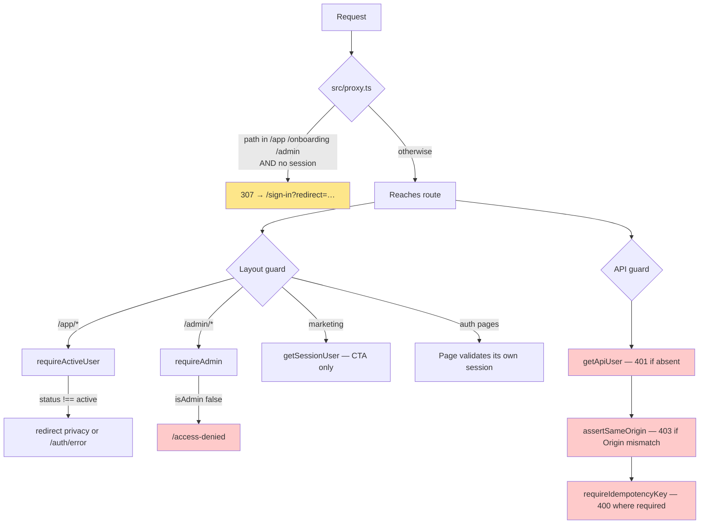
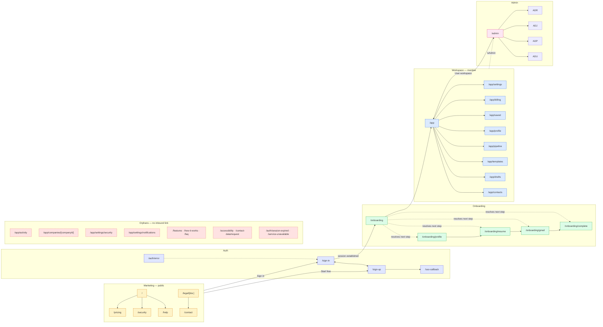
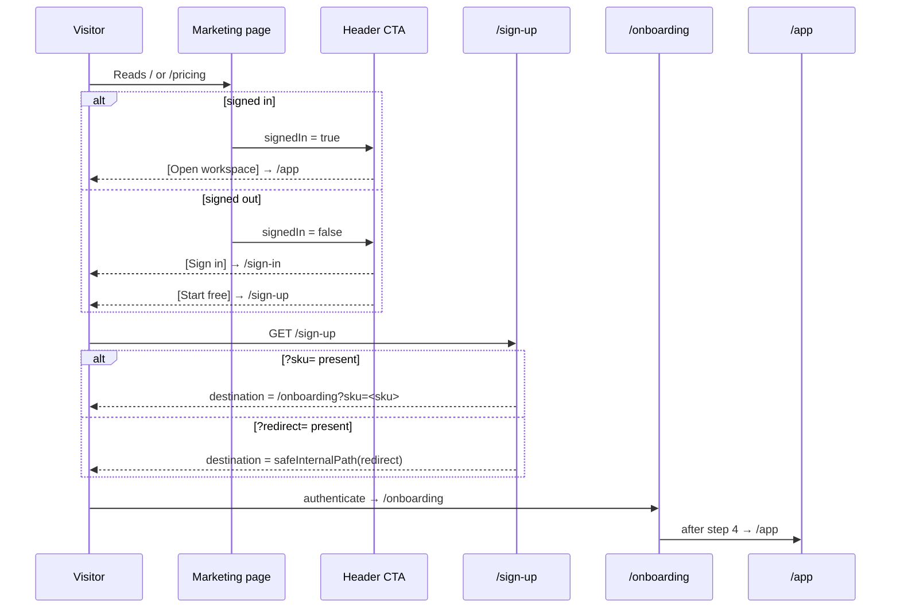
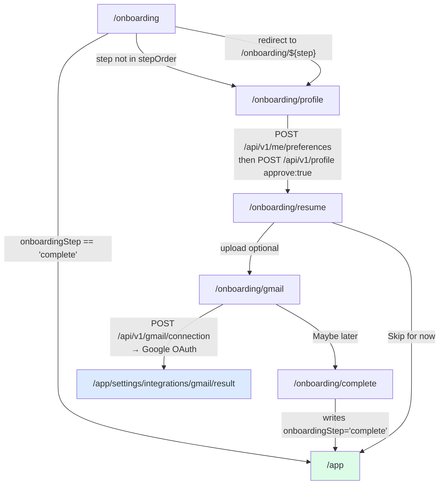
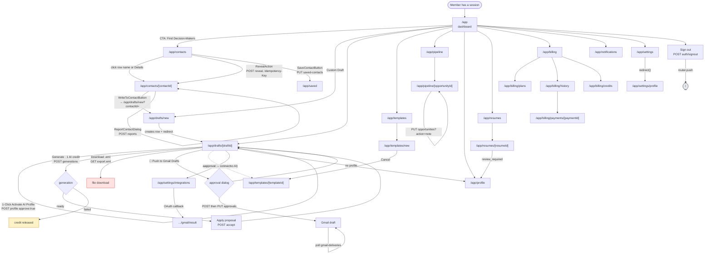

# ReachBee — Userflow

A route-accurate walkthrough of every user journey in the ReachBee web app, for someone new to the codebase.

**Scope.** All **64 page routes** (`src/app/**/page.tsx`) and **37 API routes** (`src/app/api/**/route.ts`).
Every page appears exactly once: in a journey, or in [Appendix A](#appendix-a--unreachable-routes). Route groups — `(marketing)` and `(auth)` — do not appear in the URL.

**How to read the badges.**

| Badge | Meaning |
| --- | --- |
| `EXERCISED` | I ran this path and observed the outcome. |
| `INFERRED` | Read from source; not run end to end. |
| `CONFIRMED DEFECT` | Reproduced in a production build. Not fixed. See [Appendix B](#appendix-b--confirmed-defects-current-state). |

> **Correction to earlier counts.** A previous pass reported "47 pages + 57 API routes." The accurate figures, from `find src/app -name page.tsx` (64) and `find src/app/api -name route.ts` (37), are used throughout this document. They reconcile with the production build manifest, which lists **103** entries: the 64 pages, the 37 API routes, plus `/_not-found` and `/icon.svg`.

---

## Table of contents

1. [Roles and entry points](#1-roles-and-entry-points)
2. [The gate stack](#2-the-gate-stack)
3. [Navigation / IA map](#3-navigation--ia-map)
4. [Journey 1 — Anonymous visitor](#journey-1--anonymous-visitor-on-marketing)
5. [Journey 2 — Authentication](#journey-2--authentication-sign-in-sign-out-session)
6. [Journey 3 — New signup through onboarding](#journey-3--new-signup-through-onboarding)
7. [Journey 4 — Signed-in member workspace](#journey-4--signed-in-member-workspace)
8. [Journey 5 — Admin](#journey-5--admin)
9. [Mermaid: main authenticated journey](#9-mermaid-main-authenticated-journey)
10. [State catalogue](#10-state-catalogue)
11. [Escape hatches](#11-escape-hatches-and-boundaries)
12. [Appendix A — Unreachable routes](#appendix-a--unreachable-routes)
13. [Appendix B — Confirmed defects](#appendix-b--confirmed-defects-current-state)
14. [Appendix C — API reference](#appendix-c--api-reference)
15. [What I could not verify](#what-i-could-not-verify)

---

## 1. Roles and entry points

Three roles, resolved server-side. There is no client-side role model.

| Role | How it is determined | Code |
| --- | --- | --- |
| **Anonymous** | No valid session | `getSessionUser()` returns `null` — `src/server/auth/session.ts:68` |
| **Member** | Session resolves to a `users` row with `status === "active"` | `requireActiveUser()` — `src/server/auth/session.ts:231` |
| **Admin** | Member **and** a `user_role_assignments` row with `role === "admin"` | `requireAdmin()` — `src/server/auth/session.ts:241` |

**Account statuses.** `users.status` gates entry independently of role. Anything other than `active` is refused:

```
requireActiveUser()  →  status === "deleting"  →  redirect("/app/settings/privacy")
                      →  any other non-active  →  redirect("/auth/error?reason=disabled")
```
`src/server/auth/session.ts:234-236`

### Entry points

| Entry | Behaviour | Evidence |
| --- | --- | --- |
| `/` | Marketing home. Always public. | `src/app/(marketing)/page.tsx` |
| Deep link to `/app`, `/onboarding`, `/admin` while signed out | **HTTP 307** to `/sign-in?redirect=<original path+query>` | `src/proxy.ts:22-37` — `EXERCISED` |
| Deep link while signed in but disabled | Redirected to `/app/settings/privacy` or `/auth/error?reason=disabled` | `src/server/auth/session.ts:234` — `INFERRED` |
| `/sign-in`, `/sign-up` while already signed in | Redirect to `/app` | `src/app/(auth)/sign-in/page.tsx:16`, `sign-up/page.tsx:16` — `INFERRED` |
| `src/proxy.ts` (Next 16 proxy/middleware) | Runs on pages **and** API routes so Clerk helpers see decorated request state | `src/proxy.ts:57-64` |
| Custom domain | **None.** `reachbee.sayalabs.in` is only a string used for outbound email links — `src/server/services/email.ts:95` | `EXERCISED` (grep) |

---

## 2. The gate stack

Guards apply at four independent layers. The proxy is explicitly *not* a security boundary — it is UX convenience only, and every page and service authorizes again server-side (`src/proxy.ts:5-8`).



### Gate reference

| Gate | File:line | Applies to | Failure mode | Verified |
| --- | --- | --- | --- | --- |
| `PROTECTED_PREFIXES = ["/app","/onboarding","/admin"]` | `src/proxy.ts:22` | All pages + API | 307 → `/sign-in?redirect=…` | `EXERCISED` |
| `requireActiveUser()` | `src/server/auth/session.ts:231` | **33 pages call it directly** — all 5 `/onboarding` pages, and 28 of the 30 `/app` pages. The two `/app` pages that omit the call are `/app/settings` (a bare `redirect()`) and `/app/settings/integrations/gmail/result`; both render nothing sensitive and are covered by the layout guard | Redirect | `EXERCISED` |
| `requireAdmin()` | `src/server/auth/session.ts:241` | `/admin/layout.tsx:15`, `admin-shell.tsx:20`, `admin/contacts/[contactId]/page.tsx:31,53` | See [DEF-1](#def-1--non-admin-admin-returns-http-200) | `EXERCISED` |
| `getApiUser()` | `src/server/auth/session.ts:249` | Most API routes — exact per-route split in [Appendix C](#appendix-c--api-reference) | `401 UNAUTHENTICATED` | `EXERCISED` |
| `assertSameOrigin(req)` | `src/server/http.ts` | All mutating API routes | `403 FORBIDDEN_ORIGIN` | `EXERCISED` |
| `requireIdempotencyKey(req)` | `src/server/http.ts:128` | Reveal, generations, orders | `400 IDEMPOTENCY_KEY_REQUIRED` | `EXERCISED` |
| `errorResponse(err)` message map | `src/server/http.ts:59-71` | Every API route | See [DEF-2](#def-2--eml-export-returns-http-500) | `EXERCISED` |

---

## 3. Navigation / IA map

Primary navigation is the workspace sidebar (`src/components/shell/app-shell.tsx:25-35`) plus the utility header. Marketing navigation is the header (`src/components/marketing/header.tsx:26-31`) and the footer (`src/components/ui/footer-25/index.tsx:36-45, 155-160`).



### Reachability verdict

The dashed red **Orphans** box in the diagram has **no inbound link anywhere in the repository** — no `href`, no `router.push`, no `redirect()`. Those pages are reachable only by typing the URL. Each is documented once, in [Appendix A](#appendix-a--unreachable-routes).

| Route | Why it is orphaned |
| --- | --- |
| `/app/activity` | Nothing links to it. `ActivityPage` is fully built and reads real ledger + delivery data. |
| `/app/companies/[companyId]` | Nothing links to it. The contact detail page renders company evidence inline (`src/app/app/contacts/[contactId]/page.tsx:84-100`) instead of linking. |
| `/app/settings/security` | No settings sub-navigation exists. `/app/settings` redirects straight to `/app/settings/profile`. |
| `/app/settings/notifications` | Same — no inbound link. |
| `/features`, `/how-it-works` | Header links point at the **anchors** `/#features` and `/#how-it-works` on `/`, not these pages. |
| `/faq` | Only referenced from `src/components/ui/navigation-5/index.tsx:190`, which is itself dead code. |
| `/accessibility` | No inbound link. |
| `/contact-data/request` | No inbound link; only links *out* to `/legal/contact-data`. |
| `/auth/session-expired` | No inbound link — nothing ever sends a user here. |
| `/service-unavailable` | No inbound link. |

---

## Journey 1 — Anonymous visitor on marketing

**Gate:** none. `src/app/(marketing)/layout.tsx:8` calls `getSessionUser().catch(() => null)` purely to swap the header CTA between "Start free" and "Open workspace". It never blocks.

**Shell:** every page in this journey renders inside `(marketing)/layout.tsx` → `MarketingHeader` + `MarketingFooter` + `MarketingMotion`.

### The visitor spine

A visitor enters at step 1 and may take any branch; the order below is the canonical path, and every step is reachable from the shared header/footer on any other. The journey's exit is step 7 (ask support) or the header CTA into [Journey 2](#journey-2--authentication-sign-in-sign-out-session).

| # | Route | Reached by | Guard | States here | API call |
| --- | --- | --- | --- | --- | --- |
| 1 | `/` | Direct arrival, or the footer wordmark | none — public | Populated; **degraded catalog** if the SKU list fails to load | none |
| 2 | `/pricing` | Header nav; footer (×2) | none | Same **degraded catalog** branch | none |
| 3 | `/security` | Footer (×2) | none | Static trust claims + badge states | none |
| 4 | `/help` | Footer; workspace sidebar bottom link | none | Empty → `EmptyState` "No articles yet" (`help/page.tsx:14-25`) | none |
| 5 | `/help/[slug]` | Clicking an article in step 4 | none | Article, or `notFound()` (`help/[slug]/page.tsx:19`) → [DEF-3](#def-3--soft-404s-notfound-returns-http-200) | none |
| 6 | `/legal/[doc]` | Footer (`/legal/privacy`, `/legal/terms`, `/legal/contact-data`); `/pricing` badges | none | Document, or `notFound()` (`legal/[doc]/page.tsx:20`) → [DEF-3](#def-3--soft-404s-notfound-returns-http-200) | none |
| 7 | `/contact` | Footer (×2); socials row; `/auth/error`; `src/app/error.tsx:33` | none | Always a form; **error** = per-field validation | `POST /api/v1/public?kind=support` |

**Degraded-catalog detail (steps 1–2).** When the catalog fails, `Pricing` renders "We show real prices only when our catalog loads. You can still sign in and use the free tools." — `src/components/marketing/landing.tsx:495-499`. Prices are never invented.

**Contact form validation.** `src/components/marketing/contact-form.tsx:35` posts to `POST /api/v1/public?kind=support`; a short message is rejected with a per-field error (`message: Too small: expected string to have >=20 characters`) rather than a generic failure. `EXERCISED`.

### Conversion path (marketing → app)



`?sku` is validated against `/^[a-z0-9_]+$/i` and takes priority over `?redirect` (`src/app/(auth)/sign-up/page.tsx:18-20`). Both `redirect` params pass through `safeInternalPath()` (`src/lib/validation.ts`), which rejects external origins.

### Dead-end CTAs on marketing

These are presentational only and accept input without acting on it:

- **Footer subscribe form** — `onSubmit={(e) => e.preventDefault()}` at `src/components/ui/footer-25/index.tsx:60`. The email is silently discarded on **every** marketing page, because the footer is in the shared layout.
- **Homepage `Newsletter1`** — the page passes `heading`, `subheading`, `placeholder`, `buttonText`, `disclaimer` but **no `onSubmit`** (`src/app/(marketing)/page.tsx:40-46`), so submitting performs a native GET and reloads the page.
- **Footer socials** — point at bare `https://x.com`, `https://linkedin.com`, `https://github.com` (`src/components/ui/footer-25/index.tsx:91-93`).

---

## Journey 2 — Authentication (sign in, sign out, session)

### The auth spine

Steps 1 → 2 → 3 form the happy path (returning visitor skips straight to step 1, new visitor detours through step 2). Step 4 is the terminal failure surface. **Exit from a session** is not a page: `SignOutButton` → `POST /api/v1/auth/signout` → `router.push("/")`.

| # | Route | Reached by | Guard at this step | States here | API call |
| --- | --- | --- | --- | --- | --- |
| 1 | `/sign-in` | Header "Sign in"; footer; **proxy 307** on any gated deep link; `/auth/error` retry | Session exists → `redirect("/app")` | **Clerk:** single Google button. **Dev adapter:** amber "Development build" notice + `DevSignInForm`. Carries `?redirect=` via `safeInternalPath` | `POST /api/v1/auth/dev-signin` (dev mode only) |
| 2 | `/sign-up` | Header "Start free"; step 1 footer link | Session exists → `redirect("/app")` | Same dual mode. Subtitle promises "Five contact reveals and two AI generations." | `POST /api/v1/auth/dev-signin` (dev mode only) |
| 3 | `/sso-callback` | `GoogleAuthButton` with `?next=` (`src/components/auth/google-auth-button.tsx:60`) | `if (authMode !== "clerk") redirect("/sign-in")` | Spinner + "Completing sign-in…". `next` re-validated via `safeInternalPath`; defaults `/app` (sign-in) or `/onboarding` (sign-up) | completes the Clerk round trip, then `GET /api/v1/me` |
| 4 | `/auth/error` | `session.ts:235` for a disabled account; `?reason=disabled` | none — public | Two messages by `reason`: `disabled` vs generic. Links to `/sign-in` and `/contact`. Deliberately leaks no account-existence signal | none |

**Where it hands off.** Step 1 with a valid session → `/app`. Step 2 → `/onboarding` ([Journey 3](#journey-3--new-signup-through-onboarding)). Step 3 → `/app` or `/onboarding` depending on `next`. Step 4 is terminal — its only way back into the product is step 1.

### Dev sign-in (local only)

`POST /api/v1/auth/dev-signin` — `src/app/api/v1/auth/dev-signin/route.ts:12-27`

```
403 FORBIDDEN  if (authMode !== "dev" || isProduction)
400 INVALID_INPUT  if email fails safeEmail
200 { data: { userId, mode: "email" } }
```

`devSignIn()` (`src/server/auth/session.ts:130`) provisions the user, grants the trial **once per identity fingerprint**, opens a 30-day session, sets an httpOnly `ab_session` cookie, and sends a welcome email only when the trial was actually granted. `GET` on the same route returns `{ signedIn: boolean }`.

`EXERCISED`: signing in as a new address returned `200` with balances `{ contact: { available: 5 }, ai: { available: 2 } }` via `GET /api/v1/me`.

### Sign-out

`SignOutButton` (`src/components/shell/sign-out.tsx:16`) → `POST /api/v1/auth/signout` → `signOut()` (`src/server/auth/session.ts:194`) deletes the session row, clears the cookie, and — in Clerk mode — revokes the Clerk session via `clerkClient().sessions.revokeSession()` so the user is not silently signed back in. Then `router.push("/")`.

### Session expiry

The user is **never** routed to `/auth/session-expired` by application code — see [Appendix A](#appendix-a--unreachable-routes). The proxy's real behaviour on a dead session is a 307 to `/sign-in?redirect=<original>` (`src/proxy.ts:30-37`). `EXERCISED`.

---

## Journey 3 — New signup through onboarding

**Gate:** `requireActiveUser()` on every step. `/onboarding` is a **resolver**, not a page.



`/onboarding/page.tsx:5-11`. The step order is `["profile","resume","gmail","preferences","complete"]`.

> **Latent dead end — `INFERRED`.** `"preferences"` is in `stepOrder` but **no `/onboarding/preferences` page exists**, so a user whose `onboarding_step` were `"preferences"` would be redirected to a 404. Unreachable today because `onboarding_step` is only ever written as `"complete"` (`src/app/onboarding/complete/page.tsx:14`) and defaults to `"profile"` (`src/db/schema.ts:39`). The column is unconstrained free text.

### The onboarding spine

Strictly sequential: every step has exactly one forward exit except step 3, which offers a second. Entry is from [Journey 2](#journey-2--authentication-sign-in-sign-out-session) step 2 or 3; **exit is step 5 → `/app`**, which is step 3 of the [Journey 4](#journey-4--signed-in-member-workspace) spine.

| # | Route | Reached by | Guard at this step | States here | API call |
| --- | --- | --- | --- | --- | --- |
| 1 | `/onboarding` | `sso-callback` sign-up default; `/sign-up?sku=` | `requireActiveUser()` | **No UI** — always redirects. `complete` → `/app`; unknown step → step 2; else → `/onboarding/${step}` | none |
| 2 | `/onboarding/profile` | Step 1 resolution; progress bar | `requireActiveUser()` | Form: display name, career stage (4 options), target roles (comma-separated), preferred locations. **Error:** `role="alert"` "Saving failed…". **Busy:** button → "Saving…" | `PATCH /api/v1/me/preferences` then `POST /api/v1/profile` (`approve: true`) |
| 3 | `/onboarding/resume` | Step 2 submit → `router.push` (`onboarding-steps.tsx:73`) | `requireActiveUser()` | Optional. Upload zone + confirmation. **Two exits:** "Skip for now" → `/app`; "Continue" → step 4 | `POST /api/v1/uploads/resume` (optional) |
| 4 | `/onboarding/gmail` | Step 3 "Continue" | `requireActiveUser()` | **Connected:** redirects to Google. **Declined:** amber alert, still proceeds. **Unavailable:** `catch` → "Gmail connection isn't available…". "Maybe later" → step 5 | `POST /api/v1/gmail/connection` (`returnPath: "/onboarding/complete"`) |
| 5 | `/onboarding/complete` | Step 4 "Maybe later", or the OAuth callback `returnPath` | `requireActiveUser()` | **Side effect on GET:** `setOnboardingStep(user.id, "complete", true)` runs during render (`page.tsx:14`). Shows real balances, then links to `/app/contacts` and `/app` | writes `users.onboarding_step` |

**Profile step does two writes** (`src/components/auth/onboarding-steps.tsx:16-73`): `PATCH /api/v1/me/preferences`, then `POST /api/v1/profile` with `approve: true` and two seeded facts. The source comment records that this previously posted to a non-existent `/api/v1/profile/revisions` and silently 404'd, leaving every AI generation failing with `NO_CONFIRMED_FACTS`.

---

## Journey 4 — Signed-in member workspace

**Gate:** `requireActiveUser()` in `src/app/app/layout.tsx:15` runs before any page body renders. `AppShell` calls it again (`src/components/shell/app-shell.tsx:21`).

**Persistent chrome:** sidebar (7 primary + 3 bottom), credit strip linking to `/app/billing/credits?type=contact` and `?type=ai`, utility header with "Create an introduction" → `/app/drafts/new`, bell → `/app/notifications`, and an `Admin` button rendered **only** when `user.isAdmin`.

### 4.1 The workspace spine — one pass, entry to exit

Read the steps top to bottom: this is the order a member actually moves through the product, starting at sign-in. Steps 1–2 are sign-in and onboarding, which [Journey 2](#journey-2--authentication-sign-in-sign-out-session) and [Journey 3](#journey-3--new-signup-through-onboarding) already document node by node — this table links to those nodes rather than redeclaring their routes. Steps 3–6 take a contact from search to a paid reveal to a saved record; steps 7–9 take it from a draft through AI generation to an exported file; steps 10–17 build the reusable assets and the pipeline; steps 18–22 are the money loop; steps 23–28 are the account tail. Every step carries the guard it hits and the API it calls. Per-area detail hangs off each step range in [§4.2](#42-steps-34--contacts-search) onward.

**Entry condition.** A guest arriving at any `/app`, `/onboarding` or `/admin` URL has already been 307'd by the proxy to `/sign-in?redirect=…` — that redirect is step 1. After authenticating, a new member runs step 2; a returning member enters at step 3.

| # | Route | Reached by | Guard at this step | States here | API call |
| --- | --- | --- | --- | --- | --- |
| 1 | _[Journey 2](#journey-2--authentication-sign-in-sign-out-session) step 1_ | Proxy **307** on any gated deep link; header "Sign in"; `/auth/error` retry | The page validates its own session — no workspace guard | Dual mode: Clerk single Google button, or dev adapter with `DevSignInForm`. Carries `?redirect=` through `safeInternalPath` | `POST /api/v1/auth/dev-signin` (dev mode only) |
| 2 | _[Journey 3](#journey-3--new-signup-through-onboarding)_ | Step 1 via sign-up; `?sku=` from the pricing CTA; `sso-callback` default | `requireActiveUser()` | Resolver renders no UI: `complete` → `/app`, unknown step → `/onboarding/${step}` | none — the page never calls an endpoint |
| 3 | `/app` | Onboarding complete; sidebar "Overview"; `FinalCta`; 404 page | `requireActiveUser()` (layout + shell) | Populated / empty-drafts / no-reminders / 3 next-step variants | `GET /api/v1/me` |
| 4 | `/app/contacts` | Step 3 "Find Decision-Makers"; sidebar; empty states elsewhere | `requireActiveUser()` | Empty / locked / unlocked / paginated / loading | `GET /api/v1/contacts` |
| 5 | `/app/contacts/[contactId]` | Step 4 row name or "Details" | `requireActiveUser()` | `notFound()` / verified / catch-all / stale | `GET /api/v1/contacts/{id}` |
| 5a | *(no page)* **Reveal — spends 1 contact credit** | "Reveal" on a locked row, from step 4 or 3 | `assertSameOrigin` + **`Idempotency-Key` required** | Success / `400 IDEMPOTENCY_KEY_REQUIRED` / out of credits `409` / `RATE_LIMITED` | `POST /api/v1/contacts/{id}/reveal` |
| 6 | `/app/saved` | "Save" from step 5 (writes first) | `requireActiveUser()` | Empty / populated / tombstone | `PUT /api/v1/saved-contacts/{id}` |
| 7 | `/app/drafts` | Sidebar; step 3 "All drafts" | `requireActiveUser()` | Empty / populated / `generating` | `GET /api/v1/drafts` |
| 8 | `/app/drafts/new` | Header "Create an introduction"; step 7 empty state; step 5 "Write to contact" | `requireActiveUser()` | **No UI** — creates a row then redirects; every visit mints a new draft | `POST /api/v1/drafts` |
| 9 | `/app/drafts/[draftId]` | Step 8 redirect; step 7 row; step 3 recent list | `requireActiveUser()` | Compose / generating / proposal-ready / conflict / delivery / export — see the state machine in [§4.5](#45-steps-89--drafts-compose--generate--edit--export) | `GET`, `PATCH`, `DELETE /api/v1/drafts/{id}`; `POST …/generations`; `POST /api/v1/generations/{id}/accept`; `GET /api/v1/drafts/{id}/export.eml` (download) — [DEF-2](#def-2--eml-export-returns-http-500) |
| 10 | `/app/templates` | Sidebar | `requireActiveUser()` | Empty / populated | `GET /api/v1/templates` |
| 11 | `/app/templates/new` | Step 10 "New template" | `requireActiveUser()` | Create form | `POST /api/v1/templates` |
| 12 | `/app/templates/[templateId]` | Step 10 row | `requireActiveUser()` | Edit / `notFound()` / save-redirect | `PATCH /api/v1/templates/{id}` |
| 13 | `/app/resumes` | Step 14 breadcrumb; upload flows. **Not in the sidebar** | `requireActiveUser()` | Empty / 9 machine states / degraded-scanner warning | `GET /api/v1/resumes`, `POST /api/v1/uploads/resume` |
| 14 | `/app/resumes/[resumeId]` | Step 13 filename | `requireActiveUser()` | `notFound()` / download-gated / `review_required` → step 15 | `GET /api/v1/resumes/{id}/download`, `DELETE /api/v1/resumes` |
| 15 | `/app/profile` | Step 14 `review_required` card; sidebar; step 3 next-step; step 9 profile warning | `requireActiveUser()` | Unapproved / reviewable / none / superseded | `GET`,`POST`,`PUT /api/v1/profile` |
| 16 | `/app/pipeline` | Sidebar; step 3 "Open pipeline" | `requireActiveUser()` | Empty / board grouped by stage | `GET /api/v1/opportunities` |
| 17 | `/app/pipeline/[opportunityId]` | Step 16 card; step 3 reminders | `requireActiveUser()` | `notFound()` / stage controls / notes list | `PATCH`,`PUT`,`DELETE /api/v1/opportunities?id=` |
| 18 | `/app/billing` | Sidebar; user menu; credit strip | `requireActiveUser()` | Balances / catalog-unavailable warning | `GET /api/v1/billing` |
| 19 | `/app/billing/plans` | Step 18 card or "Buy a pack" | `requireActiveUser()` | Catalog-unavailable / trial / pack grid / sandbox | `POST /api/v1/billing/orders` |
| 20 | `/app/billing/history` | Step 18 "Payments" | `requireActiveUser()` | Empty / paid / being-confirmed | `GET /api/v1/billing` |
| 21 | `/app/billing/payments/[paymentId]` | Step 20 "Details"; step 19 checkout redirect | `requireActiveUser()` | fulfilled / pending / cancelled / failed / awaiting | `POST /api/v1/billing/orders/{id}/verify` |
| 22 | `/app/billing/credits` | Credit strip (×2); step 18 "Credit ledger" | `requireActiveUser()` | Empty / filtered (All, Contact, AI) | `GET /api/v1/billing` |
| 23 | `/app/notifications` | Header bell | `requireActiveUser()` | Empty / unread / read | `PATCH /api/v1/notifications` (`action=read`\|`dismiss`) |
| 24 | `/app/settings` | Sidebar; user menu | `requireActiveUser()` | **No UI** — redirects; returns HTTP 200, not 307 | — |
| 25 | `/app/settings/profile` | Step 24 redirect | `requireActiveUser()` | Form; missing prefs silently default | `PATCH /api/v1/me/preferences` |
| 26 | `/app/settings/privacy` | Redirect for `status === "deleting"` | `requireActiveUser()` | Active / in-deletion | `POST /api/v1/privacy` |
| 27 | `/app/settings/integrations` | Step 3 Gmail next-step; step 9 approvals; step 28 back-link | `requireActiveUser()` | Connected / not connected / delivery history | `POST`,`DELETE /api/v1/gmail/connection` |
| 28 | `/app/settings/integrations/gmail/result` | Step 27 OAuth callback redirect | `requireActiveUser()` | 6 mapped outcomes + generic fallback | `GET /api/v1/gmail/callback` (the producer) |

**Exit.** The member leaves the workspace by signing out (`SignOutButton` → `POST /api/v1/auth/signout` → `router.push("/")`) or by a proxy 307 on the next request after their session dies. Two exits are *not* in the table because they are not workspace pages: `/access-denied` (step 16/17 attempted as a non-admin) and the 404 boundary.

**Where the thread loops.** Steps 5a → 6 → 7 → 14 form the repeatable core: reveal an address, write to it, track it. Step 22 feeds steps 5a and 7 (credits in, credits spent); steps 18–22 replenish. Steps 13–15 feed step 9 (a confirmed profile is a precondition for generation).

### 4.2 Steps 3–4 — Contacts search

**Step 3, the dashboard.** Three balance cards read `getBalances()`: contact reveals, AI generations, Gmail status (`connected` / `Sandbox mode` / `Not connected`). The next-step card is data-driven:

| State | Trigger | Render |
| --- | --- | --- |
| Next step: profile | `!hasApprovedProfile(user.id)` | Card → `/app/profile` |
| Next step: Gmail | `FEATURE_GMAIL_ENABLED && !connection && gmailMode === "live"` | Card → `/app/settings/integrations` |
| Next step: contacts | neither of the above | Card → `/app/contacts` |
| Empty drafts | `recentDrafts.length === 0` | `EmptyState` "No drafts yet" → `/app/drafts/new` (`page.tsx:150-158`) |
| Populated drafts | otherwise | Last 5, with `generating` badge (`page.tsx:163-172`) |
| No reminders | `reminders.length === 0` | Text prompt; no CTA to create one (`page.tsx:183`) |
| Reminders | otherwise | Up to 5 → `/app/pipeline/${r.id}` |

**Step 4, search.** **Empty:** `EmptyState` "No matching contacts" → `/app/drafts/new` (`page.tsx:85-94`). **Loading:** `<Suspense>` skeleton around `SearchToolbar` only (`page.tsx:81-83`). **Locked row:** `RevealAction`. **Unlocked row:** address shown + "Unlocked" badge. **Paginated:** "Load more" preserves all filters, drops `cursor`. **Responsive:** desktop table (`md:block`) and mobile cards (`md:hidden`) render the same fields (`page.tsx:98-197`).

**Filters** — `SearchToolbar` (`src/components/directory/search-toolbar.tsx`) writes to the URL via `router.replace(..., { scroll: false })`, so results are shareable. Consumed at `page.tsx:47-56`: `q`, `dept`, `role`, `location`, `stage`, `verification`, `cursor`. Page size fixed at 25.

### 4.3 Steps 5–5a–6 — Reveal and save

**Step 5, contact detail.** `notFound()` if absent (`page.tsx:17`). Verification `StatusChip` incl. "Catch-all domain". "Employment may have changed" chip when `status === "stale"`. Company evidence panel; `.catch(() => null)` at `page.tsx:20` degrades gracefully. Actions: Save, Write (unlocked only), Report.

**Step 5a, reveal costs 1 contact credit.** `POST /api/v1/contacts/[id]/reveal` requires `Idempotency-Key` (`requireIdempotencyKey`, `http.ts:128`; missing → `400 IDEMPOTENCY_KEY_REQUIRED` — `EXERCISED`). Reopening is always free. The composer shows "Email locked — reveal in directory before Gmail delivery" while locked.

**Step 6, save.** `PUT /api/v1/saved-contacts/{id}` (aliased by `PATCH`); unsave is `DELETE`. Both require same-origin.

`/app/saved` renders in three states: **Empty** — `EmptyState` "Nothing saved yet" → `/app/contacts` (`page.tsx:20-29`). **Populated** — each row links back to the contact detail **unless it is a tombstone**; an unavailable record renders as plain text plus an "Unavailable" badge and an explanation that unlock history is preserved (`page.tsx:36-52, 60`), with Save and Write hidden. **Error** — no per-page boundary; falls through to `src/app/error.tsx`.

**Report / bounce refund** — available from step 5. `POST /api/v1/contacts/[id]/reports`. `reportType: "bounced"` routes to `reportBounceAndRefund()` and issues a replacement credit; other types (`stale`, `incorrect`, `removal`, `abuse`) go to `reportContact()` (`src/app/api/v1/contacts/[id]/reports/route.ts:21-31`). The composer's "Bounce Guarantee" claim is therefore backed by real code. `INFERRED` — not executed.

### 4.4 Step 7 — Drafts list

**Empty:** `EmptyState` "No drafts yet" → `/app/drafts/new`. Filters `status !== "deleted"` (`page.tsx:15`). Each row carries its mode, version, relative update time, and a `generating` badge while AI runs.

### 4.5 Steps 8–9 — Drafts: compose → generate → edit → export

**Step 8** renders **no UI**. It creates a draft then `redirect()`s to step 9 (`page.tsx:26-39`). It accepts `?contactId=` (UUID-validated), `?mode=` ∈ manual/quick_ai/agentic (default `quick_ai`), and `?intent=` ∈ advertised_role/internship/intro/referral/follow_up (default `intro`). **Every visit creates a row** — refreshing mints a new draft.

**Step 9** is `notFound()` if the draft is absent **or** `status === "deleted"` (`page.tsx:17`), then renders `Composer` (`src/components/composer/composer.tsx`) — the highest-density surface in the app:

| Region | States |
| --- | --- |
| Recipient rail | none set → inline "Set recipient" form (name + email, validated `/^[^\s@]+@[^\s@]+\.[^\s@]+$/`); directory-locked → warning badge; set → summary with Change / Clear. `rcptError` renders `role="alert"`. |
| Mode | `manual` / `quick_ai` / `agentic` tablist, `aria-selected` |
| Autosave | debounced 800 ms, version-checked. `idle` → "Unsaved changes", `saving`, `saved`, `error` → "Save failed — retrying on next edit", `conflict` → "Conflicting changes" + dialog |
| Intent | 5 options; `follow_up` adds a warning that the draft will not claim an email was sent |
| Profile gate | `!profileReady` → warning + **"1-Click Activate AI Profile"** which POSTs `/api/v1/profile` with `approve: true` |
| Generate | Disabled unless `ai.available > 0 && recipient !== null && !generationInFlight && profileReady`. `generationInFlight` covers queued/reserved/preparing/generating so a double-click cannot double-charge |
| Generation | `queued`/`reserved`/`preparing` → "Preparing…"; `generating` → "Writing your introduction…"; `ready`+`pending` → proposal card with Apply / Dismiss; `failed` → `failureMessage`; `cancelled`/`released` → "Cancelled — credit released"; after accept/dismiss → "Start another revision" |
| Polling | Bounded: 20 polls, 2 s → 10 s backoff, skips while `document.hidden`, aborts on unmount (`AbortController`). Exhaustion → "Still working on it. Reopen this draft in a moment." |
| Approval dialog | Lists recipient, mailbox, subject, attachment, body preview. Green banner: "Nothing will be sent." |
| Conflict dialog | "Reload latest" / "Copy my text" — never overwrites |
| Delivery | `created` → success; `unknown`/`reconciling` → spinner + "Check again"; `needs_confirmation` → warning + "Create a new draft anyway (may duplicate)"; `known_failed`/`blocked` → failure message + Try again; otherwise "Creating draft in Gmail…" |
| Export | **Unconditional** `<a href={…/export.eml}>` — this is what surfaces [DEF-2](#def-2--eml-export-returns-http-500) |

**Delivery is deliberately absent as an automatic step:** with Gmail connected the primary button is "🚀 Push to Gmail Drafts" which opens the approval dialog; `POST` then `PUT /api/v1/drafts/[id]/approvals` perform approve → deliver, and delivery is polled at `GET /api/v1/gmail-deliveries/[id]`.

There is **no Send button anywhere** — stated explicitly in the editor footer.

### 4.6 Steps 10–12 — Templates

Applying a template is deterministic and free — it never calls AI (`page.tsx:19`). **Step 10 empty state** suggests `{{recipient_first_name}}` / `{{achievement}}` placeholders. **Step 11** renders `TemplateEditor` with `templateId={null}`; `POST /api/v1/templates` creates and `router.push` lands on step 12 (`template-editor.tsx:53`). **Step 12** is `notFound()` if absent (`page.tsx:18`); its query is scoped `and(eq(templates.id, …), eq(templates.userId, user.id))`, and it renders with sample placeholder values so previews are never empty.

### 4.7 Steps 13–14 — Resumes

**Step 13** has an **empty** `EmptyState` and nine labelled machine states (`page.tsx:13-22`): `uploaded`, `scanning`, `scanning_rejected`, `parsing`, `review_required`, `ready`, `parse_failed`, `failed`. When `DOCUMENT_PROCESSOR_ENDPOINT` is unset a **degraded** warning card explains that files get structural validation only and that no malware scan runs — labelled a launch gate (`page.tsx:70-80`).

Upload is `POST /api/v1/uploads/resume` (+ `PUT`). **Step 14** is `notFound()` (`page.tsx:17`); download is `GET /api/v1/resumes/[id]/download`, ownership-checked and scan-gated, and the button is disabled unless `scanStatus === "clean"`. The file is never publicly linkable. Delete is `DELETE /api/v1/resumes` (soft state transition). A `review_required` resume pushes the member to step 15.

### 4.8 Step 15 — Career profile

Three-way state (`page.tsx:23-69`): **unapproved revision** → amber "Parsed resume awaiting review"; **reviewable** → `ProfileFactsEditor`; **none** → "No profile yet". When a newer revision exists than the one being reviewed, a fourth "Current approved revision" card renders below. Approval is what unlocks AI drafting at step 9.

### 4.9 Steps 16–17 — Pipeline / opportunities

**Step 16 empty:** `EmptyState` "No opportunities yet" + `NewOpportunityButton` (`page.tsx:28-33`); **populated:** `PipelineBoard` grouped by stage. **Step 17** is `notFound()` (`page.tsx:16`). Job URL opens in a new tab with `rel="noopener noreferrer"`. `StageControls` moves stage / sets `nextActionAt`. Notes: `NotesComposer` PUTs then calls `window.location.reload()` — a full page reload, not a router refresh (`page.tsx:82`); empty notes → "No notes yet."

**Stages** (`src/server/services/opportunities.ts:17-25`): `interested` → `draft_ready` → `applied_or_contacted` → `conversation` → `interview` → `offer` → `closed`.

Opportunity CRUD all lives on **one** endpoint, discriminated by HTTP method and an `?id=` query param — `GET` list, `POST` create (201), `PATCH` update, `DELETE` remove, `PUT` add note (all on `/api/v1/opportunities`). `INFERRED` — not executed.

The product position is explicit in UI copy: stages are self-reported, ReachBee does not read the inbox, and draft creation never implies "contacted".

### 4.10 Steps 18–22 — Billing and credits

**Step 18** shows two balance cards and three sub-links; **catalog unavailable** gives an explicit warning "Catalog temporarily unavailable — purchases are paused honestly rather than showing invented prices" (`page.tsx:77`). **Step 19** on catalog failure shows a warning card with no invented prices; otherwise a trial card from `free_trial_v1` plus a pack grid where `CheckoutLauncher` is gated on `FEATURE_LIVE_PURCHASES_ENABLED \|\| paymentsMode === "mock"`, with sandbox mode labelled. **Step 20 empty:** `EmptyState`; it joins orders to payments and shows "Being confirmed" for pending so nobody pays twice. **Step 21** accepts **either** an order id or a payment id (`page.tsx:20`) across five statuses — fulfilled, pending, cancelled, failed, awaiting — and on fulfilled shows granted quantities and current balances. **Step 22** is an append-only ledger, 100 rows, filterable All / Contact / AI, empty → "No entries yet.", across ten ledger kinds (`page.tsx:9-19`).

Checkout: `CheckoutLauncher` → `POST /api/v1/billing/orders` → `router.push('/app/billing/payments/${orderId}')` (`checkout-launcher.tsx:57`), with a mock-mode 800 ms fallback (`:85`). `POST /api/v1/billing/orders/[id]/verify` reconciles. Webhook at `POST /api/webhooks/razorpay`. Fulfillment is idempotent — exactly-once credit grant regardless of which signal arrives. `INFERRED` — not executed.

### 4.11 Steps 23–28 — Notifications and settings

**Step 23 empty:** `EmptyState` "All clear". Read items render at `opacity-80` and lose the "New" badge; `NotificationActions` calls `PATCH /api/v1/notifications` with `action=read` or `action=dismiss` (`src/app/api/v1/notifications/route.ts:26-27`). **Step 24** renders no UI and redirects to step 25; **confirmed** to return HTTP 200 rather than 307 — see [DEF-3](#def-3--soft-404s-notfound-returns-http-200). **Step 25** is a `SettingsForm` covering display name, timezone, career stage, default mode, `notifyReminders`, `notifyProduct`, `dailyDigestEnabled`, written via `PATCH /api/v1/me/preferences`; missing prefs fall back to defaults (`page.tsx:20-25`) rather than showing an error. **Step 26** offers export and delete via `ExportDeletionPanel`, states plainly what survives deletion, and branches its footer text on `user.status === "deleting"`; `POST /api/v1/privacy` runs exports as durable jobs, one per day, with 24 h availability. **Step 27** shows Gmail connection status, scope badges, connection version, and recent deliveries with per-state chips; `POST /api/v1/gmail/connection` starts OAuth and `DELETE` disconnects. **Step 28** maps six outcomes (`connected`, `declined`, `partial_scope`, `state_invalid_or_expired`, `invalid_grant`, `access_denied`) plus a generic fallback that echoes the raw key, and states that no tokens or state params remain in the URL — **confirmed 200 for both success and error queries**, `EXERCISED`.

> **Settings has no sub-navigation.** `/app/settings` redirects straight to `/app/settings/profile`, and `/app/settings/profile` renders no list of sibling sections. The other two pages are therefore unreachable — [Appendix A](#appendix-a--unreachable-routes).

---

## Journey 5 — Admin

**Gate:** `requireAdmin()` in `src/app/admin/layout.tsx:15`. `AdminShell` calls it again (`src/components/admin/admin-shell.tsx:20`). Non-admin → `/access-denied`.

`AdminShell` renders its own chrome: black header, "Admin workspace" + **Operator** badge, "User workspace" link back to `/app`, and a 9-item sidebar that is **not** the member sidebar.

| # | Route | Reached by | Guard at this step | Purpose | Empty state |
| --- | --- | --- | --- | --- | --- |
| 1 | `/admin` | Header "Admin" button (rendered only when `user.isAdmin`) | `requireAdmin()` in `admin/layout.tsx:15` + `admin-shell.tsx:20` | Operational triage: 4 metric cards (credit consistency, uncertain Gmail outcomes, unfulfilled payments > 5 min, open contact reports) + job queue by state. Calls `verify_credit_consistency()` | "Queue empty" badge (`page.tsx:36`) |
| 2 | `/admin/jobs` | Step 1 — **two** metric cards link here | `requireAdmin()` | Kind / state / attempts / error / updated | `jobs.length === 0` (`:50`) |
| 3 | `/admin/payments` | Step 1 metric card | `requireAdmin()` | Provider payment / user / amount / state / grants, plus webhook events | `payments.length === 0` (`:58`), "No webhook events received." (`:77`) |
| 4 | `/admin/reports` | Step 1 metric card | `requireAdmin()` | Contact reports queue — where contact-data requests land | `reports.length === 0` (`:45`) |
| 5 | `/admin/contacts` | Sidebar | `requireAdmin()` | Contact table: contact / company / status / verification / email checked | **None — [DEF-4](#def-4--three-admin-list-pages-render-an-empty-table)** |
| 6 | `/admin/contacts/[contactId]` | Step 5 row | `requireAdmin()` again, inline (`:31`, `:53`) | Full record, source rows, verification history | `notFound()` (`:22`); two inline empty fallbacks (`:105`, `:117`) |
| 7 | `/admin/companies` | Sidebar | `requireAdmin()` | Company / domain / stage / evidence / contacts | **None — [DEF-4](#def-4--three-admin-list-pages-render-an-empty-table)** |
| 8 | `/admin/users` | Sidebar | `requireAdmin()` | Email / status / reveals / AI / drafts | **None — [DEF-4](#def-4--three-admin-list-pages-render-an-empty-table)** |
| 9 | `/admin/audit-log` | Sidebar | `requireAdmin()` | Action / actor / entity / reason / when | `events.length === 0` (`:43`) |
| 10 | `/admin/config` | Sidebar | `requireAdmin()` | Feature flags & adapters (on/off badges), company evidence freshness | n/a |

**Operator rhythm.** Step 1 is triage and it is the only page with outgoing metric links; steps 2–4 are the queues those links reach and are what an operator works first. Steps 5–8 are directory and account inspection (5 → 6 drill-down), and 9–10 are the read-only forensic tail. **Exit** is the header's "User workspace" link back to `/app`, or sign-out. A non-admin who reaches any step is diverted to `/access-denied` — see [DEF-1](#def-1--non-admin-admin-returns-http-200).

`/admin` is reachable from the member workspace **only** when `user.isAdmin` — the header renders the "Admin" button conditionally (`app-shell.tsx:105-109`). `EXERCISED`: as a non-admin the response was HTTP 200 carrying the access-denied UI — [DEF-1](#def-1--non-admin-admin-returns-http-200).

---

## 9. Mermaid: main authenticated journey

The five journeys a returning member actually walks, with every edge annotated by its trigger.



---

## 10. State catalogue

Where each state class is produced, app-wide.

| State | Mechanism | Files |
| --- | --- | --- |
| **Loading** (root) | `SplashScreen` | `src/app/loading.tsx` |
| **Loading** (workspace) | `SplashScreen fullScreen={false}` | `src/app/app/loading.tsx` |
| **Loading** (inline) | `<Suspense>` skeleton | `app/contacts/page.tsx:81` |
| **Empty** | `EmptyState` primitive | 10 pages: contacts, saved, drafts, templates, resumes, pipeline, notifications, billing/history, billing/credits, billing/plans, help |
| **Error boundary** | `reset()` + digest reference + `/contact` link | `src/app/error.tsx` |
| **Global error** | Inline-styled, no theme | `src/app/global-error.tsx` |
| **Not found** | `notFound()` → `not-found.tsx`, links to `/` and `/app` | 10 call sites; see [DEF-3](#def-3--soft-404s-notfound-returns-http-200) |
| **Gated — signed out** | proxy 307 → `/sign-in?redirect=…` | `src/proxy.ts:30` |
| **Gated — disabled** | redirect → `/auth/error?reason=disabled` | `session.ts:235` |
| **Gated — deleting** | redirect → `/app/settings/privacy` | `session.ts:235` |
| **Gated — non-admin** | redirect → `/access-denied` | `session.ts:242` |
| **Degraded** (catalog) | Warning copy, no invented prices | `landing.tsx:495`, `billing/page.tsx:77`, `billing/plans/page.tsx:27` |
| **Degraded** (scanner) | "Local development scanner" card | `app/resumes/page.tsx:70` |
| **Degraded** (Gmail mock) | "Sandbox mode" labels | `app/page.tsx:130`, `composer.tsx` |
| **In-flight** | `generating` badges; bounded polling with backoff | `app/page.tsx:171`, `app/drafts/page.tsx:49`, `composer.tsx` |

---

## 11. Escape hatches and boundaries

| # | Route | Surface | Orphan? | Purpose |
| --- | --- | --- | --- | --- |
| 1 | `/access-denied` | Forbidden | no | Non-admin hitting `/admin`. Explicitly states "hidden navigation is not a security boundary". Links to `/app`. |

Two further boundary surfaces — the 503 maintenance page and the session-expired re-auth page — have **no inbound link** and are declared once, in [Appendix A](#appendix-a--unreachable-routes). They are cross-referenced here rather than treated as journey nodes.

Other boundaries reached during a journey, with no URL of their own:

| Boundary | Purpose |
| --- | --- |
| `not-found.tsx` | Rendered by `notFound()`. Links to `/` and `/app`. See [DEF-3](#def-3--soft-404s-notfound-returns-http-200). |
| `error.tsx` | Client error boundary: `reset()` + digest reference + link to `/contact`. |
| `global-error.tsx` | Root-level failure; inline-styled, no theme. |

And the response contract every API route funnels through:

| Boundary | Reference | Behaviour |
| --- | --- | --- |
| Auth failure | `/auth/error?reason=` | `disabled` vs generic. No account-existence signal. |
| API error map | `src/server/http.ts:59-71` | Stable code → status: `IDEMPOTENCY_KEY_REQUIRED` 400, `UNAUTHORIZED` 401, `FORBIDDEN` 403, `NOT_FOUND` 404, `DRAFT_DELETED` 410, `VERSION_CONFLICT`/`CONFLICT` 409, `RATE_LIMITED` 429, `UNAVAILABLE`/`TIMEOUT` 503, everything unmapped → 500. |

---

## Appendix A — Unreachable routes

Confirmed by grep across all `href=`, `router.push`, and `redirect()` call sites in `src/`. Each is listed exactly once here and appears nowhere else as a journey node.

| Route | File | What it does | How to reach it |
| --- | --- | --- | --- |
| `/app/activity` | `src/app/app/activity/page.tsx` | Chronology of credit ledger + Gmail deliveries, merged and sorted | Type the URL |
| `/app/companies/[companyId]` | `src/app/app/companies/[companyId]/page.tsx` | Company evidence + people at company | Type the URL (needs a real id) |
| `/app/settings/security` | `src/app/app/settings/security/page.tsx` | Account/sessions, Gmail authorization, data-request pointers | Type the URL |
| `/app/settings/notifications` | `src/app/app/settings/notifications/page.tsx` | Channel preferences, "what we will never send" | Type the URL |
| `/features` | `src/app/(marketing)/features/page.tsx` | Feature grid page | Type the URL — header links to the `/#features` anchor instead |
| `/how-it-works` | `src/app/(marketing)/how-it-works/page.tsx` | How-it-works page | Type the URL — header links to `/#how-it-works` |
| `/faq` | `src/app/(marketing)/faq/page.tsx` | FAQ page | Type the URL — the only reference is inside dead component `components/ui/navigation-5/index.tsx:190` |
| `/accessibility` | `src/app/(marketing)/accessibility/page.tsx` | Accessibility statement | Type the URL |
| `/contact-data/request` | `src/app/(marketing)/contact-data/request/page.tsx` | No-account data correction/removal request → `POST /api/v1/public?kind=contact-data-request` | Type the URL |
| `/auth/session-expired` | `src/app/(auth)/auth/session-expired/page.tsx` | Re-authentication after expiry | Type the URL — nothing routes here |
| `/service-unavailable` | `src/app/service-unavailable/page.tsx` | 503 maintenance page | Type the URL |

**Root cause.** No settings sub-navigation, no footer link for the secondary marketing pages, and no route ever targets the session-expiry or maintenance surfaces. Two marketing pages (`/features`, `/how-it-works`) are likely intended to be reachable but collide with anchors on `/`.

---

## Appendix B — Confirmed defects (current state)

Reproduced against a production build (`pnpm build` + `pnpm start`). **Not fixed in this pass.** Listed as observations.

> **Scoping.** Every claim, line number and quoted string here describes committed `HEAD`; the working tree has diverged since, so re-verify any citation before relying on it.

### DEF-1 — non-admin `/admin` returns HTTP 200

**Observed.** A signed-in non-admin requesting `/admin` receives **HTTP 200** with the access-denied UI. The RSC payload contains `NEXT_REDIRECT;replace;/access-denied;307;`, thrown only *after* the layout guard aborts. No admin chrome or PII is rendered (grep for `Admin workspace` / `Operator` → 0 hits).

**Also observed.** The payload leaked one metric card's props:

```
b0:{"label":"Credit consistency issues","value":0,"critical":false,"href":"/admin/jobs"}
```

so `src/app/admin/page.tsx:10-16` began executing its five cross-user aggregate queries before `requireAdmin()` aborted. The comment at `src/app/admin/layout.tsx:6-12` states the layout guard exists precisely to prevent this.

**Impact.** No data leak — the response is an access-denied page. But monitoring, crawlers and uptime checks see 200 for a 403, and cross-user aggregate queries run for unauthorized callers.

**Status.** `EXERCISED` — reproduced in dev and production. Whether *every* admin query completes before the throw is `INFERRED`: App Router renders layout and page concurrently, so ordering is not guaranteed.

### DEF-2 — `.eml` export returns HTTP 500

**Observed.** `GET /api/v1/drafts/{id}/export.eml` returns **HTTP 500** `INTERNAL` for any draft whose recipient has not been revealed. Reproduced in dev and production, twice each.

**Chain.**

1. `src/server/services/drafts.ts:376` — `const toEmail = data.recipient?.email ?? "undisclosed-recipient@invalid";`
2. `src/server/adapters/mime.ts:105` — `validateEmailAddress("undisclosed-recipient@invalid")` fails `/^[^\s@]+@[^\s@]+\.[^\s@]+$/` (no dot in the domain) and `buildMimeMessage` throws `INVALID_TO: invalid syntax` (`mime.ts:120`).
3. `src/server/http.ts:59-71` — no mapping for `INVALID_TO`, so it falls through to `apiError(500, "INTERNAL", …)`.

**Why it matters.** The **Download .eml** button in the composer is unconditional (`src/components/composer/composer.tsx`), so one click on any new or unrevealed draft produces a 500.

**Status.** `EXERCISED` — full chain confirmed by reproduction plus source trace.

### DEF-3 — soft 404s (`notFound()` returns HTTP 200)

**Observed.** Every `notFound()` raised inside a Server Component returns **HTTP 200** while rendering the 404 UI. Confirmed in a production build.

| Request | Expected | Actual |
| --- | --- | --- |
| `/nonexistent-xyz` | 404 | 404 ✓ |
| `/legal/nope` | 404 | **200** |
| `/help/nope` | 404 | **200** |
| `/app/contacts/{unknown-uuid}` | 404 | **200** |
| `/app/drafts/{unknown-uuid}` | 404 | **200** |
| `/app/companies/{unknown-uuid}` | 404 | **200** |
| `/app/billing/payments/nope` | 404 | **200** |

Body carries `NEXT_HTTP_ERROR_FALLBACK;404` and renders client-side.

**Same class of problem for redirects.** These also return 200 instead of 307:

| Request | Should be | Actual |
| --- | --- | --- |
| `/app/settings` (guest) | 307 | 307 ✓ *(proxy handles this one)* |
| `/app/settings` (member) | 307 | **200** |
| `/onboarding` | 307 | **200** |
| `/app/drafts/new` | 307 | **200** |
| `/admin` (non-admin) | 307 | **200** |

The proxy-issued 307s (`/app`, `/admin` while signed out) are correct; only redirects raised inside a Server Component are affected.

**Affected call sites.** `app/app/contacts/[contactId]/page.tsx:17` · `app/app/drafts/[draftId]/page.tsx:17` · `app/app/templates/[templateId]/page.tsx:18` · `app/app/resumes/[resumeId]/page.tsx:17` · `app/app/pipeline/[opportunityId]/page.tsx:16` · `app/app/companies/[companyId]/page.tsx:15` · `app/app/billing/payments/[paymentId]/page.tsx:21` · `app/admin/contacts/[contactId]/page.tsx:22` · `app/(marketing)/legal/[doc]/page.tsx:20` · `app/(marketing)/help/[slug]/page.tsx:19`.

**Status.** `EXERCISED` — reproduced against `next start`.

### DEF-4 — three admin list pages render an empty table

`src/app/admin/users/page.tsx:39`, `src/app/admin/companies/page.tsx:26` and `src/app/admin/contacts/page.tsx:39` render a `<tbody>` with no `{x.length === 0 ? …}` branch. Their siblings all have one — `admin/jobs:50`, `admin/payments:58`, `admin/reports:45`, `admin/audit-log:43`, `app/billing/credits:81`. On an empty table an operator sees a header row and nothing else. `INFERRED` — read from source, not exercised.

---

## Appendix C — API reference

37 route files under `src/app/api`. **25 of them call `getApiUser()`** and return `401` when the session is missing or the account is not `active`; the other 12 guard differently. The **Guards** column below is the single source for every route's guard — read it rather than any summary of it.

| Method(s) | Endpoint | Guards | Used by |
| --- | --- | --- | --- |
| `GET` | `/api/health/live` | none | Liveness |
| `GET` | `/api/health/ready` | none | Readiness (`{"status":"ready","database":"ok"}` — `EXERCISED`) |
| `POST`,`GET` | `/api/v1/auth/dev-signin` | `getSessionUser()` + dev-mode only | Sign-in form |
| `POST` | `/api/v1/auth/signout` | session cookie read directly | `SignOutButton` |
| `GET` | `/api/v1/me` | `getSessionUser()` | Balances + preferences |
| `PATCH` | `/api/v1/me/preferences` | `getSessionUser()` + origin | `SettingsForm`, onboarding step 1 |
| `GET`,`POST`,`PUT` | `/api/v1/profile` | session (+ origin on writes) | `ProfileFactsEditor`, composer 1-click activate, onboarding step 1 |
| `GET` | `/api/v1/contacts` | session | `/app/contacts` |
| `GET` | `/api/v1/contacts/[id]` | session | Contact detail |
| `POST` | `/api/v1/contacts/[id]/reveal` | session + origin + **Idempotency-Key** | `RevealAction` |
| `POST` | `/api/v1/contacts/[id]/reports` | session + origin | `ReportContactDialog` |
| `GET`,`POST` | `/api/v1/drafts` | session (+ origin) | `/app/drafts`, `/app/drafts/new` |
| `GET`,`PATCH`,`DELETE` | `/api/v1/drafts/[id]` | session (+ origin) | `Composer` autosave |
| `GET` | `/api/v1/drafts/[id]/export.eml` | session | Download .eml — [DEF-2](#def-2--eml-export-returns-http-500) |
| `POST` | `/api/v1/drafts/[id]/generations` | session + origin + Idempotency-Key | Generate button |
| `GET`,`POST` | `/api/v1/generations/[id]` | session | Generation polling / cancel |
| `POST` | `/api/v1/generations/[id]/accept` | session + origin | Apply / Dismiss |
| `POST`,`PUT` | `/api/v1/drafts/[id]/approvals` | session + origin | Approval dialog → delivery |
| `GET` | `/api/v1/gmail-deliveries/[id]` | session | Delivery polling |
| `POST` | `/api/v1/gmail-deliveries/[id]` | session + origin | `reconcile` / `recreate` |
| `GET`,`POST`,`DELETE` | `/api/v1/gmail/connection` | session (+ origin) | `GmailConnectPanel`, onboarding step 3 |
| `GET` | `/api/v1/gmail/callback` | OAuth state | Redirects to `…/gmail/result` |
| `GET`,`POST`,`PATCH`,`DELETE` | `/api/v1/templates` | session (+ origin) | `TemplateEditor` |
| `PUT`,`PATCH`,`DELETE` | `/api/v1/saved-contacts/[id]` | session + origin | `SaveContactButton` |
| `GET`,`DELETE` | `/api/v1/resumes` | session (+ origin) | `DeleteResumeButton` |
| `GET` | `/api/v1/resumes/[id]/download` | session + ownership + scan gate | `DownloadResumeButton` |
| `POST`,`PUT` | `/api/v1/uploads/resume` | session + origin | `UploadZone` |
| `GET`,`POST`,`PATCH`,`DELETE`,`PUT` | `/api/v1/opportunities` | session (+ origin) | Pipeline board, stage controls, notes |
| `GET`,`PATCH`,`DELETE`,`POST` | `/api/v1/notifications` | session (+ origin) | `NotificationActions` |
| `GET` | `/api/v1/billing` | session | Billing |
| `POST` | `/api/v1/billing/orders` | session + origin + Idempotency-Key | `CheckoutLauncher` |
| `POST` | `/api/v1/billing/orders/[id]/verify` | session | Order reconciliation |
| `POST` | `/api/v1/privacy` | `getSessionUser()` + recent auth | Export / delete |
| `POST` | `/api/v1/public` | none — by design | Contact form, contact-data request |
| `POST` | `/api/v1/digest/send-test` | session | Daily digest test |
| `POST`,`GET` | `/api/v1/cron/run` | `CRON_SECRET` bearer | External scheduler — drives jobs + digest |
| `POST` | `/api/webhooks/clerk` | Clerk signature | Account sync |
| `POST` | `/api/webhooks/razorpay` | Razorpay signature | Payment fulfillment |

---

## What I could not verify

Stated plainly so nothing above reads as more certain than it is.

- **Not exercised at all:** AI generate → accept → apply, Gmail OAuth and delivery polling, payments/checkout and the Razorpay webhook, resume upload and its parse pipeline, the daily digest, and the admin UI under a genuine admin account.
- **No browser was used.** Nothing here describes how anything looks; all findings are HTTP- and source-level.
- **Inferred:** the `/onboarding/preferences` dead end (requires DB state that cannot currently occur), DEF-4, and the full extent of the admin query race in DEF-1.
- **Not production-configured here:** Clerk, Razorpay, OpenRouter and Resend were exercised in dev-mode/local configuration only. `AUTH_MODE=dev` was active, so Clerk-specific branches are read, not run.
- **Environment artifact, not a bug:** an early dev-server session returned 404 for every `/api/*` route after repeated kill/restart cycles. Clearing `.next` resolved it and the same routes worked in dev and production afterwards.
- **Test data left behind:** exercising the surface created `audit-probe@example.com` and several drafts in the **local** `applybee_dev` database. No production data was touched.x